<div align="center">

<p align="center">
  
</p>

<h3 align="center">
Universidad Peruana de Ciencias Aplicadas
</h3>

<h3 align="center">
Ingeniería de Software  
<br><br>
Periodo: 202610 
<br><br>
1ACC0238 - Aplicaciones para Dispositivos Móviles
<br><br>
NRC: 3667  
<br><br>
Docente: Eduardo Martin Reyes Rodriguez  
<br><br>
<strong>Informe de TB1</strong>  
<br><br>
Startup: Coder-Placing
<br><br>
Producto: SpacePulse
<br><br>
<br><br>
<strong>Integrantes</strong>  
<br><br>
Aliaga Urbina, Wilder Gonzalo (U202222001)
<br><br>
Via Luna, Bruce (U202313403)
<br><br>
Martinez Gaona, Pablo Afranio (U202120011) 
<br><br>
 Perez Tuesta, Gabriel (U202321281) 
<br><br>
 Landa Ortiz, Sergio Javier (U202311086)
<br><br>
2026-01
</h3>
</div>


## Registro de Versiones del Informe


| Versión | Fecha      | Autor                        | Descripción de modificación                   |              
| ------- |------------|------------------------------|-----------------------------------------------|
| 1.0  | 09/04/2026 | Bruce Via Luna               | Creacion del documento                        |
| 1.01 | 20/04/2026 | Bruce Via                    | Creacion de Epicas y correccion del documento |
| 1.02 | 22/04/2026 | Aliaga Urbina Wilder Gonzalo | Startup Profile                               |
| 1.03 | 22/04/2026 | Aliaga Urbina Wilder Gonzalo | Solution Profile(Lean UX Process)             |
| 1.04 | 22/04/2026 |  Perez Tuesta Gabriel |         Tactical-Level Domain-Driven Design                                      |
|1.05|24/04/2026  | Todos los integrantes | Capitulo I <br> Capitulo II


## Project Report Collaboration Insights

**AUTHORS:**

- Bruce Via Luna
- Aliaga Urbina Wilder Gonzalo
- Pablo Afranio Martinez Gaona
- Gabriel Perez Tuesta
- Sergio Javier Landa Ortiz

|  URL del repositorio del reporte  |
| :-----------------------------------: |
| [https://github.com/Coder-Placing/Proyect-Report](https://github.com/Coder-Placing/Proyect-Report) |


**TB1:**

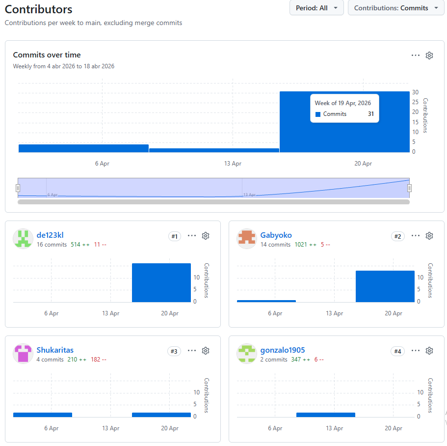
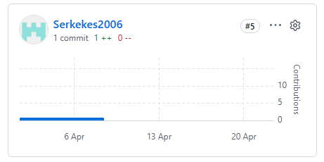

## Contenido

- [Student Outcome](#student-outcome)

- [Objetivos SMART](#objetivos-smart)

- [Capítulo I: Presentación](#capítulo-i-presentación)
    - [1.1. Startup Profile](#11-startup-profile)
        - [1.1.1. Descripción de la Startup](#111-descripción-de-la-startup)
        - [1.1.2. Perfiles de integrantes del equipo](#112-perfiles-de-integrantes-del-equipo)
    - [1.2. Solution Profile](#12-solution-profile)
        - [1.2.1. Antecedentes y problemática](#121-antecedentes-y-problemática)
        - [1.2.2. Lean UX Process](#122-lean-ux-process)
            - [1.2.2.1. Lean UX Problem Statements](#1221-lean-ux-problem-statements)
            - [1.2.2.2. Lean UX Assumptions](#1222-lean-ux-assumptions)
            - [1.2.2.3. Lean UX Hypothesis Statements](#1223-lean-ux-hypothesis-statements)
            - [1.2.2.4. Lean UX Canvas](#1224-lean-ux-canvas)
    - [1.3. Segmentos Objetivo](#13-segmentos-objetivo)

- [Capítulo II: Requirements Development and Software Solution Design](#capítulo-ii-requirements-development-and-software-solution-design)
    - [2.1. Competidores](#21-competidores)
        - [2.1.1. Análisis competitivo](#211-análisis-competitivo)
        - [2.1.2. Estrategias y tácticas frente a competidores](#212-estrategias-y-tácticas-frente-a-competidores)
    - [2.2. Entrevistas](#22-entrevistas)
        - [2.2.1. Diseño de entrevistas](#221-diseño-de-entrevistas)
        - [2.2.2. Registro de entrevistas](#222-registro-de-entrevistas)
        - [2.2.3. Análisis de entrevistas](#223-análisis-de-entrevistas)
    - [2.3. Needfinding](#23-needfinding)
        - [2.3.1. User Personas](#231-user-personas)
        - [2.3.2. User Task Matrix](#232-user-task-matrix)
        - [2.3.3. User Journey Mapping](#233-user-journey-mapping)
        - [2.3.4. Empathy Mapping](#234-empathy-mapping)
        - [2.3.5. Big Picture EventStorming](#235-big-picture-eventstorming)
        - [2.3.6. Ubiquitous Language](#236-ubiquitous-language)
    - [2.4. Requirements specification](#24-requirements-specification)
        - [2.4.1. User Stories](#241-user-stories)
        - [2.4.2. Impact Mapping](#242-impact-mapping)
        - [2.4.3. Product Backlog](#243-product-backlog)
    - [2.5. Strategic-Level Domain-Driven Design](#25-strategic-level-domain-driven-design)
        - [2.5.1. EventStorming](#251-eventstorming)
            - [2.5.1.1. Candidate Context Discovery](#2511-candidate-context-discovery)
            - [2.5.1.2. Domain Message Flows Modeling](#2512-domain-message-flows-modeling)
            - [2.5.1.3. Bounded Context Canvases](#2513-bounded-context-canvases)
        - [2.5.2. Context Mapping](#252-context-mapping)
        - [2.5.3. Software Architecture](#253-software-architecture)
            - [2.5.3.1. Software Architecture Context Level Diagrams](#2531-software-architecture-context-level-diagrams)
            - [2.5.3.2. Software Architecture Container Level Diagrams](#2532-software-architecture-container-level-diagrams)
            - [2.5.3.3. Software Architecture Deployment Diagrams](#2533-software-architecture-deployment-diagrams)
    - [2.6. Tactical-Level Domain-Driven Design](#26-tactical-level-domain-driven-design)
        - [2.6.x. Bounded Context: <Bounded Context Name>](#26x-bounded-context-bounded-context-name)
            - [2.6.x.1. Domain Layer](#26x1-domain-layer)
            - [2.6.x.2. Interface Layer](#26x2-interface-layer)
            - [2.6.x.3. Application Layer](#26x3-application-layer)
            - [2.6.x.4. Infrastructure Layer](#26x4-infrastructure-layer)
            - [2.6.x.5. Bounded Context Software Architecture Component Level Diagrams](#26x5-bounded-context-software-architecture-component-level-diagrams)
            - [2.6.x.6. Bounded Context Software Architecture Code Level Diagrams](#26x6-bounded-context-software-architecture-code-level-diagrams)
                - [2.6.x.6.1. Bounded Context Domain Layer Class Diagrams](#26x61-bounded-context-domain-layer-class-diagrams)
                - [2.6.x.6.2. Bounded Context Database Design Diagram](#26x62-bounded-context-database-design-diagram)
    - [Capítulo III: Solution UI/UX Design](#capítulo-iii-solution-uiux-design)
      - [3.1. Product design](#31-product-design)
        - [3.1.1. Style Guidelines](#311-style-guidelines)
          - [3.1.1.1. General Style Guidelines](#3111-general-style-guidelines)
        - [3.1.2. Information Architecture](#312-information-architecture)
          - [3.1.2.1. Organization Systems](#3121-organization-systems)
          - [3.1.2.2. Labelling Systems](#3122-labelling-systems)
          - [3.1.2.3. SEO Tags and Meta Tags](#3123-seo-tags-and-meta-tags)
          - [3.1.2.4. Searching Systems](#3124-searching-systems)
          - [3.1.2.5. Navigation Systems](#3125-navigation-systems)
        - [3.1.3. Landing Page UI Design](#313-landing-page-ui-design)
          - [3.1.3.1. Landing Page Wireframe](#3131-landing-page-wireframe)
          - [3.1.3.2. Landing Page Mock-up](#3132-landing-page-mock-up)
        - [3.1.4. Mobile Applications UX/UI Design](#314-mobile-applications-uxui-design)
          - [3.1.4.1. Mobile Applications Wireframes](#3141-mobile-applications-wireframes)
          - [3.1.4.2. Mobile Applications Wireflow Diagrams](#3142-mobile-applications-wireflow-diagrams)
          - [3.1.4.3. Mobile Applications Mock-ups](#3143-mobile-applications-mock-ups)
          - [3.1.4.4. Mobile Applications User Flow Diagrams](#3144-mobile-applications-user-flow-diagrams)
          - [3.1.4.5. Mobile Applications Prototyping](#3145-mobile-applications-prototyping)
    - [Capítulo IV: Product Implementation & Validation](#capítulo-iv-product-implementation--validation)
      - [4.1. Software Configuration Management](#41-software-configuration-management)
        - [4.1.1. Software Development Environment Configuration](#411-software-development-environment-configuration)
        - [4.1.2. Source Code Management](#412-source-code-management)
        - [4.1.3. Source Code Style Guide & Conventions](#413-source-code-style-guide--conventions)
        - [4.1.4. Software Deployment Configuration](#414-software-deployment-configuration)
      - [4.2. Landing Page & Mobile Application Implementation](#42-landing-page--mobile-application-implementation)
        - [4.2.1. Sprint 1](#421-sprint-1)
          - [4.2.1.1. Sprint Planning 1](#4211-sprint-planning-1)
          - [4.2.1.2. Sprint Backlog 1](#4212-sprint-backlog-1)
          - [4.2.1.3. Development Evidence for Sprint Review](#4213-development-evidence-for-sprint-review)
          - [4.2.1.4. Testing Suite Evidence for Sprint Review](#4214-testing-suite-evidence-for-sprint-review)
          - [4.2.1.5. Execution Evidence for Sprint Review](#4215-execution-evidence-for-sprint-review)
          - [4.2.1.6. Services Documentation Evidence for Sprint Review](#4216-services-documentation-evidence-for-sprint-review)
          - [4.2.1.7. Software Deployment Evidence for Sprint Review](#4217-software-deployment-evidence-for-sprint-review)
          - [4.2.1.8. Team Collaboration Insights during Sprint](#4218-team-collaboration-insights-during-sprint)
- [Conclusiones](#conclusiones)
- [Bibliografía](#bibliografía)
- [Anexos](#anexos)

## Student Outcome
El curso contribuye al cumplimiento del Student Outcome ABET:
**ABET - EAC - Student Outcome 7 Criterio**: La capacidad de adquirir y aplicar nuevos conocimientos según sea
necesario, utilizando estrategias deaprendizaje apropiadas.
En elsiguiente cuadro se describe las accionesrealizadas y enunciados de conclusiones por parte del grupo, que permiten sustentar el haber alcanzado los criterios especificos.

| Criterio específico | Acciones realizadas   | Conclusiones |
|--------|---------------|------|
| Actualiza conceptos y conocimientos necesarios para su desarrollo profesional y en especial para su proyecto en soluciones de software. | - **Aliaga Urbina, Wilder Gonzalo – TB1** <br> Desarrollé el Capítulo I del trabajo, aplicando conceptos de Startup Profile, Solution Profile, Lean UX y Segmentos Objetivo.  <br><br> -**Wilder Gonzalo Aliaga Urbina** <br> TB1: Desarrollé el Capítulo I del trabajo, aplicando conceptos de Startup Profile, Solution Profile, Lean UX y Segmentos Objetivo. <br><br> -**Perez Tuesta, Gabriel - TB1** <br> Comprendí la necesidad de mantener un aprendizaje constante al profundizar en EventStorming, Candidate Context Discovery, Domain Message Flows Modeling y Bounded Context Canvases, reconociendo su valor fundamental en el diseño inicial de soluciones de software. <br><br> -**Sergio Javier Landa Ortiz -TB1**<br> Dominar el análisis comparativo y el resumen de entrevistas es vital para validar SpacePulse frente a la competencia. Estas herramientas permiten contrastar funcionalidades, detectar brechas en el mercado y alinear el diseño de nuestro producto con las necesidades reales de los usuarios desde la fase estratégica. <br><br> -**Bruce Via Luna-TB1** <br> Realice parte del Needfinding y el Requirements Specifications para dar una direccion de funcionalidades y requerimientos para el avance del grupo| **TB1:** Como equipo, se evidencia una actualización integral y proactiva de conocimientos aplicados a las fases tempranas del ciclo de vida del software. Los integrantes han investigado y dominado con éxito conceptos que abarcan desde el diseño estratégico y de negocio (Lean UX, Startup Profile, análisis competitivo para SpacePulse), hasta el modelado de arquitectura (EventStorming, Bounded Contexts) y la ingeniería de requisitos (Needfinding). En conjunto, esta asimilación metodológica y técnica garantiza que la solución de software en desarrollo cuente con una dirección clara, bases arquitectónicas robustas y funcionalidades estrictamente alineadas a las necesidades validadas del mercado y los usuarios        |
| Reconoce la necesidad del aprendizaje permanente para el desempeño profesional y el desarrollo de proyectos en soluciones de software. | - **Aliaga Urbina, Wilder Gonzalo – TB1**<br>  Durante esta parte del proyecto investigué y apliqué conceptos de Lean UX, hipótesis, canvas y análisis del mercado objetivo, complementando mis conocimientos técnicos con un enfoque más estratégico. <br><br> -**Wilder Gonzalo Aliaga Urbina** <br> TB1: Durante esta parte del proyecto investigué y apliqué conceptos de Lean UX, hipótesis, canvas y análisis del mercado objetivo, complementando mis conocimientos técnicos con un enfoque más estratégico. <br><br> -**Perez Tuesta, Gabriel - TB1** <br> Me di cuenta de que el aprendizaje es continuo al desarrollar completamente el Bounded Context, ya que fue necesario investigar nuevas maneras de presentar la información de forma clara y comprensible <br><br> -**Sergio Javier Landa Ortiz -TB1**<br> Confirmé que el aprendizaje es constante al realizar el análisis comparativo y las entrevistas, ya que tuve que investigar nuevos formatos para sintetizar los hallazgos y presentar las ventajas de SpacePulse de forma estratégica y convincente <br><br> -**Bruce Via Luna-TB1** <br>| **TB1:** El equipo demuestra una clara conciencia sobre la importancia del aprendizaje continuo en el ciclo de vida del desarrollo de software. Los integrantes han evidenciado esta competencia al salir de su zona de confort para investigar proactivamente de forma autónoma, ya sea adquiriendo una visión estratégica de negocio (Lean UX y análisis de mercado), buscando nuevas metodologías de representación arquitectónica (Bounded Context) o explorando nuevos formatos para sintetizar hallazgos competitivos. En conjunto, reconocen que el éxito de un proyecto tecnológico exige adaptabilidad y una actualización constante de conocimientos más allá de lo estrictamente técnico.        |
<hr>

## Objetivos SMART


## Capítulo I: Presentación
### 1.1. Startup Profile
Coder-Placing es una startup orientada a la digitalización de espacios privados, principalmente viviendas y oficinas, mediante un modelo que integra remodelación, gestión operativa y monitoreo IoT en una sola solución. La propuesta nace ante una necesidad concreta del mercado: actualmente, gran parte del proceso de remodelación y gestión de espacios todavía se maneja con comunicación dispersa, cotizaciones aisladas, poca trazabilidad del avance y escasa visibilidad del estado real de los trabajos. Frente a ello, Coder-Placing busca ofrecer una alternativa tecnológica que permita centralizar la información, mejorar la coordinación entre actores y brindar mayor control durante todo el proceso.


#### 1.1.1. Descripción de la Startup

Nuestra empresa desarrolla soluciones digitales para conectar a propietarios, remodeladores expertos y técnicos en torno a un mismo espacio físico. Su propuesta combina marketplace, contratación por suscripción, seguimiento operativo de remodelaciones y monitoreo mediante dispositivos IoT, permitiendo una gestión más ordenada, medible y transparente.

Dentro de este ecosistema, se propone como producto principal SpacePulse, una aplicación móvil/web que permite publicar espacios, contratar combos de remodelación, gestionar procesos y materiales, monitorear avances, recibir alertas y controlar pagos recurrentes desde una sola plataforma.

**Objetivo:**

Brindar a propietarios y remodeladores expertos una plataforma centralizada para alquilar, remodelar y monitorear espacios privados, integrando procesos operativos, pagos y seguimiento IoT en tiempo real.

**Misión**

Simplificar la transformación y gestión de espacios privados mediante tecnología accesible, conectando a los actores del proceso de remodelación con información centralizada, trazabilidad operativa y monitoreo inteligente.

**Visión**

Convertirnos en una startup referente en Latinoamérica en soluciones digitales para espacios inteligentes, destacando por integrar remodelación, gestión operativa y monitoreo IoT en una experiencia confiable, innovadora y escalable.


#### 1.1.2. Perfiles de integrantes del equipo
|  Foto   | Miembros del equipo        | Código de Estudiante |   Descripción          |
|---------| -------------------------- |----------------------| ---------------------- |
|  |Wilder Gonzalo Aliaga Urbina |U202222001    | Estudiante de Ingeniería de Software, con interés en el desarrollo de aplicaciones y soluciones tecnológicas orientadas a la mejora de procesos. Cuento con conocimientos en tecnologías como Java, Spring Boot, Angular, TypeScript, C#, .NET y bases de datos relacionales y no relacionales. Me caracterizo por ser una persona responsable, proactiva y comprometida con el trabajo en equipo, buscando siempre aportar de manera organizada al desarrollo del proyecto.    |
|  |Via Luna Bruce|U202313403|Mi nombre es Bruce Via, tengo 20 años y soy estudiante de la carrera de ingenieria de Software. Me considero uan persona que muestra un interes desmedido cuando lo que hago resulta agradable, dispuesto a aprender nuevos conocimientos incluso si no es necesario, ademas de siempre intentar mejorar en lo que hago demostrando iniciativo|
| |Martinez Gaona, Pablo Afranio   | U202120011  | Tengo 24 años y estudio la carrera de Ingeniería de Software. Me considero alguien adaptable a la situación, así como alguien que trabaja muy bien en equipo. Manejo lenguajes de programación como C++ y Python. Busco aprender más acerca de la ciencia de datos asi como de la inteligencia artificial. Me gusta los videojuegos y escuchar música. |
| |Perez Tuesta, Gabriel |U202321281|Soy estudiante de ingeniería de software del 6to ciclo con conocimientos en JavaScript, Vue y NextJS, me quiero especializar en desarrollo web tanto en front end como en back end.|
| |Sergio Javier Landa Ortiz | U202311086 |Soy un estudiante de software, cursando actualmente el 7mo ciclo, la carrera me interesa mucho ya que siempre aprendo cosas nuevas cada dia, las tecnologias son tantas que nunca te aburres, me considero una persona responsable y me gusta trabajar en equipo|


### 1.2. Solution Profile

SpacePulse es una plataforma digital orientada a dos segmentos principales: clientes que desean contratar un servicio de remodelación o acondicionamiento para su casa u oficina, y empresas remodeladoras que necesitan gestionar sus servicios, proyectos y seguimiento operativo desde un mismo entorno. La solución integra cuatro frentes principales: publicación del espacio, contratación del servicio, seguimiento del proyecto y monitoreo de incidencias mediante IoT.

La propuesta toma valor porque los espacios inteligentes no se limitan a automatización: según Deloitte, los smart buildings combinan automatización operativa y gestión inteligente del espacio para mejorar la experiencia del usuario, elevar la productividad, reducir costos y mitigar riesgos. Además, el uso de sensores y medidores inteligentes puede generar ahorros eléctricos promedio de 4% a 12% cuando se brinda retroalimentación en tiempo real al usuario.

#### 1.2.1. Antecedentes y problemática

Actualmente, la remodelación de viviendas y oficinas suele gestionarse con herramientas separadas: mensajes por WhatsApp, hojas de cálculo, cotizaciones manuales, llamadas, evidencias dispersas y seguimiento informal del avance. Esto dificulta saber qué se contrató, cuánto se ha ejecutado, qué materiales faltan, cuánto se debe pagar y si existe alguna incidencia en el espacio intervenido.

A esto se suma un contexto en el que la digitalización del seguimiento sí es viable. En el primer trimestre de 2025, el 58,9% de los hogares del país contó con acceso a internet y el 95,2% tuvo telefonía móvil, mientras que al cierre de 2024 alrededor de 31,35 millones de teléfonos móviles accedieron a internet en el Perú. Esto muestra que ya existe una base tecnológica suficiente para una solución mobile-first enfocada en seguimiento y monitoreo remoto.

#### 1. ¿Qué?

Existe una falta de integración en la gestión de la remodelación y monitoreo de espacios privados. Los propietarios no cuentan con una plataforma unificada para publicar su espacio, contratar remodelación, controlar pagos, revisar avances e identificar incidentes técnicos en tiempo real.

#### 2. ¿Cuándo?

El problema aparece durante todo el ciclo de atención del espacio: desde la publicación inicial del inmueble, pasando por la cotización y contratación del servicio, hasta la ejecución de la remodelación, el control de materiales, los cobros y el seguimiento de incidentes o cambios solicitados.

#### 3. ¿Dónde?

Se presenta principalmente en viviendas, departamentos, oficinas y pequeños espacios privados urbanos, donde el proceso de mejora o reacondicionamiento requiere coordinación remota, control presupuestal y comunicación constante entre varios actores.

#### 4. ¿Quién?

Los afectados principales son:

- **Clientes que desean el servicio**, como propietarios o administradores de casas y oficinas que buscan remodelar, modernizar o acondicionar un espacio con mayor control, visibilidad y confianza.
- **Remodeladores expertos**, que necesitan captar clientes, organizar servicios, gestionar proyectos, coordinar personal técnico, controlar materiales y mantener trazabilidad sobre tiempos, costos e incidencias.

#### 5. ¿Por qué?

Porque el proceso sigue siendo altamente manual y fragmentado. Aunque el contexto digital ya es favorable, muchas decisiones operativas todavía dependen de seguimiento informal, lo que genera retrasos, sobrecostos, poca transparencia y menor confianza entre las partes.

#### 6. ¿Cómo?

La problemática puede abordarse mediante una aplicación que centralice:

- el catálogo de espacios y servicios de remodelación,
- la contratación del servicio,
- la facturación y emisión de comprobantes,
- el registro de proyectos, procesos y materiales,
- el monitoreo de lecturas IoT,
- la generación de alertas e incidencias,
- y la creación de tareas correctivas hasta el cierre del servicio.

#### 7. ¿Cuánto?

- Según Ipsos Perú, el 35% de los hogares alista obras, remodelación y decoración en casa. Esto respalda que sí existe una demanda real por mejoras y cambios en la vivienda, que puede beneficiarse de una solución digital para organizar el proceso.

- El mismo estudio señala que entre los principales proyectos del hogar figuran construir, ampliar, remodelar y decorar, lo que confirma que las familias peruanas no solo piensan en comprar vivienda, sino también en transformarla y acondicionarla.

- El Ministerio de Vivienda advirtió que en el Perú el 70% de las viviendas corresponde a autoconstrucción y remarcó la importancia de contratar profesionales especializados, como ingenieros y arquitectos, para asegurar una inversión de calidad. Esto se relaciona directamente con la necesidad de contar con remodeladores confiables y con mayor trazabilidad en el servicio.

- CAPECO indicó que el componente vivienda explica siete de cada diez metros cuadrados edificados en Lima Metropolitana. Esta cifra refuerza la relevancia del segmento vivienda dentro de la actividad constructiva y justifica una solución enfocada en espacios residenciales y oficinas pequeñas. 

- Según un estudio reportado por Perú21 en febrero de 2023, el 17% de los peruanos deseaba realizar remodelaciones en sus viviendas. El informe destacó la importancia de planificar, organizar y buscar profesionales y materiales adecuados para optimizar tiempo y dinero en estas mejoras.

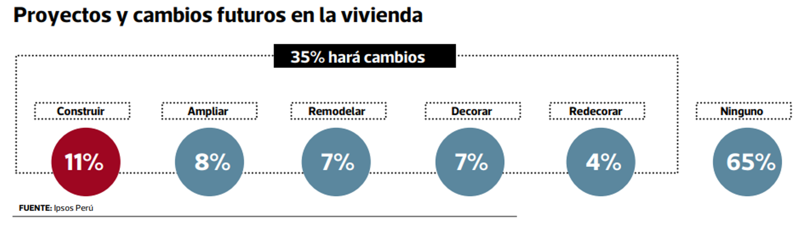

#### 1.2.2. Lean UX Process

##### 1.2.2.1. Lean UX Problem Statements

**Problema 1**  
Los propietarios de casas y oficinas necesitan una forma más simple de contratar y seguir remodelaciones, porque actualmente el proceso depende de múltiples canales y no ofrece trazabilidad clara del avance, los costos ni las incidencias.

**Problema 2**  
Los remodeladores expertos necesitan una plataforma para organizar proyectos, materiales, procesos y cobros, porque la gestión dispersa reduce su eficiencia operativa y dificulta brindar una experiencia confiable al cliente.

**Problema 3**  
Tanto clientes como remodeladores expertos necesitan monitoreo centralizado del estado del espacio, porque los cambios, alertas y problemas técnicos suelen detectarse tarde o comunicarse de forma desordenada.

##### 1.2.2.2. Lean UX Assumptions

**Business Assumptions (Suposiciones de Negocio)**

- Creo que mis clientes tienen la necesidad de: Contar con una plataforma que centralice la contratación, planificación, seguimiento y monitoreo de remodelaciones para casas y oficinas, evitando la desorganización, la poca visibilidad del avance y la dependencia de medios informales de comunicación.

- Estas necesidades se pueden resolver con: Una aplicación móvil que conecte al cliente y al remodelador experto en un mismo entorno digital, permitiendo visualizar el progreso, registrar procesos, materiales, tiempos, pagos, incidentes y alertas del espacio intervenido.

- Mis clientes iniciales son (o serán): Propietarios de casas u oficinas pequeñas que desean remodelar con mayor control y transparencia, así como remodeladores expertos que necesitan ordenar sus operaciones y ofrecer un servicio más confiable.

- El valor principal que los clientes quieren obtener de mi servicio es: Tener control, visibilidad y seguimiento del proceso de remodelación en tiempo real. Beneficios adicionales que también pueden obtener: mejor comunicación, trazabilidad de cambios, mayor control de costos, respuesta rápida ante incidentes y una experiencia más ordenada.

- Adquiriré a la mayoría de mis clientes a través de: Redes sociales, campañas dirigidas a propietarios y pequeñas empresas, alianzas con especialistas del rubro, demostraciones del producto y recomendaciones de clientes satisfechos.

- Ganaré dinero mediante: Cobros por servicios contratados dentro de la plataforma, suscripciones para remodeladores expertos y comisiones por paquetes de remodelación o monitoreo IoT.

- Mi principal competencia en el mercado será: Servicios tradicionales de remodelación y plataformas que no integran seguimiento del proceso. Los superaremos debido a: Nuestra propuesta reúne marketplace, gestión de remodelación, monitoreo IoT, alertas automáticas y trazabilidad en una sola solución móvil.

- Mi mayor riesgo de producto es: Que los usuarios perciban la plataforma como algo más complejo que gestionar todo por WhatsApp, llamadas o visitas. Lo resolveremos mediante: Una interfaz simple, información clara, alertas útiles y una propuesta enfocada en reducir incertidumbre y aumentar la confianza.

- Otras suposiciones que, si resultan falsas, harán que nuestro proyecto fracase:
    - Que los clientes valoren monitorear el avance de la remodelación desde una aplicación móvil.
    - Que los remodeladores expertos estén dispuestos a registrar procesos, materiales e incidencias de forma constante.
    - Que el componente IoT sea visto como una ventaja diferencial.
    - Que exista disposición a pagar por un servicio más transparente, trazable y apoyado en tecnología.

**User Assumptions (Suposiciones de Usuario)**

- ¿Quién es el usuario?: Nuestros usuarios serán, por un lado, clientes que desean remodelar una casa u oficina con mayor confianza; y, por otro lado, remodeladores expertos que ejecutan el servicio y coordinan personal, materiales, tiempos y seguimiento operativo.

- ¿Dónde encaja nuestro producto en su trabajo o vida?: Para el cliente, encaja como una herramienta de seguimiento y control del estado de su espacio. Para el remodelador experto, encaja como una herramienta de gestión operativa y comunicación con el cliente durante el proyecto.

- ¿Qué problemas resuelve nuestro producto?: Nuestro producto resuelve los siguientes problemas:
    - La falta de visibilidad sobre el estado real de una remodelación.
    - La desorganización en el registro de procesos, materiales, tiempos y costos.
    - La dependencia de llamadas, mensajes o visitas para conocer avances.
    - La poca trazabilidad de cambios o incidentes.
    - La falta de alertas oportunas frente a retrasos o problemas en el espacio.

- ¿Cuándo y cómo se usa nuestro producto?: Se utiliza antes, durante y después de contratar el servicio. El cliente lo usa para revisar avances, aceptar cambios, visualizar pagos, recibir alertas y confirmar incidentes. El remodelador experto lo usa para registrar procesos, actualizar estados, gestionar materiales, controlar tareas y mantener informado al cliente desde dispositivos móviles.

- ¿Qué características son importantes?: Las características más importantes de nuestro producto son:
    - Visualización del avance de la remodelación en tiempo real.
    - Registro de procesos, materiales, costos y tiempos.
    - Alertas automáticas e incidentes asociados al espacio.
    - Historial de cambios durante la remodelación.
    - Gestión de pagos, contratos o suscripciones.
    - Marketplace inicial para conectar espacios y servicios.
    - Monitoreo IoT aplicado al seguimiento del espacio.

- ¿Cómo debería verse y comportarse nuestro producto?: Debe tener una interfaz moderna, intuitiva y tecnológica, con navegación simple, paneles claros, indicadores fáciles de entender y alertas visibles. Además, debe transmitir confianza, orden y control sobre el espacio y la inversión del usuario.

##### 1.2.2.3. Lean UX Hypothesis Statements

**Hypothesis Statement 01:**

- Creemos que centralizar en una sola aplicación la contratación, el seguimiento de la remodelación, el monitoreo IoT y los pagos ayudará a los clientes que desean el servicio a tener mayor control y confianza sobre su espacio.

- Sabremos que estamos bien cuando veamos que al menos el 70% de los usuarios indique en entrevistas o encuestas que la plataforma reduce la incertidumbre del proyecto y / o que ingresen a revisar su espacio al menos una vez por semana.

**Hypothesis Statement 02:**

- Creemos que permitir a los remodeladores expertos registrar procesos, materiales, tiempos y avances dentro de la plataforma les ayudará a organizar mejor su operación y brindar un servicio más profesional.

- Sabremos que estamos bien cuando veamos que al menos el 60% de los remodeladores expertos actualiza el estado de sus proyectos varias veces por semana y / o que reporten una reducción en la pérdida de información durante la ejecución del servicio.

**Hypothesis Statement 03:**

- Creemos que mostrar el avance de la remodelación en tiempo real desde el celular ayudará a los clientes a sentirse más tranquilos y seguros durante todo el proceso.

- Sabremos que estamos bien cuando veamos que al menos el 65% de los clientes consulta el avance de su proyecto desde su smartphone cada semana y / o que valoren positivamente esta funcionalidad en pruebas de usabilidad.

**Hypothesis Statement 04:**

- Creemos que incorporar alertas automáticas e incidentes relacionados con el espacio ayudará a clientes y remodeladores expertos a responder más rápido ante problemas o anomalías.

- Sabremos que estamos bien cuando veamos que al menos el 80% de las alertas críticas es revisado dentro de las primeras 24 horas y / o que los usuarios reporten que las notificaciones les permiten actuar con mayor rapidez.

**Hypothesis Statement 05:**

- Creemos que ofrecer un historial de cambios, costos y procesos completados ayudará a los clientes a percibir el servicio como más transparente y confiable.

- Sabremos que estamos bien cuando veamos que al menos el 70% de los clientes consulta el historial del proyecto durante la remodelación y / o que más del 60% afirme que esta función mejora su confianza en el servicio.

**Hypothesis Statement 06:**

- Creemos que un marketplace inicial donde se publiquen espacios y servicios de remodelación ayudará a conectar de manera más simple la necesidad del cliente con la oferta del remodelador experto.

- Sabremos que estamos bien cuando veamos que al menos el 50% de los usuarios que publica un espacio recibe una propuesta dentro de la plataforma y / o que más del 60% entienda el flujo de publicación y contratación sin ayuda externa.

**Hypothesis Statement 07:**

- Creemos que permitir modificaciones sobre muebles, procesos o elementos aún no finalizados ayudará a que la solución sea percibida como más flexible y adaptada a las necesidades del cliente.

- Sabremos que estamos bien cuando veamos que al menos el 40% de los clientes utiliza la función de cambios durante su proyecto y / o que más del 65% considere útil poder personalizar la remodelación desde la aplicación.

**Hypothesis Statement 08:**

- Creemos que integrar monitoreo IoT dentro del servicio de remodelación ayudará a diferenciar la propuesta de SpacePulse frente a soluciones tradicionales del rubro.

- Sabremos que estamos bien cuando veamos que al menos el 60% de los usuarios menciona el monitoreo IoT como un valor agregado importante y / o que esta funcionalidad influya positivamente en su decisión de usar la plataforma.

**Hypothesis Statement 09:**

- Creemos que diseñar la solución principalmente para dispositivos móviles ayudará a incrementar la frecuencia de uso y consulta de la plataforma por parte de ambos segmentos.

- Sabremos que estamos bien cuando veamos que más del 50% de las sesiones proviene de smartphones y / o que los usuarios ingresan varias veces por semana para revisar avances, alertas o cambios.

**Hypothesis Statement 10:**

- Creemos que una interfaz intuitiva, visual y fácil de usar ayudará a reducir la barrera de adopción tanto para clientes como para remodeladores expertos.

- Sabremos que estamos bien cuando veamos que al menos el 85% de los usuarios completa tareas básicas sin apoyo, y / o que la tasa de abandono inicial sea menor al 15%, y / o que la experiencia sea calificada como clara y sencilla en encuestas post-uso.

**Hypothesis Statement 11:**

- Creemos que permitir al cliente visualizar el detalle de materiales y procesos de su remodelación ayudará a aumentar su percepción de transparencia en el servicio.

- Sabremos que estamos bien cuando veamos que al menos el 60% de los clientes revisa el detalle de materiales durante el proyecto y / o que más del 65% afirme que entiende mejor en qué se invierte su dinero.

**Hypothesis Statement 12:**

- Creemos que mostrar actualizaciones frecuentes del estado del espacio remodelado ayudará a motivar al cliente a revisar la aplicación de manera constante.

- Sabremos que estamos bien cuando veamos que los clientes ingresan a la plataforma al menos una vez por semana y / o que el nivel de interacción con avances, cambios o alertas aumente durante la ejecución del proyecto.

**Hypothesis Statement 13:**

- Creemos que ofrecer a los remodeladores expertos una vista centralizada de todos sus proyectos ayudará a facilitar la gestión simultánea de varias remodelaciones.

- Sabremos que estamos bien cuando veamos que al menos el 50% de los remodeladores expertos administra más de un proyecto activo desde la plataforma y / o que reporten una mejora en el control operativo de sus servicios.

**Hypothesis Statement 14:**

- Creemos que incorporar notificaciones sobre retrasos, cambios de estado o problemas detectados ayudará a mejorar la comunicación entre el cliente y el remodelador experto.

- Sabremos que estamos bien cuando veamos una reducción del 30% en consultas repetitivas por canales externos y / o que más del 70% de los usuarios considere que la comunicación dentro de la plataforma es suficiente y clara.

**Hypothesis Statement 15:**

- Creemos que una propuesta enfocada en casas y oficinas pequeñas ayudará a validar más rápido la utilidad de la solución antes de escalar a proyectos de mayor tamaño.

- Sabremos que estamos bien cuando veamos que al menos el 60% de los primeros proyectos registrados pertenece a ese tipo de espacios y / o que los usuarios de ese segmento reporten una experiencia satisfactoria durante la etapa piloto.

##### 1.2.2.4. Lean UX Canvas

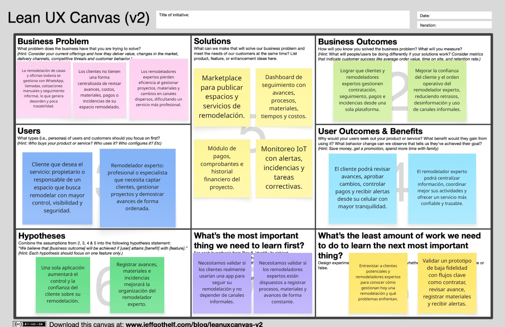

### 1.3. Segmentos Objetivo

#### Segmento Objetivo 1: Cliente que desea el servicio

Este segmento corresponde a personas o responsables de un inmueble que buscan remodelar, acondicionar o modernizar una casa, departamento u oficina. Su principal necesidad es contar con un servicio claro, confiable y fácil de seguir, que les permita revisar opciones, conocer costos, aprobar cambios y monitorear el avance del proyecto sin depender de mensajes dispersos o seguimiento informal.

**Características Demográficas:**  
Generalmente, este segmento está conformado por adultos entre 28 y 55 años, con capacidad de decisión sobre su vivienda u oficina, ubicados principalmente en zonas urbanas. Además, suelen estar familiarizados con el uso del celular para realizar consultas, coordinar servicios y hacer seguimiento a procesos importantes de su vida diaria.

**Información Estadística de Sustento:**  
Este segmento resulta relevante porque el uso de herramientas digitales en el país es cada vez mayor. En el primer trimestre de 2025, el 58,9% de los hogares del país contó con acceso a internet y el 95,2% tuvo telefonía móvil, lo que respalda la viabilidad de una aplicación móvil orientada al seguimiento de remodelaciones y monitoreo de espacios.

#### Segmento Objetivo 2: Remodeladores expertos

Este segmento corresponde a profesionales o especialistas que ofrecen servicios de remodelación, implementación o mejora de espacios privados. Su principal interés es contar con una plataforma que les permita publicar sus servicios, captar clientes, administrar proyectos, registrar materiales, coordinar actividades técnicas y llevar un mejor control de pagos, avances e incidencias.

**Características Demográficas:**  
Este segmento está conformado principalmente por profesionales independientes, técnicos especializados o pequeños equipos de trabajo ubicados en zonas urbanas, que necesitan ordenar sus procesos y brindar una atención más profesional. Además, suelen requerir herramientas digitales simples e intuitivas que les ayuden a gestionar varios proyectos sin recurrir únicamente a registros manuales o aplicaciones de mensajería.

**Información Estadística de Sustento:**  
Según PRODUCE, en el Perú operaron 2 331 173 mipyme formales al cierre de 2024, lo que confirma una base amplia de micro y pequeños negocios a los que puede dirigirse una solución como SpacePulse; en la publicación anterior de PRODUCE sobre mipyme formales, el 94,7% correspondía a microempresas y el 5,0% a pequeñas empresas. Esto respalda un enfoque inicial en remodeladores expertos y pequeños equipos que necesitan digitalizar su operación sin adoptar sistemas complejos o costosos.

## Capítulo II: Requirements Development and Software Solution Design


### 2.1. Competidores
En esta sección se detallará el panorama competitivo de SpacePulse, identificando a los actores clave en el mercado de la remodelación y automatización. El análisis abarcará desde plataformas de diseño 3D hasta integradores de domótica y servicios tradicionales, con el fin de exponer las brechas existentes en la oferta actual. Se enfatizará la falta de una solución integral que combine la estética del diseño con la implementación técnica de objetos IoT, justificando así el valor diferencial de SpacePulse como una plataforma "todo en uno" para la creación de espacios inteligentes.
 
 1. Houzz Pro

Descripcion:

 Es una solución de gestión "todo en uno" diseñada específicamente para profesionales del diseño y la remodelación de interiores. Su plataforma facilita la administración de proyectos desde la etapa de planificación hasta la ejecución final, permitiendo una comunicación fluida entre el cliente y el profesional.

 Caracteristicas Principales:

 . Herramientas de gestión de proyectos y CRM para contratistas.

 . Gestión financiera integral que incluye presupuestos, facturación y pagos en línea.

 . Biblioteca de productos y materiales para especificaciones de diseño detalladas.

 . Portal del cliente personalizado para aprobación de presupuestos y seguimiento de avances.

 . Cronograma de proyecto dinámico mediante diagramas de Gantt para control de plazos.

 . Escaneo de habitaciones con Inteligencia Artificial para la generación automática de planos.

 . Tableros de ideas (moodboards) interactivos vinculados directamente a los costos del proyecto.

 2. Planner 5D

 Caracteristicas:
 
 Es una herramienta de diseño de interiores sumamente accesible que permite a usuarios avanzados y principiantes crear planos de casas y diseños de interiores de manera intuitiva. Se destaca por integrar elementos tecnológicos en sus catálogos, permitiendo una previsualización estética de los espacios.

 Caracteristicas Principales:

 . Interfaz intuitiva de "arrastrar y soltar" para la creación y edición de planos en modos 2D y 3D.

 . Uso de Inteligencia Artificial para el reconocimiento de planos, permitiendo convertir bocetos hechos a mano en proyectos digitales editables.

 .Catálogo extenso con más de 5,000 artículos decorativos y estructurales, incluyendo una sección dedicada a dispositivos inteligentes para el hogar.

 . Funcionalidad de Realidad Virtual (VR) que permite a los usuarios realizar recorridos inmersivos por sus diseños antes de iniciar la obra física.

 . Herramientas de renderizado fotorrealista de alta definición para visualizar texturas, sombras e iluminación con precisión.

 . Capacidad de personalización total de materiales, colores y superficies para adaptar los objetos a cualquier estilo de remodelación.

 . Sincronización multiplataforma que permite editar proyectos en dispositivos móviles, tablets y computadoras de escritorio.

 .Editor de muebles integrado que permite ajustar las dimensiones y acabados de los objetos para que encajen exactamente en el espacio disponible.

 3. SmartThings (Samsung)

 Caracteristicas:
 Es una de las plataformas de automatización del hogar más robustas del mercado, enfocada en la interconectividad y el control de dispositivos IoT. Actúa como el cerebro tecnológico de una vivienda, permitiendo que dispositivos de diversas marcas trabajen juntos de manera armoniosa.

 Caracteristicas principales:

 . Compatibilidad universal con protocolos de comunicación estándar como Matter, Zigbee, Z-Wave y Wi-Fi para una interconectividad sin interrupciones.

 . Creación de rutinas y escenas personalizadas que permiten automatizar múltiples dispositivos con un solo comando o basados en condiciones del entorno.

 . Panel de control centralizado (SmartThings Hub) que permite gestionar dispositivos de cientos de marcas desde una única interfaz móvil o Smart TV.

 . Monitoreo detallado del consumo de energía en tiempo real (SmartThings Energy) para optimizar el uso de electrodomésticos y reducir costos.

 . Funcionalidad de geofencing que activa o desactiva dispositivos y sistemas de seguridad automáticamente al detectar la ubicación del usuario.

 . Integración profunda con asistentes de voz como Bixby, Google Assistant y Amazon Alexa para el control manos libres de todo el hogar.

 . Sistema de notificaciones inteligentes y alertas de seguridad que informan al usuario sobre movimientos detectados, fugas de agua o puertas abiertas.

 . Herramientas de diagnóstico y mantenimiento predictivo que notifican fallos técnicos o necesidades de servicio en los dispositivos conectados.

#### 2.1.1. Análisis competitivo
<table border="1">
  <thead>
    <tr>
      <th colspan="5">Competitive Analysis Landscape</th>
    </tr>
  </thead>
  <tbody>
    <!-- OBJETIVO -->
    <tr>
      <td>¿Por qué llevar a cabo este análisis?</td>
      <td colspan="4">Analizar a la competencia permite entender el mercado en el que se introducirá nuestro producto, ofreciendo una visión clara de las funcionalidades que ofrecen y cómo satisfacen las necesidades de sus clientes.</td>
    </tr>
    <!-- CABECERA -->
    <tr>
      <td>(Nombre y logo de cada competidor)</td>
      <td></td>
      <td>Houzz Pro<br></td>
      <td>Planner 5D <br></td>
      <td>SmartThings (Samsumg) <br></td>
      <td>Space Pulse <br></td>
    </tr>
    <!-- PERFIL -->
    <tr>
      <td rowspan="3">Perfil</td>
      <td>Overview</td>
      <td>Plataforma de gestión de proyectos y marketing "todo en uno" diseñada específicamente para profesionales de la remodelación.</td>
      <td>Herramienta intuitiva de diseño de interiores y arquitectura que permite crear planos en 2D y visualizaciones 3D fotorrealistas de casas, oficinas y paisajes.</td>
      <td>Plataforma y aplicación de domótica que permite conectar, automatizar y controlar dispositivos inteligentes del hogar (luces, electrodomésticos, TVs, cámaras).</td>
      <td>Plataforma para consultarias y/o solicitudes de ayuda para servicio domestico de Diseño de Interiores y uso de objetos IOT para facilitar el trabajo.</td>
    </tr>
    <tr>
      <td>Ventaja competitiva <br>¿Qué valor ofrece a los clientes?</td>
      <td>Es una solución todo en uno que fusiona herramientas de marketing para captar clientes con software de gestión de proyectos y diseño 3D.</td>
      <td>Capacidad para equilibrar una interfaz extremadamente intuitiva y fácil de usar con funciones potentes de inteligencia artificial (IA).</td>
      <td>Tiene enorme interoperabilidad y ecosistema abierto, compatible con más de 300 marcas y miles de dispositivos</td>
      <td>Facil de operar, tiene una interfaz comoda y rapida, se ajusta a lo que el cliente necesite con herramientas de marketing y diseño 3D</td>
    </tr>
    <tr>
      <td>Mercado objetivo</td>
      <td>Pequeñas y medianas empresas, autónomos y profesionales del sector de remodelación, construcción residencial y diseño de interiores.</td>
      <td>Aficionados al interiorismo, propietarios de viviendas y entusiastas del bricolaje (DIY) sin experiencia técnica que buscan diseñar, remodelar o amueblar espacios.</td>
      <td>Consumidores individuales (B2C) que buscan comodidad y conectividad, y empresas (B2B).</td>
      <td>Toda persona que este en busca de remodelacion o necesite algun feedback o idea de como empezar con una remodelacion efectiva en su hogar.</td>
    </tr>
    <!-- PERFIL DE MARKETING -->
    <tr>
      <td rowspan="2">Perfil de Marketing</td>
      <td>Estrategias de marketing</td>
      <td>Perfiles premium, optimización SEO para directorios, gestión de leads con Project Match y herramientas visuales como paneles de inspiración 3D.</td>
      <td>Que la creación de planos y la decoración en 3D sea accesible para cualquier persona, sin necesidad de conocimientos técnicos.</td>
      <td>Transforma la venta de dispositivos individuales en la promoción de un "estilo de vida inteligente" y conectado, impulsado por la IA.</td>
      <td>Una interfaz de llamativa y rapida, una interaccion veloz y eficiente para dar el mejor servicio</td>
    </tr>
    <tr>
      <td>Mercado objetivo</td>
      <td>Estudiantes, startups en etapa temprana, empresas innovadoras.</td>
      <td>Profesionales, empresas medianas y grandes.</td>
      <td>Startups tecnológicas, inversores, emprendedores.</td>
      <td>Personas primerisas en adquiri un hogar propio, diseñadores, empresas de Instalación Domótica.</td>
    </tr>
    <!-- PERFIL DE PRODUCTO -->
    <tr>
      <td rowspan="3">Perfil de Producto</td>
      <td>Productos & Servicios</td>
      <td>Herramientas para crear presupuestos rápidos, gestionar proyectos, facturar, recibir pagos en línea y mejorar la relación con el cliente (CRM) desde una única plataforma web o app</td>
      <td>Herramienta multiplataforma (Web, iOS, Android, Windows, macOS) para crear planos 2D y 3D.</td>
      <td>Automatización, seguridad, gestión energética y control de iluminación, incluyendo cámaras, cerraduras, enchufes y electrodomésticos.</td>
      <td>Ayuda instantanea y especializada para realizar cambios en tu hogar.</td>
    </tr>
    <tr>
      <td>Precios & Costos</td>
      <td>Modelo preemium .</td>
      <td>Gratis con funciones premium de pago .</td>
      <td>Gratis con servicios premium para empleadores e inversores.</td>
      <td>Gratis con opciones premium para mayor visibilidad.</td>
    </tr>
    <tr>
      <td>Canales de distribución (Web y/o Móvil)</td>
      <td>App móvil (iOS/Android) y versión web.</td>
      <td>App móvil y web.</td>
      <td>App móvil y web.</td>
      <td>App móvil y web.</td>
    </tr>
    <!-- SWOT -->
    <tr>
      <td rowspan="4">Análisis SWOT</td>
      <td>Fortalezas</td>
      <td>Gestión de proyectos, CRM y marketing para diseñadores.</td>
      <td>IA avanzada para diseño rápido y gran accesibilidad para principiantes.</td>
      <td>El ecosistema más robusto de compatibilidad con marcas de hardware IoT.</td>
      <td>Especialización única en cobertura de red y ubicación de sensores IoT.</td>
    </tr>
    <tr>
      <td>Debilidades</td>
      <td>Curva de aprendizaje alta y herramientas de diseño 3D menos potistas.</td>
      <td>Enfoque puramente estético; ignora la infraestructura técnica y redes.</td>
      <td>No es una herramienta de diseño; solo sirve para control post-instalación.</td>
      <td>Producto nuevo en fase de desarrollo con menor catálogo que gigantes.</td>
    </tr>
    <tr>
      <td>Oportunidades</td>
      <td>Convertirse en el estándar de gestión para el mercado de remodelaciones.</td>
      <td>Expandirse hacia el mercado de "hogar inteligente" mediante plugins.</td>
      <td>Alianzas con softwares de diseño para planificación previa (pre-venta).</td>
      <td>Alianzas con estudios que buscan "diseño inteligente" sin ser expertos.</td>
    </tr>
    <tr>
      <td>Amenazas</td>
      <td>Competidores más ágiles o especializados en nichos tecnológicos.</td>
      <td>Pérdida de usuarios profesionales que requieren mayor precisión técnica.</td>
      <td>Sistemas cerrados (Apple/Google) que limitan su expansión en ciertos hogares.</td>
      <td>Grandes softwares de diseño (Revit/Planner 5D) integrando funciones similares.</td>
    </tr>
  </tbody>
</table>
#### 2.1.2. Estrategias y tácticas frente a competidores
<br>

## Afrontando las fortalezas de nuestros competidores:

<br>

**Fortalezas de competidores:**
- Planner 5D: gran base de usuarios y herramientas de IA estética consolidadas.

- Houzz Pro: ecosistema completo de gestión de proyectos y marca reconocida.

- SmartThings: compatibilidad masiva con hardware y respaldo de grandes fabricantes.

- SpacePulse: estándar de la industria para documentación arquitectónica técnica.

## Comprendemos que nuestras fortalezas son:
- Enfoque exclusivo en infraestructura técnica de red y sensores IoT.

- Simulación predictiva: capacidad de prever cobertura Wi-Fi antes de la construcción.

- Nicho especializado: herramienta diseñada para cerrar la brecha entre diseño y conectividad. 

## Estrategias:
- Diferenciarnos mediante el posicionamiento técnico-estético, no solo visual.

- Crear una herramienta de validación de ingeniería accesible para no expertos.

- Alianzas estratégicas con firmas de diseño de interiores y proveedores de domótica.

## Tácticas:
- Implementar simuladores de mapas de calor Wi-Fi intuitivos en la interfaz.

- Incentivar a estudios de diseño a certificar sus planos con el "Sello de Conectividad SpacePulse".

- Marketing digital enfocado en el ahorro de tiempo y reducción de errores de instalación. 

---

## Afrontando las debilidades de nuestros competidores:

<br>

**Debilidades de competidores:**

- Planner 5D: ignora por completo la infraestructura técnica y la red.

- Houzz Pro: carece de herramientas de simulación IoT avanzadas.

- SmartThings: no permite la planificación previa sobre planos arquitectónicos.

- SpacePulse: alta curva de aprendizaje y costo para diseñadores independientes.

## Comprendemos que nuestras debilidades son:

- Startup nueva con poca base de usuarios inicial.

- Catálogo de dispositivos limitado frente a ecosistemas globales.

## Estrategias:

- Crecer a través de nichos específicos (remodelaciones inteligentes) antes de expandir.

- Apoyarnos en alianzas con marcas IoT para integrar sus catálogos y atraer usuarios.

## Tácticas:

- Campañas de captación en facultades de diseño y arquitectura (ej. UPC).

- Programas de referidos para los primeros "Early Adopters" del sector diseño.

- Construir una comunidad sólida en el sector de Smart Home Design.
---

## Afrontando las oportunidades de nuestros competidores:

<br>

**Oportunidades de competidores:**
- Expansión de la domótica residencial (SmartThings).

- Crecimiento de las herramientas de IA generativa (Planner 5D).

- Demanda de gestión digital de obras (Houzz Pro).
## Comprendemos que nuestras oportunidades son:
- Conectar el diseño de interiores con la ingeniería de redes.

- Posicionarnos como la herramienta estándar para el hogar inteligente.

- Aprovechar el auge de dispositivos Matter y Zigbee en el mercado global.

## Estrategias:
- Crear un espacio que combine diseño estético + eficiencia tecnológica.

- Aliarnos con instaladores y empresas de tecnología para el hogar.

## Tácticas:
- Organizar webinars de capacitación técnica para diseñadores tradicionales.

- Ofrecer planes gratuitos iniciales a estudios emergentes para ganar tracción.

- Automatizar el cálculo de ubicación de sensores para maximizar la cobertura.

---

## Afrontando las amenazas de nuestros competidores:

<br>

**Amenazas de competidores:**
- Recursos masivos de grandes plataformas para copiar funcionalidades.

- Alta competencia en el software de diseño de interiores generalista.

- Barreras de entrada por lealtad a softwares tradicionales.

## Comprendemos que nuestras amenazas son:
- Riesgo de que grandes plataformas incorporen capas de simulación de red.

- Dificultad de escalar sin un catálogo de hardware masivo.


## Tácticas:
- Innovar en funcionalidades (ej. "match" automático entre dispositivos y metros cuadrados).

- Fidelizar a la comunidad con reportes técnicos listos para impresión.

- Monitorear tendencias IoT para adaptar la plataforma a nuevos protocolos rápidamente.
### 2.2. Entrevistas


#### 2.2.1. Diseño de entrevistas

Segmentos Encontrados:

. Dueño de Propiedad:
Personas que buscan remodelar su hogar integrando tecnología inteligente para mejorar el confort, la seguridad y la eficiencia energética.

. Diseñador/Arquitecto de Interiores: Profesionales que planifican los espacios y necesitan herramientas técnicas para integrar dispositivos IoT sin sacrificar la estética.

Preguntas:

Para asegurar que SpacePulse resuelva los problemas reales de sus usuarios, se han formulado las siguientes preguntas para los dos segmentos objetivo:

Segmento: Dueño de Propiedad

Principales: 

¿Tiene planeado realizar una remodelación en su hogar próximamente o ha realizado una recientemente?

¿Qué tan familiarizado está con el concepto de "Hogar Inteligente" (Smart Home) y qué dispositivos IoT le gustaría tener?

¿Cuáles son sus mayores temores o dificultades al planificar una remodelación (costos, tiempo, falta de asesoría técnica)?

¿Ha intentado instalar objetos inteligentes antes? ¿Tuvo problemas de configuración o conectividad?

¿Qué tan importante es para usted ver cómo quedarán los sensores o luces inteligentes antes de instalarlos?

¿Estaría dispuesto a usar una app que no solo diseñe la estética, sino que le asegure que toda la tecnología instalada funcionará correctamente?

¿Le interesaría que su remodelación incluya simulaciones de ahorro energético mediante el uso de objetos IoT?

Complementarias

¿Qué preocupaciones tiene respecto a la privacidad de los datos recopilados por los dispositivos IoT en su hogar?

¿Qué expectativas tiene sobre el soporte técnico después de terminada la remodelación?

¿Qué tan importante es para usted controlar todos los dispositivos desde una sola aplicación móvil?

Segmento: Diseñador/Arquitecto de Interiores

Principales:

¿Cuál es su enfoque principal al diseñar un espacio residencial y con qué frecuencia integra tecnología en sus proyectos?

¿Cómo coordina actualmente la instalación técnica (electricidad, red Wi-Fi) con la parte estética del diseño?

¿Cuáles son los principales problemas que enfrenta al intentar incluir objetos IoT en sus diseños tradicionales?

¿Qué software utiliza actualmente para el diseño de interiores? ¿Le permite simular la funcionalidad de dispositivos inteligentes?

¿Cómo le explica a un cliente los beneficios técnicos y la ubicación de los objetos inteligentes en un plano?

¿Cuánto tiempo pierde coordinando con técnicos externos para asegurar la compatibilidad de los dispositivos seleccionados?

¿Cómo cree que la demanda de remodelaciones inteligentes afectará su profesión en los próximos 5 años?

Complementarias:

¿Qué tan crucial es para usted que una herramienta de diseño sea intuitiva y no requiera conocimientos profundos de ingeniería de redes?

¿Qué tan importante es para usted tener un catálogo amplio de diferentes marcas de dispositivos IoT para ofrecer a sus clientes?

¿Estaría dispuesto a colaborar en el ajuste de una herramienta que automatice el cálculo de cobertura de red y ubicación de sensores en sus planos?

#### 2.2.2. Registro de entrevistas
*Entrevistas a Diseñadores*
---
<br>

<table align="center">
  <tr>
    <th colspan="2" style="text-align:center">Entrevista 1</th>
  </tr>
  <tr>
    <td><strong>Entrevistado</strong></td>
    <td>Olivia Carmelino</td>
  </tr>
  <tr>
    <td><strong>Edad</strong></td>
    <td>30</td>
  </tr>
  <tr>
    <td><strong>Distrito</strong></td>
    <td>Santiago de Surco</td>
  </tr>
  <tr>
    <td><strong>Timing</strong></td>
    <td>0:24-6:41</td>
  </tr>
  <tr>
    <td><strong>URL</strong></td>
    <td>
      
  `https://youtu.be/GgHrGeZUhwA`

  </td>
  </tr>
  <tr>
    <td colspan="2" style="text-align:justify">
      Resumen: <br>
      Olivia, diseñadora de interiories, reside en el destrito de Santiago de Surco, habla sobre como esta implementando tecnologia IoT en los espacios que remodela con permiso de sus clientes, relata como, pese a ser nueva, siente que el mercado de als remodelaciones pasara o dejara de enfocarse tanto en lo estetico para llegar al diseño tecnologico funcional, sin dejar de lado lo primero, diciendo como con mayor gente interesada y que ofrece dicho servicio.
    </td>
  </tr>
  <tr>
    <td colspan="2"><br>
      <br>
    </td>
  </tr>
</table>

<table align="center">
  <tr>
    <th colspan="2" style="text-align:center">Entrevista 2</th>
  </tr>
  <tr>
    <td><strong>Entrevistado</strong></td>
    <td>Jarol Panduro Sedillo</td>
  </tr>
  <tr>
    <td><strong>Edad</strong></td>
    <td>28</td>
  </tr>
  <tr>
    <td><strong>Distrito</strong></td>
    <td>Cercado de Lima</td>
  </tr>
  <tr>
    <td><strong>Timing</strong></td>
    <td>0:10 - 4:22</td>
  </tr>
  <tr>
    <td><strong>URL</strong></td>
    <td>
      
  `https://drive.google.com/file/d/1VUPeKRScP4pmlAPUAXPYoO35EDITJ83n/view?usp=sharing`

  </td>
  </tr>
  <tr>
    <td colspan="2" style="text-align:justify">
      Resumen: <br>
     Especialista en diseño de interiores enfocado en el confort funcional, Jarol integra tecnología en todos sus proyectos para garantizar espacios actualizables. Utiliza el concepto de "tecnología invisible" para ocultar instalaciones técnicas en el mobiliario, enfrentando retos como la falta de infraestructura previa y el contraste estético entre dispositivos modernos y estilos clásicos. Al emplear software como SketchUp y Revit, siente la limitación de no poder simular alcances de sensores de forma nativa, lo que lo lleva a perder hasta un 20% de su tiempo en validaciones técnicas con proveedores. Considera vital el uso de herramientas intuitivas que automaticen cálculos de red sin requerir conocimientos de ingeniería, y está totalmente dispuesto a colaborar en el desarrollo de soluciones que faciliten la transición hacia el estándar del Smart Home en los próximos años.
    </td>
  </tr>
  <tr>
    <td colspan="2"><br>
      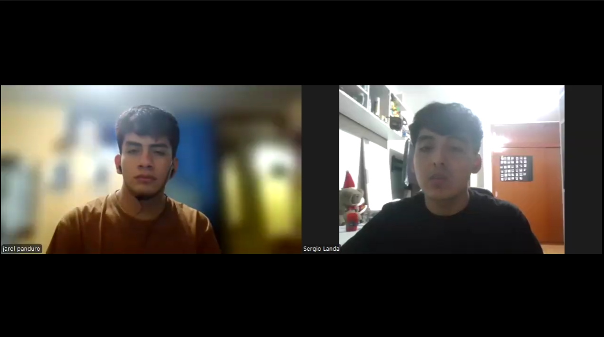<br>
    </td>
  </tr>
</table>

<br><br>

<table align="center">
  <tr>
    <th colspan="2" style="text-align:center">Entrevista 3</th>
  </tr>
  <tr>
    <td><strong>Entrevistado</strong></td>
    <td>Javier Landa</td>
  </tr>
  <tr>
    <td><strong>Edad</strong></td>
    <td>56</td>
  </tr>
  <tr>
    <td><strong>Distrito</strong></td>
    <td>San Isidro</td>
  </tr>
  <tr>
    <td><strong>Timing</strong></td>
    <td>00:00 - 10:49</td>
  </tr>
  <tr>
    <td><strong>URL</strong></td>
    <td>
    
  `https://drive.google.com/file/d/12ziUWQE9mXweRocDbyVaa0xu8OfRvco2/view?usp=sharing`

  </td>
  </tr>
  <tr>
    <td colspan="2" style="text-align:justify">
      Resumen: <br>
      Especialista en diseño de interiores con una visión centrada en la habitabilidad emocional, Javier integra tecnología en el 100% de sus proyectos actuales, enfrentando el reto constante de ocultar componentes técnicos para no romper la armonía estética. Reporta una pérdida del 20% de su tiempo en coordinación con técnicos externos debido a que sus herramientas de diseño (Revit/SketchUp) no permiten simular funcionalidades inteligentes, por lo que considera crítico contar con soluciones intuitivas que automaticen el cálculo de coberturas. Proyecta que en los próximos 5 años su profesión mutará hacia una curaduría de interfaces espaciales, donde el diseño invisible será tan vital como el mobiliario, mostrando total disposición para colaborar en el desarrollo de herramientas que simplifiquen esta transición tecnológica.
    </td>
  </tr>
  <tr>
    <td colspan="2"><br>
      <br>
    </td>
  </tr>
</table>

<br><br>

*Entrevistas a Dueños de Casas*
---

<table align="center">
  <tr>
    <th colspan="2" style="text-align:center">Entrevista 1</th>
  </tr>
  <tr>
    <td><strong>Entrevistado</strong></td>
    <td>Sebastian Altamirando</td>
  </tr>
  <tr>
    <td><strong>Edad</strong></td>
    <td>25 </td>
  </tr>
  <tr>
    <td><strong>Distrito</strong></td>
    <td>Miraflores</td>
  </tr>
  <tr>
    <td><strong>Timing</strong></td>
    <td>0:25-7:57</td>
  </tr>
  <tr>
    <td><strong>URL</strong></td>
    <td>

  `https://youtu.be/Po_A6Yu5vzU`

  </td>
  </tr>
  <tr>
    <td colspan="2" style="text-align:justify">
      Resumen: <br>
      Sebastian, Ingeniero Civil que tiene su propio departamento en Cercado de Lima, habla sobre como le interesa remodelar su espácio a falta de ventilacion en su hogar, señala que al no ser muy experto en eso y sobre todo al no tener un segundo lugar al cual ir en lo que remodelan su espacio, quisiera usar la aplicacion para que le ayude a buscar a un remodelador rapido en su trabajo, ademas señala su desconocimiento sobre las tecnologias IoT pero sin desmeritar lo que pueden lograr, admitiendo que le gustaria implementar en su nuevo espacio durante o luego de la remodelacion
    </td>
  </tr>
  <tr>
    <td colspan="2"><br>
      <br>
    </td>
  </tr>
</table>

<br><br>

<table align="center">
  <tr>
    <th colspan="2" style="text-align:center">Entrevista 2</th>
  </tr>
  <tr>
    <td><strong>Entrevistado</strong></td>
    <td>Ana Villafane.</td>
  </tr>
  <tr>
    <td><strong>Edad</strong></td>
    <td>28</td>
  </tr>
  <tr>
    <td><strong>Distrito</strong></td>
    <td>San borja</td>
  </tr>
  <tr>
    <td><strong>Timing</strong></td>
    <td>00:00 - 5:46</td>
  </tr>
  <tr>
    <td><strong>URL</strong></td>
    <td>

  `https://drive.google.com/file/d/1mncX9-VSim25VVBZ4s30iJ8Vvl-aNdtR/view?usp=sharing` 

  </td>
  </tr>
  <tr>
    <td colspan="2" style="text-align:justify">
      Resumen:<br>
      Ana busca remodelar su departamento, específicamente la sala y la cocina, con el objetivo de reforzar el confort y la seguridad a través de la tecnología IoT. Aunque no tiene experiencia previa instalando dispositivos inteligentes, muestra interés en integrar luces con sensores, sistemas de vigilancia y asistentes de voz como Alexa. Sus principales preocupaciones son el costo de la inversión y la gestión de la energía (qué sucede ante un corte de luz), además de la privacidad de sus datos. Valora profundamente que la tecnología sea estéticamente armoniosa y funcional, por lo que considera muy útil una aplicación que permita simular ahorros energéticos y asegurar la compatibilidad técnica desde una sola interfaz móvil.
    </td>
  </tr>
   <tr>
    <td colspan="2"><br>
      <br>
    </td>
  </tr>
</table>

<br><br>

<table align="center">
  <tr>
    <th colspan="2" style="text-align:center">Entrevista 3</th>
  </tr>
  <tr>
    <td><strong>Entrevistado</strong></td>
    <td>Jorge Linares</td>
  </tr>
  <tr>
    <td><strong>Edad</strong></td>
    <td>28 </td>
  </tr>
  <tr>
    <td><strong>Distrito</strong></td>
    <td>Los Olivos</td>
  </tr>
  <tr>
    <td><strong>Timing</strong></td>
    <td>0:26-5:44</td>
  </tr>
  <tr>
    <td><strong>URL</strong></td>
    <td>
      
  `https://drive.google.com/file/d/17U2rL6DTw_zLxlXX_KyZ1lIi4wdGhCtp/view?usp=sharing`

  </td>
  </tr>
  <tr>
    <td colspan="2" style="text-align:justify">
      Resumen:<br>
      Jorge está interesado en remodelar su hogar e integrar tecnología inteligente como sensores de seguridad e iluminación. Sus principales preocupaciones son los costos, el tiempo y la falta de asesoría técnica confiable. También valora poder visualizar los dispositivos antes de instalarlos, contar con soporte técnico, proteger sus datos y controlar todo desde una sola aplicación.
    </td>
  </tr>
   <tr>
    <td colspan="2"><br>
      <br>
    </td>
  </tr>
</table>

#### 2.2.3. Análisis de entrevistas
<br>

*Segmento Diseñadores*

<table>
  <tr>
    <td>Caracteristicas</td>
    <td>Diseñadores que lo mencionan</td>
    <td>Porcentaje</td>
  </tr>
  <tr>
    <td>Integración de tecnología IoT/Smart Home en proyectos</td>
    <td>3</td>
    <td>100%</td>
  </tr>
  <tr>
    <td>Pérdida de tiempo (aprox. 20%) en validaciones técnicas o coordinación</td>
    <td>2</td>
    <td>67%</td>
  </tr>
  <tr>
    <td>Uso de software de diseño (SketchUp/Revit)</td>
    <td>2</td>
    <td>67%</td>
  </tr>
  <tr>
    <td>Necesidad de herramientas para simular alcance de sensores/redes</td>
    <td>2</td>
    <td>67%</td>
  </tr>
  <tr>
    <td>Enfoque en "tecnología invisible" y armonía estética</td>
    <td>2</td>
    <td>67%</td>
  </tr>
  <tr>
    <td>Visión del mercado hacia el diseño tecnológico funcional</td>
    <td>3</td>
    <td>100%</td>
  </tr>
  <tr>
    <td>Disposición para colaborar en el desarrollo de nuevas soluciones</td>
    <td>2</td>
    <td>67%</td>
  </tr>
</table>

**Resumen del analisis de entrevistas de Diseñadores:**

<br>

Los especialistas son diseñadores con una visión clara hacia la digitalización del hogar. Coinciden en que el futuro del diseño de interiores no será solo estético, sino funcional-tecnológico. Su principal "punto de dolor" es la ineficiencia técnica: pierden una quinta parte de su tiempo coordinando con proveedores o validando coberturas que sus softwares actuales (Revit/SketchUp) no permiten simular. Valoran la "estética invisible" y buscan herramientas intuitivas que automaticen cálculos técnicos sin necesidad de ser ingenieros.

*Segmento Dueños de Hogar*

<table>
  <tr>
    <td>Caracteristicas</td>
    <td>Dueños que lo mencionan</td>
    <td>Porcentaje</td>
  </tr>
  <tr>
    <td>Interés en remodelar para mejorar confort y ventilación/seguridad</td>
    <td>3</td>
    <td>100%</td>
  </tr>
  <tr>
    <td>Desconocimiento técnico o falta de experiencia previa en IoT</td>
    <td>2</td>
    <td>67%</td>
  </tr>
  <tr>
    <td>Preocupación por costos de inversión y soporte técnico</td>
    <td>2</td>
    <td>67%</td>
  </tr>
  <tr>
    <td>Interés en una plataforma para contactar profesionales rápidamente</td>
    <td>2</td>
    <td>67%</td>
  </tr>
  <tr>
    <td>Preocupación por la privacidad de datos y seguridad</td>
    <td>2</td>
    <td>67%</td>
  </tr>
  <tr>
    <td>Valoran la simulación previa y el control desde una sola interfaz</td>
    <td>2</td>
    <td>67%</td>
  </tr>
</table>

**Resumen del analisis de entrevistas de Dueños:**

<br>

Los clientes buscan mejorar la habitabilidad de sus hogares (especialmente en distritos como Cercado de Lima y Surco) pero se enfrentan a la barrera del desconocimiento técnico y el temor a los costos elevados. Valoran mucho la posibilidad de encontrar profesionales de confianza rápidamente a través de una aplicación. Existe un interés latente por el IoT (iluminación, sensores, Alexa), siempre y cuando se garantice la privacidad, la armonía visual y se ofrezca una herramienta que simule beneficios como el ahorro energético antes de realizar la inversión.
**Puntos relevantes**

<br>

- Ambos grupos coinciden en la necesidad de integrar tecnología sin sacrificar la estética (tecnología invisible vs. armonía funcional).
- Existe una oportunidad clara para una herramienta que permita a los especialistas simular alcances técnicos y a los clientes visualizar resultados y ahorros.
- Mientras los diseñadores buscan reducir el tiempo perdido en validaciones, los clientes buscan reducir el tiempo de búsqueda de profesionales confiables.
- La privacidad de datos y la continuidad del servicio (cortes de luz/hackeos) son preocupaciones críticas para el usuario final que el profesional debe saber gestionar.

### 2.3. Needfinding


#### 2.3.1. User Personas

User Persona 1:

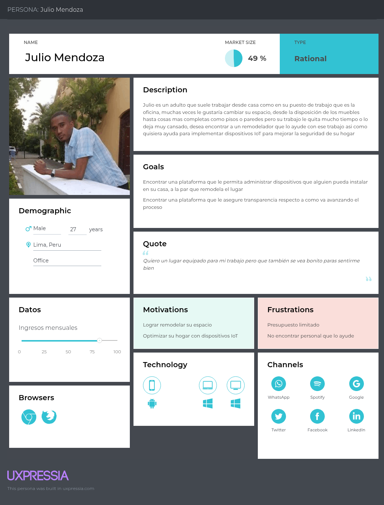

User Persona 2:

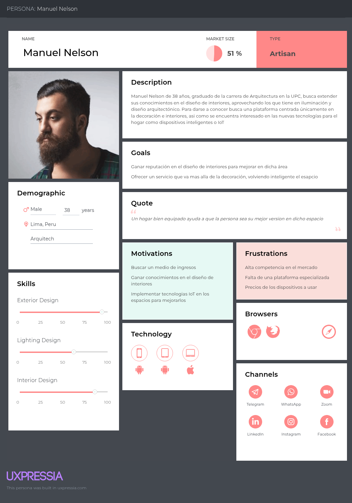

#### 2.3.2. User Task Matrix

|Task|Importancia (Julio Mendoza)|Frecuencia (Julio Mendoza)|Importancia (Manuel Nelson)|Frecuencia (Manuel Nelson)|
|--|----|---|----|---|
|Verificar la publicacion del espacio|Alta|Constante|Alta|Diaria|
|Verificar el avance del espacio|Alta|Semanal|Alta|Semanal|
|Actualizar el estado o avance del espacio|Alta|Ocasional|Media|Semanal|
|Administrar pagos por el servicio|Alta|Constante|Alta|Constante|
|Acordar condiciones del espacio|Media|Constante|Alta|Constante|
|Evaluar el precio de los muebles y procesos|Alta|Constante|Alta|Constante|
|Cotizar precio de objetos IoT|Media|Constante|Alta|Semanal|
|Demostrar el estado del espacio finalizado|Alta|Mensual|Media|Semanal|


#### 2.3.3. User Journey Map

User Journey Map Segmento objetivo 1:

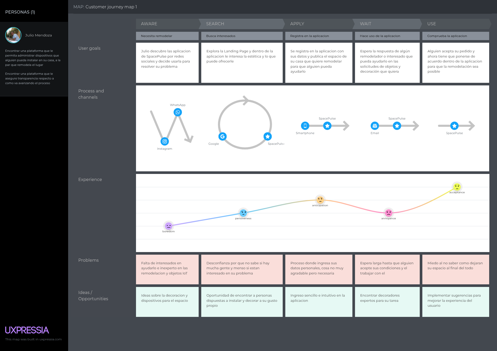

User Journey Map Segmento objetivo 2:

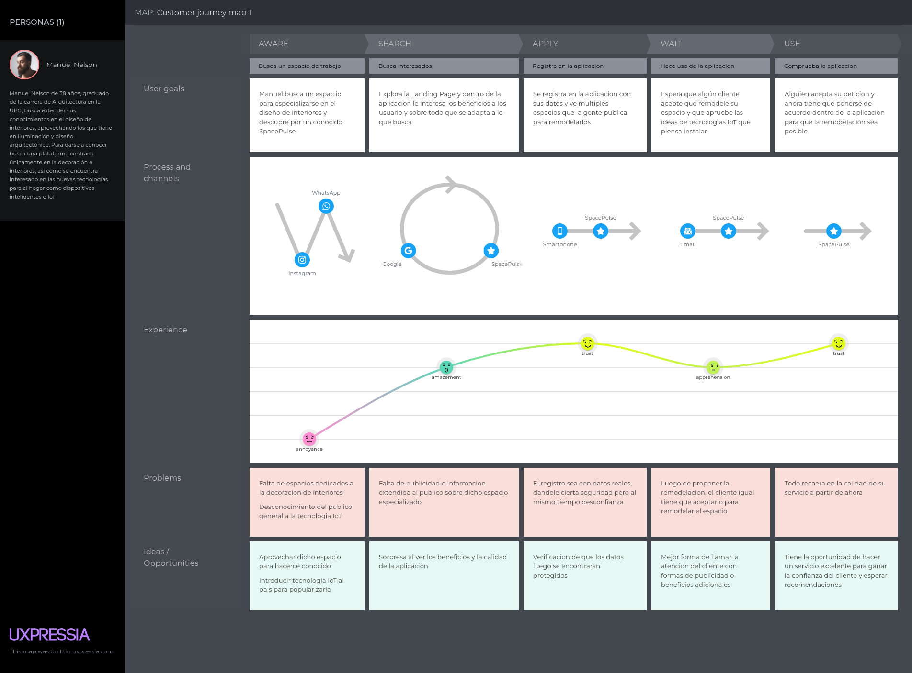

#### 2.3.4. Empathy Mapping

Empathy Map Segmento Objetivo 1:

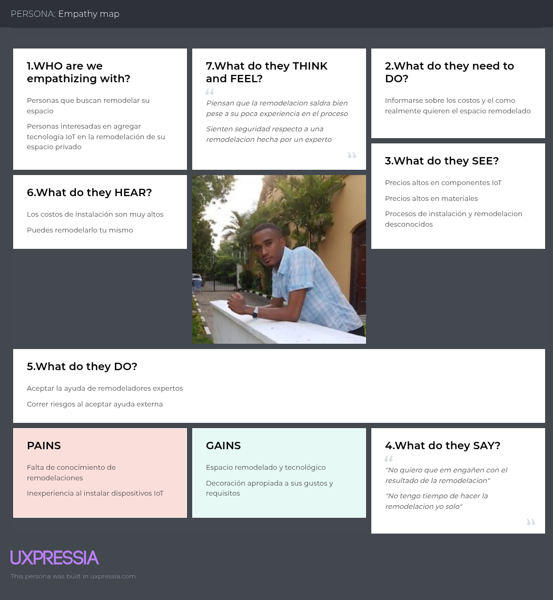

Empathy Map Segmento Objetivo 2:

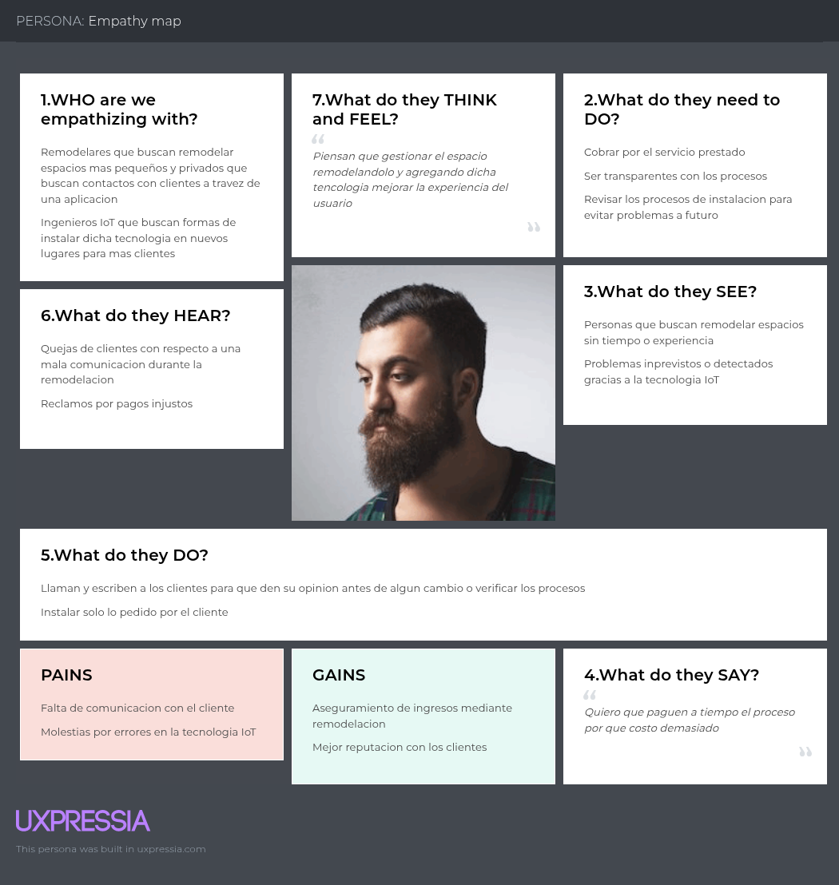

#### 2.3.5. Big Event Storming

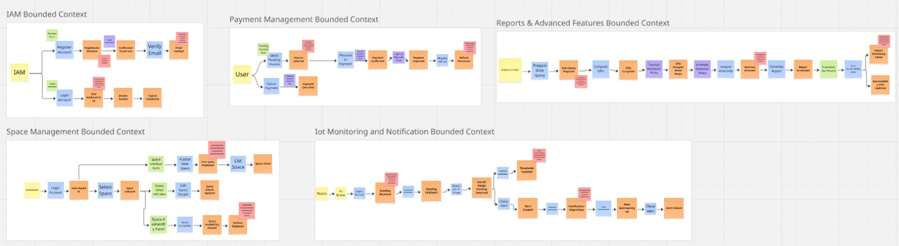

#### 2.3.6. Ubiquitous Language

|Termino|Definicion|
|-------|----------|
|Cliente|Persona que busa publicar su espacio para una remodelacion|
|Espacio|Lugar demilitado por paredes o espacio legal, ya sea cuarto, pasillo, o zona de la casa a remodelar|
|Propiedad|Activo Fisico y tangible donde se encuentra el espacio|
|Contrato|Acuerdo documentado que formaliza la alianza de trabajo y el pago del cliente|
|Cotizacion|Forma de asignar el valor monetario en comparacion a lo que se pide|
|Procesos|Trabajos que se hacen de forma tangible en el espacio, ejemplo (Cambio de suelos, remodelado de paredes, creacion de enchufes)|
|Pago|egistro de dinero entregado o recibido, ya sea para trabajos o instalaciones.|
|Incidencia|Problema o desperfecto reportado durante el uso o remodelación del espacio|
|Dispositivos IoT|Dispositivos especializados en conectarse mediante coneccion Wi-fi para su control desde celulares|

### 2.4. Requirements Specification

#### 2.4.1. User Stories

En esta seccion detallaremos la existencia, escenarios y diferentes historias de usuarios o 
User Stories que usaremos a lo largo del proyecto, para mejor orden se iniciara con la creacion de 
Epicas para poder agrupar a todas las historias de usuario en categorias para su posterior
cumplimiento

|Epic ID | Titulo | Descripción|
|--------|--------|------------|
|EP01    | Landing Page | Como usuario de SpacePulse quiero navegar por una Landing Page con una experiencia de usuario fluida y agil, para verificar y experimentar sus funcionalidades y el acceso a la informacion util del producto.
|EP02    |Gestion de usuarios|Como usuario de SpacePulse, quiero crear un perfil, modificarlo, abrir y cerrar sension en cualquier dispositivo y recuperar la contraseña de mi cuenta para crear mi identidad dentro de la aplicacion y acceder a sus funcionalidades.
|EP03    |Gestion de espacios| Como usuario de SpacePulse, quier crear, eliminar y editar espacios para tener un control de su remodelacion en tiempo real y actualizado usando las funcionalidades de SpacePulse.|
|EP04    |Funcionalidades Avanzadas de Cliente|Como usuario de SpacePulse, quiero acceder a funcionalidades apegadas a mi rol como usuario para saber que herramientas poseo para la remodelacion de mi espacio|
|EP05    |Monitoreo de Remodelaciones| Como usuario de SpacePulse, quiero analizar y evaluar el proceso de mi espacio para su control durante el proceso de remodelacion|
|EP06    |Funcionalidades Avanzadas| Como usuario de SpacePulse, quiero ver las funcionalidades y acceder a ellas en todo momento para mejorar el flujo de la aplicacion y optimizarlo|
|EP07    |Seguridad de informacion| Como administrador de SpacePulse, quiero gestionar y cuidar el perfil de mis usuario, para asegurar su estadia dentro de la aplicacion y no sientan un riesgo de sus datos al navegar dentro de ella.|
|EP08    | Accesibilidad|Como usuario de SpacePulse, quiero funcionalidades que ayuden a que la aplicacion sea mas accesible en aspectos como color, configuracion y optimizacion para no tener problemas durante su uso.

Una vez concluidas las epicas, ahora podemos proceder a encapsular las multiples historias de usuario que poseemos para definir los requerimientos de nuestra aplicacion y saber como desarrollarla correctamente

| Epic / Story ID | Titulo | Descripción | Criterios de Aceptación | Epic ID | 
|-----------------|--------|-------------|-------------------------|--------------------------|
|Landing Page / US01|Visualizacion de Landing Page|Como usuario de SpacePulse, quiero acceder a una Landing Page informativa para ver los beneficios y lo que ofrece la aplicacion | Dado que el usuario accede a la web pública<br> Cuando abre la sección de servicios <br> Entonces el sistema muestra los servicios que ofrece. |EP01|
|Landing Page / US02| Acceso a la aplicacion | Como usuario de SpacePulse, quiero acceder a la aplicacion desde la Landing Page para acceder a la aplicacion desde otros medios|  Dado que el usuario accede a la Landing Page <br> Cuando acceda al boton "Ingresar" <br> Entonces sera redirigido a la aplicacion | EP01|
|Gestion de Usuarios / US03| Registro de Usuarios | Como usuario de SpacePulse, quiero crear una cuenta para acceder a la aplicacion|Dado que el usuario accede a la aplicacion <br> Cuando llene el formulario con su informacion personal <br> Y los datos sean permitidos <br> Entonces la aplicacion creara una cuenta para el usuario | EP02|
| Gestion de Usuarios / US04 | Inicio de Sesion | Como usuario de SpacePulse, quiero iniciar sesion con mis datos personales para acceder a la aplicacion con una cuenta personalizada para mi | Escenario 1: <br> Dado que el usuario esta en la ventana de "Iniciar Sesion" <br> Cuando llene el formulario de inicio de sesion <br> Y los datos sean correctos <br> Entonces acceder con el inicio de sesion <br> <br> Escenario 2: <br> Dado que el usuario esta en la ventana de "Iniciar Sesion" <br> Cuando llene el formulario de inicio de sesion <br> Y los datos sean incorrectos <br> Entonces no podra acceder al inicio de sesion | EP02|
Gestion de Usuarios / US05 | Recuperar Contraseña | Como usuario de SpacePulse, quiero recuperar la contraseña de mi cuenta, para recuperar el acceso a mi cuenta en caso se me olvide | Dado el usuario no recuerde la contraseña de su cuenta <br> Cuando el usuario presione el boton de "Recuperar contraseña" <br> Entonces el sistema iniciaria el proceso para recuperar o reemplazar su anterior contraseña | EP02|
|Gestion de Usuarios/ US06| Editar Perfil | Como usuario de SpacePulse, quiero editar mi perfil en ciertos aspectos para mayor personalizacion de mi cuenta |Escenario 1: <br> Dado el usuario esta en al seccion "Mi Perfil" <br> Cuando el usuario presione el boton "Editar Perfil" <br> Entonces el sistema iniciara el formulario de datos editables del perfil de usuario <br><br> Escenario 2: Edicion de Perfil <br> Dado que el usuario esta en el formulario de editar perfil <br> Cuando el usuario modifique los datos que desee <br> Entonces el sistema lo actualizara y su perfil mostrara los nuevos datos | EP02|
| Gestion de Usuarios / US07 | Seleccion de Roles | Como usuario de Space Pulse, quiero seleccionar el rol que sere para acceder a las funcionalidades de dicho rol para evitar problemas a futuro | Dado que el usuario esta creando su cuenta <br> Cuando vea la opcion de seleccionar rol <br> Entonces podra seleccionar si es dueño o remodelador | EP02|
|Gestion de espacios / US08 | Creación de Espacio |Como cliente, quiero crear un espacio para que sea publico y se pueda remodelar mas adelante |Dado que el cliente se encuentra en la sección "Mis Espacios", Cuando llena el formulario con los detalles del inmueble (dimensiones, fotos, tipo) y presiona "Guardar", Entonces el sistema registra el espacio y lo marca como disponible para recibir propuestas de remodelación. | EP03|
|Funcionalidades Avanzadas / US09 | Recibir notificaciones IoT |Como cliente, quiero recibir notificacion de los dispositivos IoT instalados para mantener controlado mi espacio | Dado que los dispositivos IoT están activos en el local, Cuando un sensor registra una métrica fuera de los parámetros normales (ej. temperatura elevada), Entonces el sistema envía inmediatamente una notificación push al celular del cliente indicando la anomalía|EP06 |
|Monitoreo de Remodelaciones / US10 | Reportes de remodelación |Como cliente, quiero pedir reportes que desmuestren como va avanzando la remodelacion del espacio para mantenerme informado |Dado que el cliente ingresa a su proyecto en ejecución, Cuando presiona el botón "Generar Reporte de Avance", Entonces el sistema recopila las tareas completadas y genera un documento descargable con el progreso porcentual de la obra. | EP05|
|Gestion de espacios / US11 | Subir espacio para edicion |Como cliente, quiero subir los diferentes espacios que este por pedir remodelar para asi tener multiples remodeladores | Dado que el cliente tiene un espacio guardado en su cuenta, Cuando selecciona la opción "Publicar para cotización", Entonces el espacio se vuelve visible en el directorio público para que los contratistas puedan revisarlo y enviar sus propuestas.| EP03|
|Seguridad de informacion / US12 | Seguridad de datos |Como administrador, quiero proteger los multiples datos ingresados para mantener una fidelidad de los clientes | Dado que un usuario registra información personal o de pagos en la plataforma, Cuando la información se envía al servidor, Entonces el sistema aplica protocolos de encriptación antes de almacenarla en la base de datos para prevenir accesos no autorizados.|EP07 |
|Monitoreo de Remodelaciones / US13 | Historial de proyectos | Como cliente, quiero ver un registro histórico de todas mis remodelaciones y equipos IoT instalados, para auditar los cambios realizados en mi propiedad a lo largo del tiempo |Dado que el cliente tiene proyectos finalizados, Cuando accede a la pestaña "Historial", Entonces el sistema lista los proyectos ordenados por fecha con sus métricas finales. |EP05 |
|Funcionalidades Avanzadas de Cliente / US14 | Dejar opiniones |Como cliente, quiero dejar una reseña sobre el servicio del contratista y la calidad de la instalación IoT, para ayudar a otros propietarios a tomar decisiones informadas |Dado que un proyecto cambia a estado "Entregado", Cuando el cliente completa el formulario de estrellas y texto, Entonces el sistema publica la reseña en el perfil del contratista. |EP04 |
|Funcionalidades Avanzadas / US15 | Alertas de seguridad |Como propietario, quiero recibir notificaciones inmediatas si los sensores IoT detectan una intrusión o movimiento inusual fuera de horario en mi local, para contactar a las autoridades rápidamente |Dado que el local está fuera del horario comercial, Cuando el sensor de movimiento detecta actividad, Entonces el sistema envía una alerta Push y un correo al propietario |EP06 |
|Gestion de espacios / US16 | Seguimiento en tiempo real |Como cliente, quiero monitorear el avance de la remodelación en tiempo real a través del panel de control, para conocer el progreso sin necesidad de visitar físicamente la obra |Dado que el remodelador marca una tarea como completada, Cuando el cliente abre su panel, Entonces la barra de progreso general aumenta su porcentaje automáticamente. | EP03|
|Funcionalidades Avanzadas / US17 | Comparación de presupuestos |Como cliente, quiero comparar múltiples cotizaciones de diferentes proveedores para la misma remodelación, para evaluar fácilmente costos, tiempos e inclusiones tecnológicas |Dado que el cliente encuentra la mejor opción, Cuando hace clic en "Aceptar cotización", Entonces el sistema notifica al proveedor y rechaza automáticamente las demás. |EP06 |
|Monitoreo de Remodelaciones / US18 | Gestión de pagos |Como cliente, quiero  realizar y administrar los pagos de la remodelación por hitos dentro de la plataforma, para mantener un control financiero seguro y centralizado de la obra | Escenario 1: Dado que un hito de obra ha sido validado, Cuando el cliente procesa el pago con su tarjeta, Entonces el sistema cambia el estado de la factura a "Pagado" y libera los fondos. <br><br> Escenario 2: Dado que una transacción es rechazada por el banco, Cuando ocurre el fallo, Entonces el sistema mantiene el hito como "Pendiente" y notifica al usuario del error.|EP05 |
|Funcionalidades Avanzadas / US19 | Recordatorios de pago |Como cliente, quiero recibir recordatorios automáticos de los próximos pagos de la remodelación, para evitar penalizaciones por retraso o paralizaciones de la obra |Dado que faltan 3 días para el vencimiento de una cuota, Cuando el sistema ejecuta el cron diario, Entonces envía un correo recordatorio al cliente con el enlace de pago. |EP06 |
|Funcionalidades Avanzadas de Cliente / US20 | Registro de incidencias |Como cliente, quiero reportar problemas detectados en la obra o fallas en los sensores IoT, para que el equipo técnico los atienda en el menor tiempo posible |Dado que se detecta una tubería rota, Cuando el supervisor sube una foto y descripción, Entonces el sistema crea un ticket urgente y notifica al dueño del espacio. | EP04|
|Funcionalidades Avanzadas de Cliente / US21 | Confirmación de entrega de materiales | Como remodelador, quiero confirmar la recepción de los materiales y dispositivos IoT en el local, para mantener la trazabilidad del inventario y autorizar los pagos a proveedores| Dado que llega un envío de sensores, Cuando el encargado marca el pedido como "Recibido", Entonces el sistema actualiza el inventario del proyecto y notifica a contabilidad.|EP04 |
|Funcionalidades Avanzadas / US22 | Descarga de reportes |Como cliente, quiero descargar reportes en PDF sobre el avance físico de la obra y el rendimiento de los dispositivos IoT, para presentarlos en reuniones de directorio o registros contables |Dado que un reporte mensual ha sido generado, Cuando el cliente presiona "Descargar PDF", Entonces el navegador descarga un archivo formateado con la gráfica de avance y consumos. |EP06 |
|Funcionalidades Avanzadas / US23 | Panel de control de dispositivos IoT |Como cliente, quiero visualizar el estado, la batería y la conectividad de todos mis dispositivos IoT instalados en un único dashboard, para asegurar que la red de monitoreo funcione correctamente |Dado que todos los sensores están operativos, Cuando el usuario entra al panel, Entonces se muestran indicadores en verde con la última fecha de sincronización. |EP06 |
|Gestion de espacios / US24 | Sugerencias de mejoras |Como cliente, quiero que el sistema analice los datos de mis sensores ambientales y me ofrezca sugerencias de remodelación automáticas, para optimizar el consumo de energía y agua del local | Dado que el usuario usa la aplicacion, Cuando entre en l area de Sugerencias de la aplicacion, Entonces podra dejar una opinion para que el equipo de SpacePulse la escuche| EP03|
|Funcionalidades Avanzadas de Cliente /  US25 | Calificación del servicio |Como cliente, quiero evaluar el trabajo general de la remodelación una vez concluida, para proveer retroalimentación sobre la calidad, la limpieza y la puntualidad del contratista | Dado que el proyecto cambia a estado "Finalizado", Cuando el usuario ingresa a la plataforma, Entonces aparece un modal emergente solicitando calificar el servicio del 1 al 5.|EP04 |
|Seguridad de informacion / US26 | Control de acceso de usuarios (RBAC) | Como administrador, quiero gestionar permisos por rol para controlar accesos.|Dado que el usuario edita un perfil, Cuando intente cambiar su rol de usuario, Entonces el sistema evitara que se haga dicho cambio de rol. |EP07 |
|Funcionalidades Avanzadas / US27 | Configuración de notificaciones | Como usuario, quiero personalizar el tipo de notificaciones que voy a recibir tanto por dispositivos IoT como por procesos de la aplicacion para mantener mi espacio de notificaciones ordenado|Dado que el usuario guarda sus preferencias, Cuando inicia sesión en un dispositivo, Entonces el sistema permitira configurar la llegada de notificaciones al dispositivo |EP06 |
|Accesibilidad / US28 | Multilenguaje |Como usuario internacional, quiero cambiar el idioma de la plataforma (ej. español a inglés), para comprender con claridad los manuales de los dispositivos IoT y los contratos de remodelación |Dado que el usuario selecciona "Inglés" en el selector superior, Cuando la página recarga, Entonces todos los menús, botones y alertas se muestran traducidos correctamente. |EP08 |
|Funcionalidades Avanzadas / US29 | Filtrado de proyectos | Como usuario con multiples espacios, quiero filtrar mi lista de locales en remodelación por estado, distrito o contratista, para ubicar rápidamente la obra que necesito revisar.|Dado que el usuario tiene 10 propiedades, Cuando aplica el filtro "En ejecución", Entonces la tabla oculta las obras terminadas y solo muestra las activas. |EP06 |
|Monitoreo de Remodelaciones / US30 | Conexion con dispositivos IoT|Como remodelador, quiero registrar y emparejar un nuevo sensor inteligente a la cuenta de la propiedad, para integrarlo a la red y que empiece a reportar datos de telemetría |Dado que el técnico ingresa el MAC Address del nuevo sensor, Cuando presiona "Vincular", Entonces el backend valida la autenticidad y lo asocia al proyecto de monitoreo. |EP05 |
|Funcionalidades Avanzadas / US31 | Reportes personalizados |Como remodelador , quiero construir gráficos combinando diferentes métricas (ej. costo de obra vs. reducción de consumo eléctrico post-IoT), para analizar el ROI exacto |Dado que el usuario selecciona las variables "Gasto" y "Energía", Cuando presiona "Generar Gráfico", Entonces el sistema renderiza un reporte comparativo cruzando ambos datos. |EP06 |
|Accesibilidad / US32 | Carga de fotos de avance |Como remodelador, quiero poder tomar fotos con mi celular y subirlas directamente, para mantener un registro visual que el cliente pueda auditar |Dado que el contratista termina de pintar, Cuando selecciona "Subir Evidencia" desde su móvil, Entonces la cámara se activa, captura la foto y la adjunta al hito correspondiente. |EP08 |
|Funcionalidades Avanzadas / US33 | Chat en tiempo real | Como cliente, quiero comunicarme de forma directa y fluida mediante un chat interno con el supervisor del proyecto, para resolver dudas rápidas sin necesidad de usar WhatsApp o correos|Dado que el cliente envía un mensaje, Cuando el supervisor lo recibe, Entonces aparece una burbuja de notificación en su panel y el mensaje se añade al historial del proyecto. |EP06 |
|Funcionalidades Avanzadas / US34 | Integración con facturación electrónica |Como usuario, quiero que la plataforma genere automáticamente una factura electrónica (XML/PDF) con validez fiscal peruana por cada pago realizado, para simplificar mi declaración de impuestos |Dado que un pago por S/ 5000 es confirmado, Cuando el sistema se comunica con la API de facturación (SUNAT/OSE), Entonces emite la boleta/factura y se la envía al correo del cliente.|EP06 |
|Gestion de Usuarios / US35 | Roles de usuario |Como administrador, quiero poder crear, editar y eliminar los permisos asociados a cada rol de usuario (Remodelador, cliente), para mantener la arquitectura de seguridad del sistema | Dado que el administrador edita el rol "Remodelador", Cuando le quita el permiso de "Editar Pagos", Entonces todos los usuarios con ese rol pierden inmediatamente esa capacidad.|EP02 |
|Funcionalidades Avanzadas / US36 | API para integración externa |Como empresa, quiere exponer acceso a una API de datos IoT para integrar con otros sistemas. |Dado que la empresa utiliza un token JWT válido, Cuando realiza un GET al endpoint de lecturas, Entonces el sistema retorna un JSON con los datos de temperatura y consumo de sus locales. |EP06 |
|Accesibilidad / US37 | Modo oscuro | Como usuario, quiero  activar el modo oscuro en la interfaz, para reducir el brillo y la fatiga visual al revisar planos o alertas nocturnas|Dado que el usuario selecciona el ícono de la luna, Cuando se actualiza el tema, Entonces los fondos cambian a tonos oscuros y los textos a colores claros automáticamente. |EP08 |
|Gestion de espacios / US38 | Visualización de espacios para remodelacion |Como cliente, quiero visualizar un catálogo con mis espacios y locales registrados (con metraje y distribución básica), para evaluar rápidamente a cuál le daré prioridad de remodelación |Dado que el usuario tiene 3 locales, Cuando accede al módulo de Espacios, Entonces ve tarjetas con la foto principal, dirección y metros cuadrados de cada uno. |EP03 |
|Gestion de espacios / US39 | Actualización de Espacio |Como propietario, quiero poder modificar los datos de mi espacio (ej. si amplié un ambiente o cambié la dirección legal), para mantener la información exacta antes de pedir una cotización |Dado que el usuario deja el campo de "Metraje" en blanco, Cuando intenta guardar, Entonces el sistema resalta el campo en rojo pidiendo que introduzca un valor numérico válido. |EP03 |
|Gestion de espacios / US40 | Eliminación de Espacio |Como propietario, quiero poder borrar o archivar del sistema un inmueble que concluyo su remodelacion, para que mi panel solo muestre mis activos actuales |Dado que un espacio no tiene deudas ni obras activas, Cuando el cliente selecciona "Eliminar", Entonces el sistema realiza un soft-delete ocultándolo del listado principal. |EP03 |
|Monitoreo de Remodelaciones / US41 | Creación de Pago |Como sistema de gestión, quiero generar automáticamente una orden de cobro al inicio de cada nueva etapa de la remodelación, para asegurar el flujo de caja del contratista |Dado que el proyecto avanza a la etapa 2, Cuando se dispara el evento de dominio, Entonces el sistema crea un nuevo Payment en estado "PENDING" y notifica al cliente. |EP05 |
|Monitoreo de Remodelaciones / US42 | Consulta de Pagos |Como usuario, quiero  buscar y listar todos los recibos y comprobantes de pago de un proyecto específico, para tener control del presupuesto y auditar las salidas de dinero. | Dado que un cliente quiere ver los pagos del mes, Cuando filtra en la tabla de pagos, Entonces el sistema devuelve solo los comprobantes de ese periodo con su estado respectivo.|EP05 |
|Funcionalidades Avanzadas / US43 | Procesamiento y Confirmación de Pagos |Como cliente, quiero iniciar el procesamiento de un pago pendiente y posteriormente confirmarlo, para garantizar que la transacción bancaria ha sido exitosa antes de habilitar el servicio o proyecto | Dado que un pago se encuentra en estado PENDING, Cuando el sistema procesa la solicitud de inicio, Entonces el estado del pago cambia a INITIATED y se notifica la aceptación del proceso.| EP06 |
|Funcionalidades Avanzadas / US44 | Cancelación y Reembolso de Pagos |Como cliente, quiero  cancelar pagos que no se hayan procesado o reembolsar pagos ya completados, para gestionar devoluciones, errores de cobro o cancelaciones de clientes cumpliendo las políticas de la empresa |Dado que existe un pago en estado PENDING o INITIATED, Cuando el administrador solicita la cancelación, Entonces el estado cambia a CANCELLED y se detiene cualquier intento de cobro. |EP06  |
|Funcionalidades Avanzadas / US45 | Registro de Proyecto de Monitoreo IoT | Como remodelador, quiero registrar un nuevo proyecto de monitoreo en la plataforma, para centralizar toda la configuración, alertas y dispositivos IoT que se instalarán en una propiedad específica.|Dado que el supervisor provee información válida y un nombre único, Cuando guarda el proyecto, Entonces el sistema crea el proyecto de monitoreo y devuelve el identificador generado. | EP06 |
|Monitoreo de Remodelaciones / US46 | Visualización de Detalles de Proyecto IoT |Como cliente, quiero consultar los detalles de configuración de un proyecto de monitoreo específico, para revisar los umbrales establecidos y el estado general de la instalación tecnológica |Dado que proporciono un ID de proyecto válido al que tengo acceso, Cuando realizo la consulta, Entonces el sistema muestra todos los detalles, configuraciones y reglas de monitoreo asociadas. | EP05|
|Monitoreo de Remodelaciones / US47 | Recepción Masiva de Datos de Sensores |Como cliente, quiero tener la capacidad de recibir y procesar grandes volúmenes de lecturas de los sensores IoT en lote, para mantener la información ambiental actualizada sin saturar el rendimiento de la aplicación |Dado que los dispositivos envían un paquete de lecturas con firmas y formatos correctos, Cuando el sistema las recibe, Entonces encola las lecturas para su procesamiento asíncrono y responde que han sido aceptadas. |EP05 |
|Monitoreo de Remodelaciones / US48 | Configuración de Tareas de Monitoreo Automático |Como cliente, quiero crear y programar tareas automáticas de revisión de datos, para que la plataforma analice periódicamente la telemetría y detecte anomalías sin intervención humana. |Dado que proporciono parámetros válidos (ej. periodicidad, tipo de tarea), Cuando guardo la tarea, Entonces queda registrada y activa para ejecutarse en el intervalo establecido. |EP05 |
|Funcionalidades Avanzadas / US49 | Auditoría de Tareas de Monitoreo |Como cliente, quiero consultar el estado y registro de ejecución de una tarea de monitoreo, para verificar si se ejecutó correctamente o si hubo fallos técnicos en el análisis de datos. |Dado que existe una tarea de monitoreo en ejecución, Cuando consulto sus detalles, Entonces el sistema muestra su configuración base, la última hora de ejecución y el resultado (éxito o fallo).|EP06  |
|Funcionalidades Avanzadas / US50 | Registro de Dispositivo IoT |Como remodelador, quiero vincular un nuevo dispositivo físico (sensor/cámara) al sistema asociándolo a un proyecto de monitoreo, para que la plataforma comience a registrar su actividad. | Dado que escaneo o ingreso el código único de un dispositivo válido, Cuando lo asocio a un proyecto activo, Entonces el dispositivo queda registrado y listo para transmitir. | EP06|
|Monitoreo de Remodelaciones / US51 | Consulta de Dispositivos por Proyecto |Como remodelador, quiero visualizar un listado de todos los dispositivos IoT instalados y agrupados por proyecto, para auditar el equipamiento tecnológico de la remodelación|Dado que el remodelador ingresa a los detalles de un proyecto específico, Cuando navega a la pestaña de "Dispositivos IoT", Entonces el sistema carga una lista completa de los sensores asociados a esa obra, mostrando su ID, tipo y estado actual de conexión. |EP05 |
|Monitoreo de Remodelaciones / US52 | Consulta de Incidentes por Proyecto |Como cliente, quiero ver una lista de todos los incidentes o anomalías detectadas en mi proyecto, para poder tomar decisiones correctivas o de mantenimiento |Dado que existen incidentes registrados (ej. fugas de agua, picos de voltaje), Cuando ingreso a la pestaña de incidentes del proyecto, Entonces puedo ver la lista ordenada por fecha y severidad. |EP05 |
|Monitoreo de Remodelaciones / US53 | Reconocimiento y Gestión de Incidentes |Como cliente, quiero poder marcar un incidente crítico como "reconocido" , para detener el envío de notificaciones repetitivas y avisar al resto del equipo que ya estoy atendiendo el problema. | Dado que existe una alerta activa sonando o enviando correos, Cuando marco el incidente como reconocido, Entonces el sistema actualiza su estado, silencia las notificaciones recurrentes y registra a qué usuario se le asignó.| EP05|
|Funcionalidades Avanzadas / US54 | Registro Histórico de Notificaciones |Como cliente, quiero tener acceso a un registro completo de todas las notificaciones emitidas por el sistema en mi proyecto, para revisar alertas pasadas que pude haber omitido. |Dado que recibí múltiples alertas durante la semana, Cuando entro al panel de notificaciones del proyecto, Entonces visualizo un historial paginado con fecha, tipo de notificación y mensaje detallado. |EP06 |

#### 2.4.2. Impact Mapping

Impact Mapping Segmento Objetivo 1:

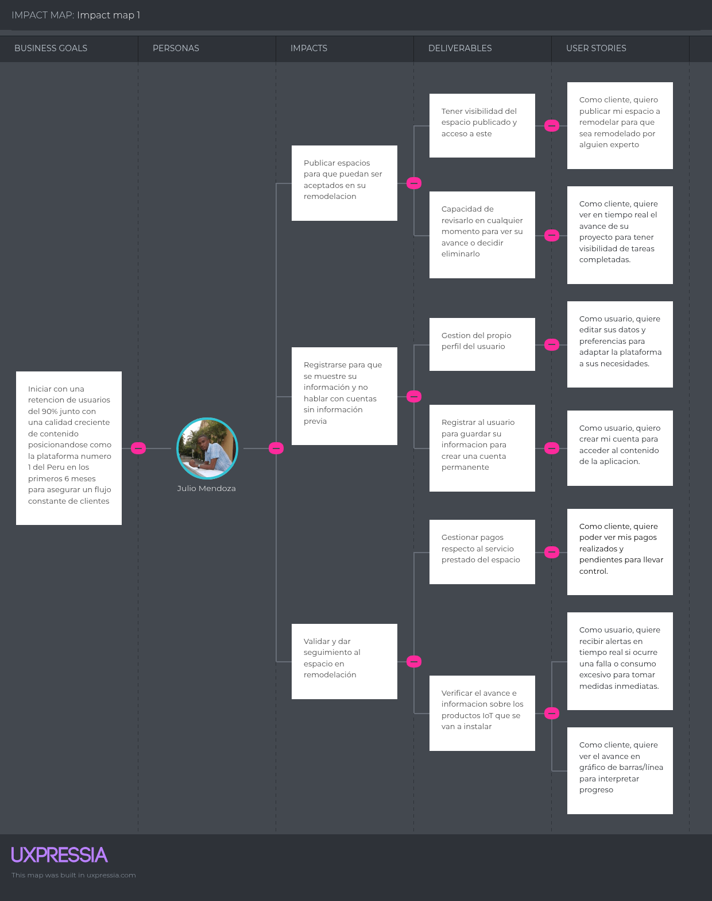

Impact Mapping Segmento Objetivo 2:

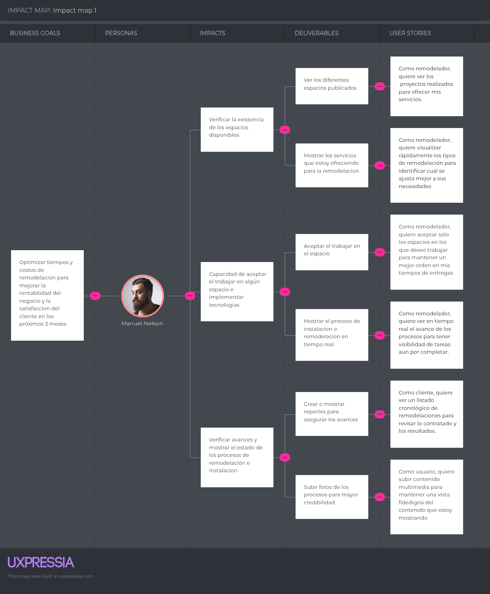

#### 2.4.3. Product Backlog

| # Order |User Story ID|Titulo|Story Points (1/2/3/5/8)|
|---------|-------------|------|------------------------|
|1|US01|Visualizacion de Landing Page|1|
|2|US02|Acceso a la aplicacion|1|
|3|US03|Registro de Usuarios|3|
|4|US04|Inicio de Sesion|2|
|5|US05|Recuperar Contraseña|3|
|6|US06|Editar Perfil|2|
|7|US07|Seleccion de Roles|1|
|8|US08|Creación de Espacio|3|
|9|US09|Recibir notificaciones IoT|5|
|10|US10|Reportes de remodelación|3|
|11|US11|Subir espacio para edicion|1|
|12|US12|Seguridad de datos|5|
|13|US13|Historial de proyectos|2|
|14|US14|Dejar opiniones|1|
|15|US15|Alertas de seguridad|2|
|16|US16|Seguimiento en tiempo real|3|
|17|US17|Comparación de presupuestos|2|
|18|US18|Gestión de pagos|3|
|19|US19|Recordatorios de pago|1|
|20|US20|Registro de incidencias|2|
|21|US21|Confirmación de entrega de materiales|2|
|22|US22|Descarga de reportes|3|
|23|US23|Panel de control de dispositivos IoT|3|
|24|US24|Sugerencias de mejoras|1|
|25|US25|Calificación del servicio|2|
|26|US26|Control de acceso de usuarios (RBAC)|2|
|27|US27|Configuración de notificaciones|2|
|28|US28|Multilenguaje|2|
|29|US29|Filtrado de proyectos|2|
|30|US30|Conexion con dispositivos IoT|3|
|31|US31|Reportes personalizados|3|
|32|US32|Carga de fotos de avance|2|
|33|US33|Chat en tiempo real|3|
|34|US34|Integración con facturación electrónica|5|
|35|US35|Roles de usuario|2|
|36|US36|API para integración externa|2|
|37|US37|Modo oscuro|1|
|38|US38|Visualización de espacios para remodelacion|3|
|39|US39|Actualización de Espacio|2|
|40|US40|Eliminación de Espacio|2|
|41|US41|Creación de Pago|2|
|42|US42|Consulta de Pagos|2|
|43|US43|Procesamiento y Confirmación de Pagos|3|
|44|US44|Cancelación y Reembolso de Pagos|2|
|45|US45|Registro de Proyecto de Monitoreo IoT|3|
|46|US46|Visualización de Detalles de Proyecto IoT|5|
|47|US47|Recepción Masiva de Datos de Sensores|3|
|48|US48|Configuración de Tareas de Monitoreo Automático|5|
|49|US49|Auditoría de Tareas de Monitoreo|2|
|50|US50|Registro de Dispositivo IoT|3|
|51|US51|Consulta de Dispositivos por Proyecto|5|
|52|US52|Consulta de Incidentes por Proyecto|5|
|53|US53|Reconocimiento y Gestión de Incidentes|5|
|54|US54|Registro Histórico de Notificaciones|3|

### 2.5. Strategic-Level Domain-Driven Design

Esta sección describe cómo el diseño orientado al dominio (DDD) guio la arquitectura estratégica de nuestra solución. Nos enfocamos en segmentar el sistema en contextos delimitados (Bounded Contexts) para mejorar la organización del desarrollo. Mediante el uso de Event Storming y Bounded Context Canvases, definimos con precisión el alcance y las interacciones de cada componente. Como resultado, logramos una estructura de software totalmente alineada con las necesidades reales del negocio.

#### 2.5.1. EventStorming
El proceso de modelado comenzó con una fase de descubrimiento deliberado mediante una dinámica de lluvia de ideas. Durante esta actividad, se utilizaron notas adhesivas de color naranja para representar los Domain Events (eventos de dominio). Estos elementos son fundamentales, ya que capturan hechos significativos que ocurren dentro del sistema y reflejan cambios de estado críticos para el negocio. Esta identificación visual permitió al equipo mapear la cronología de los procesos e identificar los puntos de interacción más relevantes de la aplicación.


##### 2.5.1.1. Candidate Context Discovery
Esta sección describe la dinámica de los procesos de negocio mediante el flujo de eventos. Al identificar los pivotal events, logramos detectar los puntos de cambio donde una responsabilidad termina y otra comienza, lo que resulta fundamental para la creación de los Bounded Contexts. Esta delimitación estratégica permite estructurar el dominio de forma coherente, facilitando el desarrollo modular y permitiendo que el software escale de manera ordenada según las necesidades de la organización.

### Identity & Access Management BC


### Payment Management BC


### Reports & Advanced Features BC


### Space Management BC


### Reports & Advanced Features BC

<br>

A partir de esto, fuimos agrupando aquellos que tenían vínculos más cercanos y separamos los que apenas interactuaban, marcando así límites de consistencia más claros.

### 2.5.1.2. Domain Message Flows Modeling

Posteriormente, se procedió a definir la interconexión estratégica de los bounded contexts delimitados en las fases previas. Este proceso se centró en la identificación y mapeo de eventos de dominio clave, los cuales actúan como el tejido conectivo de la arquitectura distribuida. Al establecer estos puntos de enlace, se garantizó una comunicación asíncrona y desacoplada, permitiendo que el flujo de información entre contextos sea fluido, coherente y respete las reglas de negocio de cada área.

## IAM (Identity and Access Management) - El Punto de Entrada --> Space Management (Gestión de Equipos) - La Configuración


## Space Management (Gestión de Equipos) - La Configuración --> Payment Management - La Activación del Servicio


## Payment Management - La Activación del Servicio --> IoT Monitoring and Notifications - El Core Operativo


## IoT Monitoring and Notifications - El Core Operativo --> Reports and Advanced Features - La Inteligencia de Negocio


 ### 2.5.1.3. Bounded Context Canvases

La separación en bounded contexts permite reducir la complejidad, facilitar la escalabilidad y mantener la coherencia del modelo, garantizando que cada parte del sistema responda a objetivos específicos sin generar dependencias innecesarias.

En SpacePulse, los bounded contexts identificados fueron los siguientes:

Registro y Autenticación de Usuario (IAM): Encargado de la validación de identidades de propietarios y técnicos, garantizando el acceso seguro a la infraestructura de remodelación e IoT privada.

Gestión de Espacios (Space Management): Núcleo operativo que organiza la infraestructura física y digital de los espacios, permitiendo definir layouts, gestionar el inventario y vincular dispositivos inteligentes.

Monitoreo y Notificaciones IoT: Responsable de procesar la telemetría de los sensores en tiempo real, identificar anomalías técnicas mediante la detección de incidentes y distribuir alertas automáticas ante eventos relevantes .

Gestión de Pagos (Payment Management): Especializado en el ciclo de vida financiero de las transacciones de remodelación, incluyendo el procesamiento de cobros, reembolsos y la emisión de facturas legales.

Informes y Funciones Avanzadas (Reports): Orientado al procesamiento de datos operativos y financieros para generar métricas de eficiencia, informes de sostenibilidad y tableros de control ejecutivo.

Cada uno de estos bounded contexts se detalla a continuación a través de su canvas, explicando su descripción, clasificación estratégica, roles, comunicaciones entrantes y salientes, lenguaje ubicuo y decisiones de negocio clave.

### Identity & Access Management BC


### Space Management BC


### Iot Monitoring and Notification BC


### Payment Management BC


### Reports & Advanced Features BC


### 2.5.2 Context Mapping
El Context Mapping de SpacePulse permite representar la organización general del dominio del sistema y la manera en que sus distintas partes se relacionan entre sí. Esta vista ayuda a delimitar responsabilidades, reducir el acoplamiento y entender con mayor claridad cómo se distribuyen los procesos principales de la solución.
Se identificaron los siguientes bounded context en el sistema:

**Identity & Access Management**

Se encarga del registro, autenticación y control de acceso de los usuarios. Su función principal es permitir que el usuario cree su cuenta, inicie sesión y acceda al sistema de forma segura según su rol. A partir de este contexto se habilita el ingreso a las demás funcionalidades de la plataforma. 

**Space Management**

Se encarga de la gestión de espacios dentro de la plataforma. Aquí se registran, publican, actualizan y administran los espacios que formarán parte del flujo principal del negocio. También concentra la lógica base sobre la cual se conectan los procesos de remodelación, monitoreo y contratación de servicios. 

**Payment Management**

Administra los pagos, cobros, suscripciones y comprobantes relacionados con los servicios contratados en SpacePulse. Su función es controlar la parte financiera del sistema y dar trazabilidad a las operaciones económicas asociadas a remodelaciones o servicios del espacio. 

**IoT Monitoring & Notifications**

Se encarga del monitoreo de lecturas, detección de incidentes y envío de notificaciones. Su objetivo es registrar eventos relacionados con el espacio o con el proceso de remodelación, identificar anomalías y comunicar alertas a los usuarios cuando sea necesario. 

**Reports & Advanced Features**

Se encarga de la generación de reportes, métricas e información analítica. Su función es tomar datos producidos por otros contextos y transformarlos en información útil para seguimiento, supervisión y apoyo a la toma de decisiones.

|Destino |Origen |Tipo de relación |Comentario |
|-------|----------|-------------|------------|
|Space Management |Identity & Access Management |Shared Kernel |La gestión de espacios requiere que el usuario esté autenticado y tenga un rol válido dentro del sistema. Por ello, ambos contextos comparten una base mínima de identidad sin mezclar sus responsabilidades. |
|Payment Management |Space Management |Customer/Supplier |Payment Management necesita información generada en Space Management, como espacios, servicios contratados o remodelaciones asociadas, para procesar los cobros y pagos del sistema. |
|IoT Monitoring & Notifications |Space Management |Customer/Supplier |El monitoreo y las notificaciones dependen de un espacio previamente registrado en la plataforma. Por eso, Space Management provee la base del espacio y IoT Monitoring & Notifications usa esa información para gestionar lecturas, alertas e incidentes. |
|Reports & Advanced Features |Payment Management |Conformist |Reports & Advanced Features consume la información financiera generada por Payment Management para construir reportes e indicadores sin modificar el modelo original. |
|Reports & Advanced Features |IoT Monitoring & Notifications |Conformist |Reports & Advanced Features también consume la información producida por IoT Monitoring & Notifications, como alertas, incidentes o eventos, para generar análisis y vistas de seguimiento. |

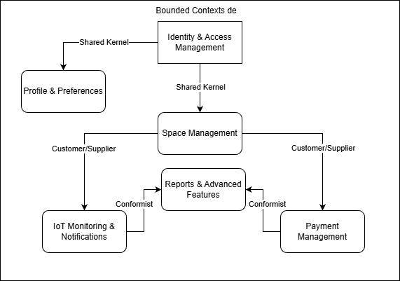

### Identity & Access Management BC


### Payment Management BC


### Iot Monitoring and Notification


### Space Management BC


### Reports & Advanced Features BC


### 2.5.3 Software Architecture
La arquitectura de software de SpacePulse ha sido planteada para soportar los procesos principales del negocio de forma organizada y desacoplada. La solución parte de una aplicación móvil desde la cual los usuarios interactúan con la plataforma para gestionar espacios, contratar servicios de remodelación, monitorear el avance del proyecto, recibir alertas y consultar reportes. Para responder a estas necesidades, el sistema se apoya en un backend centralizado que concentra la lógica del negocio y coordina la interacción con los distintos módulos funcionales, como autenticación, gestión de espacios, pagos, monitoreo IoT, notificaciones y reportes. Además, la arquitectura contempla la integración con servicios externos necesarios para el procesamiento de pagos, la generación de comprobantes electrónicos, el envío de correos y la recepción de lecturas o eventos provenientes del entorno monitoreado. Esta organización permite que la solución mantenga una estructura clara, facilite la evolución de sus funcionalidades y soporte de manera consistente el flujo principal de SpacePulse.

#### 2.5.3.1. Software Architecture Context Level Diagram
El diagrama de contexto de SpacePulse muestra la solución como un sistema central que se relaciona directamente con sus actores principales y con los servicios externos requeridos para su funcionamiento. En este caso, los usuarios que interactúan con la plataforma son el Owner, quien administra espacios, contrata remodelaciones, realiza pagos y supervisa el progreso, y el Remodeler, quien actualiza avances, registra procesos y da seguimiento al trabajo realizado. A su vez, el sistema se conecta con un Payment Gateway para procesar transacciones, con un E-Invoicing Service para generar comprobantes electrónicos, con un Email Service para enviar correos de verificación y notificaciones, y con IoT Devices / IoT Broker para recibir lecturas, eventos e información operativa del espacio monitoreado. De esta manera, el diagrama permite identificar de forma clara el alcance de SpacePulse dentro del ecosistema general de la solución y su relación con los elementos externos que complementan el servicio.

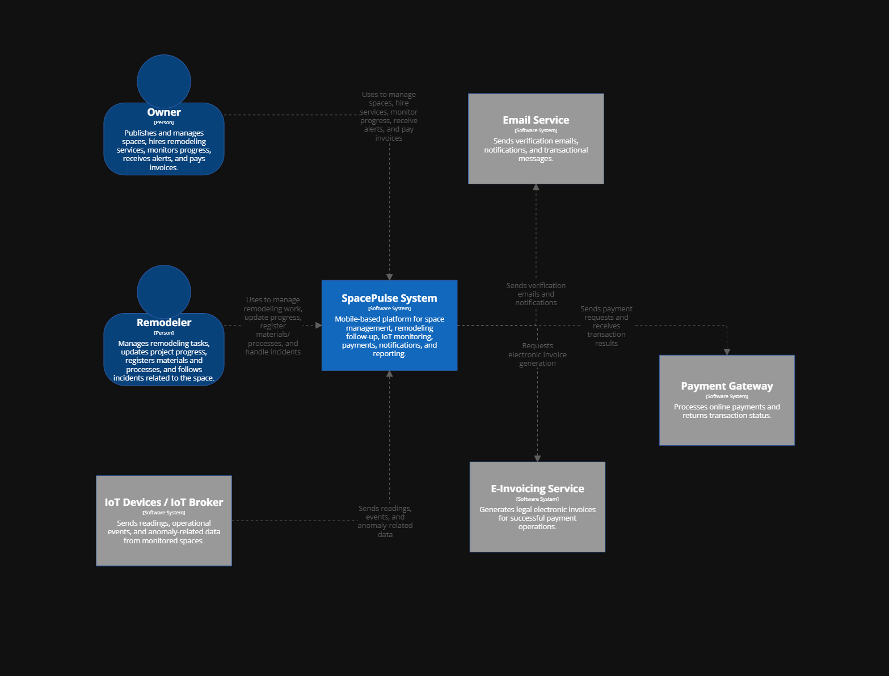

#### 2.5.3.2 Software Architecture Container Level Diagrams
En el nivel de contenedores se desglosan los principales componentes internos de SpacePulse, mostrando cómo se organiza el sistema a nivel tecnológico. Aquí se incluyen la Mobile App, la Landing Page, el API Gateway como punto central de comunicación, los distintos servicios internos que representan la lógica principal de la plataforma y una base de datos relacional común. Además, se consideran las integraciones con servicios externos para pagos, facturación electrónica, envío de correos y recepción de datos de monitoreo IoT. Cada uno de estos contenedores cumple una función específica y se relaciona con los demás para permitir el funcionamiento integrado de la solución. integraciones externas. 

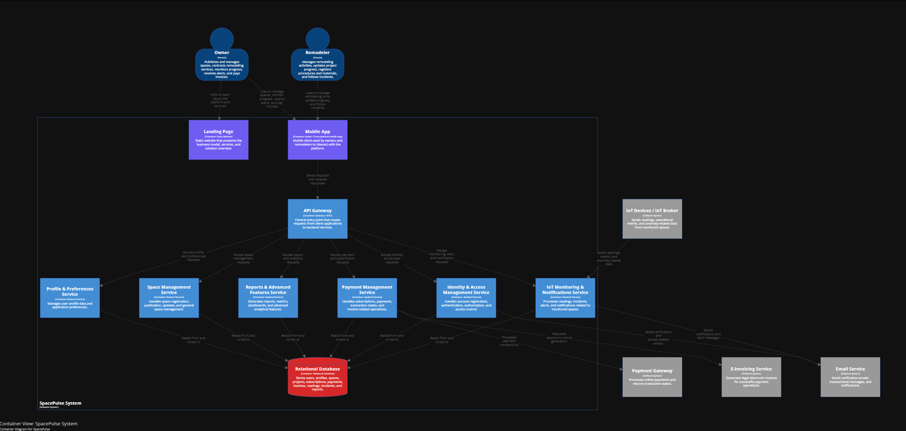

#### 2.5.3.3. Software Architecture Deployment Diagrams.
En el diagrama de despliegue se representa cómo los principales componentes de SpacePulse se distribuyen en el entorno de producción. En este caso, la Mobile App se ejecuta en los dispositivos móviles de los usuarios, mientras que la Landing Page se publica en un servicio de hosting estático. Por otro lado, el API Gateway se aloja en una plataforma cloud como punto central de acceso al backend, y la Relational Database se ubica en un servidor administrado que permite el almacenamiento persistente de la información. Esta organización permite una arquitectura más clara y escalable, separando la capa de acceso, el procesamiento principal del sistema y el almacenamiento de datos.

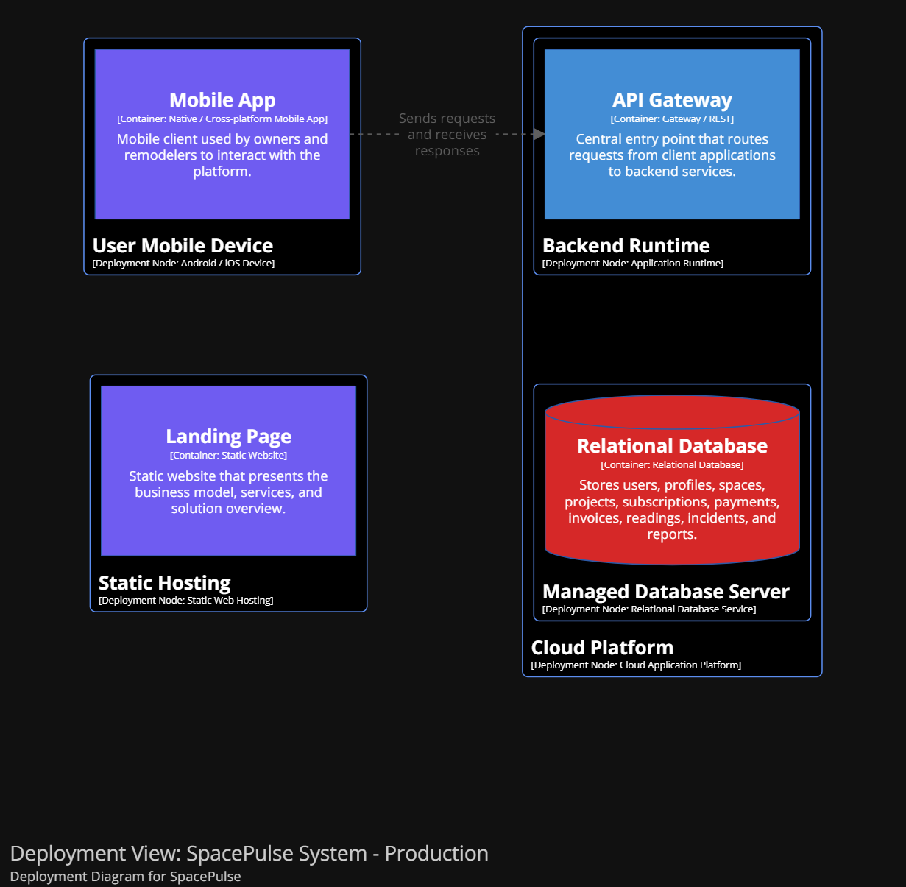

## 2.6. Tactical-Level Domain-Driven Design

### 2.6.1. Bounded Context: Identity & Access Management BC

### 2.6.1.1. Domain Layer

La capa de dominio de IAM encapsula la lógica de negocio central para la gestión de identidades y seguridad, asegurando que las reglas de autenticación y autorización sean independientes de las tecnologías externas.

### Aggregates

| **Atributo** | **Nombre**  | **Descripción**                                       |
| ------------ | --------- | ----------------------------------------------------- |
| Aggregate Root         | User      | Representa al usuario autenticado en el sistema, conteniendo su identidad y el hash de su contraseña para validación segura.       |


**Métodos:**
- User.AddPaymentMethod: Este método permite la creación y asociación de un nuevo método de pago al perfil del usuario. Internamente, instancia una entidad PaymentMethod con los datos de la tarjeta proporcionados y la añade a la lista de pagos del usuario.
- User (Constructor): Además de inicializar las propiedades del usuario, este método realiza una validación de negocio crítica al asegurar que el correo electrónico no esté vacío antes de crear la instancia.

### Entities

| **Atributo** | **Nombre**  | **Descripción**                                       |
| ------------ | --------- | ----------------------------------------------------- |
| Type, Number, Expiry, Cvv        | PaymentMethod      | Entidad que representa la información de cobro (tarjeta) vinculada a un usuario específico.      |

### Value Objects

| **Atributo** | **Nombre**  | **Descripción**                                       |
| ------------ | --------- | ----------------------------------------------------- |
| Value        | Username      | Identificador único de texto utilizado por el usuario para acceder al sistema.      |
| Value        | PasswordHash      | Representación segura de la contraseña tras pasar por un algoritmo de encriptación.      |

### Commands & Queries

| **Atributo** | **Nombre**  | **Tipo**                                       |
| ------------ | --------- | ----------------------------------------------------- |
| Username, Password        | RegisterUserCommand      | Command      |
| UserId, PaymentMethodType, CardNumber, ExpirationDate, CVV        | AddPaymentMethodCommand      | Command      |
| Username, Password        | LoginQuery      | Query      |
| UserId        | GetUserByIdQuery      | Query      |

### Domain Services

| **Nombre** | **Funcion**  | **Metodos**                                       |
| ------------ | --------- | ----------------------------------------------------- |
| IPasswordHashingService        | Define el contrato para el cifrado y verificación de contraseñas de seguridad.      | HashPassword, VerifyPassword      |
| ITokenGenerationService        | Define el contrato para la generación de tokens de acceso (JWT) para sesiones autenticadas.      | GenerateToken      |

**Métodos:**

-IPasswordHashingService.HashPassword: Recibe la contraseña en texto plano ingresada por el usuario y la transforma en una cadena cifrada (hash) mediante un algoritmo criptográfico para su almacenamiento seguro.

-IPasswordHashingService.VerifyPassword: Compara una contraseña ingresada en texto claro contra un hash previamente almacenado para verificar si coinciden, permitiendo así el acceso al sistema.

-ITokenGenerationService.GenerateToken: Utiliza la información del objeto User autenticado para generar un token de seguridad (usualmente JWT), el cual servirá como credencial temporal para autorizar las peticiones del cliente en la plataforma.

### Domain Services

| **Nombre** | **Descripción**                                     |
| ------------ | --------- |
| IUserRepository        | Interfaz para la persistencia y recuperación de datos de los agregados User.     | 
| IPaymentMethodRepository        | Interfaz para gestionar el almacenamiento de los métodos de pago vinculados a los perfiles.      | 

En la Domain Layer de SpacePulse, específicamente dentro del Bounded Context de IAM, hemos definido la gestión de identidades bajo un modelo de Domain-Driven Design (DDD). Estas entidades y objetos de valor representan las reglas de negocio fundamentales del sistema de autenticación y autorización para la plataforma de remodelación IoT.La clase User actúa como el Agregado raíz que centraliza la información del perfil y su asociación con roles específicos (como customer o perfiles técnicos), garantizando que el acceso y las credenciales se validen estrictamente a través de servicios de dominio como IPasswordHashingService e ITokenGenerationService. Finalmente, la recuperación y persistencia de estas identidades se gestiona mediante repositorios especializados como IUserRepository.

### 2.6.1.2. Interface Layer

En la Interface Layer de SpacePulse, específicamente para el contexto de IAM, se han definido los puntos de entrada para la comunicación externa. Esta capa utiliza controladores REST, recursos (DTOs) y ensambladores para desacoplar el modelo de dominio de las representaciones externas, facilitando el registro y la autenticación de los usuarios de forma segura.

### Resources

| **Nombre** | **Descripción**  |  
| ------------ | --------- | 
| RegisterUserResource        | DTO que encapsula los datos de entrada (Email, Password, FullName, Phone) para el registro de un nuevo usuario.      | 
| LoginResource        | DTO que contiene las credenciales necesarias (Email, Password) para validar el acceso al sistema.      | 
| AddPaymentMethodResource        | DTO que transporta la información financiera (Type, Number, Expiry, Cvv) para vincular una tarjeta al perfil del usuario.      | 
| UserResource        | DTO de salida que representa la información pública del usuario (ID, Nombre, Email, Rol) tras una consulta exitosa.     | 
| AuthenticatedUserResource        | Recurso que devuelve el token JWT generado y la información básica del usuario tras un inicio de sesión correcto.      | 

### Controllers

| **Nombre** | **Método HTTP**  | **Parámetro / Resource**  | **Descripción** |
| ------------ | --------- | --------- | --------- |
| UsersController        | POST    |RegisterUserResource   | Expone el endpoint para crear una nueva cuenta de usuario en la plataforma.   |
| UsersController        | POST     |  LoginResource |  Gestiona la autenticación, verificando las credenciales y devolviendo el token de acceso.  |
| UsersController        | POST      | AddPaymentMethodResource  |  Permite a un usuario autenticado registrar un nuevo método de pago en su perfil.  |
| UsersController        | GET     |  AddPaymentMethodResource |  Recupera la información detallada de un usuario específico mediante su identificador.  |

### Transformers / Assemblers

| **Nombre** | **Descripción**  |  
| ------------ | --------- | 
| UserResourceFromEntityAssembler        | Se encarga de convertir la entidad de dominio User en un objeto UserResource para su envío a través de la API.     | 
| RegisterUserCommandFromResourceAssembler        | Transforma los datos recibidos en el RegisterUserResource en un comando RegisterUserCommand procesable por la capa de aplicación.      | 
| AddPaymentMethodCommandFromResourceAssembler        | Convierte el recurso AddPaymentMethodResource en el comando correspondiente para persistir la información financiera.      | 

En la Interface Layer de SpacePulse, específicamente para el contexto de IAM, los controladores son los encargados de recibir las solicitudes HTTP, dirigirlas a los servicios apropiados y devolver una respuesta adecuada. Estos controladores no contienen reglas de negocio, sino que delegan el procesamiento a la capa de dominio o a los servicios de aplicación, actuando como una interfaz entre los usuarios y la lógica del negocio. Los controladores presentados permiten gestionar el registro de nuevos usuarios, la autenticación segura mediante credenciales y la administración de métodos de pago dentro de la plataforma de remodelación IoT.


### 2.6.1.3. Application Layer

En la Application Layer de SpacePulse, específicamente para el contexto de IAM, los handlers son los encargados de procesar los comandos y consultas, orquestando la lógica necesaria para cumplir con los casos de uso del sistema. Estos handlers actúan como mediadores entre la interfaz y el dominio, asegurando que las operaciones de registro, autenticación y gestión de pagos se realicen siguiendo las reglas de negocio establecidas . Los componentes presentados permiten orquestar la seguridad y los perfiles de usuario dentro de la plataforma de remodelación IoT.

|Nombre|Descripcion|Resumen de Logica|
|------|---------|------|
| RegisterUserCommandHandler        | Procesa la creación de nuevas cuentas de usuario .      | Valida que el email no esté en uso, cifra la contraseña usando el servicio de hashing, instancia el agregado User y persiste los cambios a través del repositorio y la unidad de trabajo . | 
| LoginQueryHandler        | Gestiona el proceso de inicio de sesión y autenticación .     | Busca al usuario por email, verifica la validez de la contraseña comparándola con el hash almacenado y genera un token JWT para sesiones seguras . | 
| AddPaymentMethodCommandHandler        | Orquesta la vinculación de información financiera a un perfil .      | Verifica la existencia del usuario, crea la entidad PaymentMethod con los datos de la tarjeta y actualiza el registro persistente mediante el repositorio correspondiente . | 
| GetUserByIdQueryHandler        | Recupera la información de un usuario específico.     | Consulta al repositorio de usuarios mediante un identificador único y devuelve un DTO con la información pública y técnica del perfil. | 

### Internal DTOs (Data Transfer Objects)

| **Nombre** | **Descripción**  |  
|------------|------------------|
| UserDto        | Objeto que transporta la información pública y operativa del usuario, incluyendo su rol, foto y lista de métodos de pago vinculados .     | 
| AuthenticationDto        | DTO especializado que encapsula la información básica del usuario junto con el token JWT tras una autenticación exitosa .      | 
| PaymentMethodDto        | Estructura de datos simplificada que representa la información de una tarjeta vinculada al perfil del usuario .      | 

### 2.6.1.4. Infrastructure Layer

En la Infrastructure Layer de SpacePulse, específicamente para el contexto de IAM, se implementan los detalles técnicos y las integraciones con marcos de trabajo externos. Esta capa se encarga de la persistencia de datos mediante Entity Framework Core (EFC), configurando las entidades del dominio para su mapeo con la base de datos, y de la implementación de los servicios de seguridad como el cifrado de contraseñas y la generación de tokens JWT. Estos componentes aseguran que la lógica de negocio se ejecute sobre una infraestructura robusta y escalable dentro de la plataforma de remodelación IoT.

### Persistence (Repositories Implementation)

| **Nombre** | **Descripción**  |   Tecnologías / Herramientas  |
| ------------ | --------- | --------- | 
| UserRepository        | Implementación concreta de IUserRepository que utiliza EFC para realizar operaciones CRUD sobre la tabla de usuarios.      | Entity Framework Core, LINQ. | 
| PaymentMethodRepository        | Implementación de IPaymentMethodRepository encargada de persistir los datos de las tarjetas vinculadas a los perfiles.     | Entity Framework Core. | 
| UserConfiguration        | Define el mapeo detallado entre la entidad User y la tabla de base de datos, incluyendo restricciones y tipos de datos.     | Fluent API (EFC). | 
| PaymentMethodConfiguration        | Configura el esquema de base de datos para la entidad PaymentMethod, estableciendo las relaciones necesarias.     | Fluent API (EFC). | 

### Security Services Implementation

| **Nombre** | **Descripción**  |   Resumen de Implementación  |
| ------------ | --------- | --------- | 
| PasswordHashingService        | Implementación técnica encargada de proteger las contraseñas de los usuarios.      | Utiliza algoritmos de cifrado estándar para generar hashes seguros y validar contraseñas durante el acceso. | 
| TokenGenerationService        |Servicio responsable de la gestión de identidades en tránsito mediante tokens de seguridad.     | Implementa la generación de tokens JWT (JSON Web Tokens), codificando la información del usuario y su rol para la autorización de peticiones. | 

### 2.6.1.5. Bounded Context Software Architecture Component Level Diagrams


### 2.6.1.6. Bounded Context Software Architecture Code Level Diagrams

### 2.6.1.6.1. Bounded Context Domain Layer Class Diagrams


### 2.6.1.6.2. Bounded Context Database Design Diagrams
El diseño de la base de datos para el contexto de IAM se ha normalizado para garantizar la integridad de las identidades y la seguridad de la información financiera. Se compone de dos tablas principales relacionadas mediante una clave foránea.


## 2.6.2. Bounded Context: Payment Management

### 2.6.2.1. Domain Layer

La Domain Layer es el núcleo que orquesta y gestiona las reglas de negocio relacionadas con las transacciones financieras y la facturación de servicios en la plataforma SpacePulse. En este contexto, entidades como **Payment** e **Invoice**, junto con los objetos de valor y servicios de validación, permiten gestionar el ciclo de vida de los pagos por proyectos de remodelación e infraestructura IoT.

**Objetivo:**

La capa de dominio tiene como objetivo representar las entidades y servicios fundamentales del procesamiento de pagos, cubriendo desde la iniciación de la transacción hasta la emisión de comprobantes fiscales, asegurando la integridad de los montos y la trazabilidad de cada cobro.

## 1. Aggregate: Payment

**Descripción:**

El agregado Payment actúa como la raíz del modelo y encapsula todos los datos y comportamientos relacionados con una transacción económica dentro del sistema. Representa un intento de cobro y contiene la información necesaria para interactuar con pasarelas de pago externas.

### Atributos

| Atributo           | Tipo   | Descripción                                                                 |
|--------------------|--------|-----------------------------------------------------------------------------|
| id                 | Guid   | Identificador único del pago (autogenerado).                               |
| projectId          | Guid   | Identificador del proyecto de remodelación asociado al pago.               |
| amount             | Money  | Objeto de valor que contiene el monto y la moneda.                         |
| status             | String | Estado actual del pago (PENDING, COMPLETED, FAILED).                       |
| externalReference  | String | Código de referencia devuelto por la pasarela de pagos.                    |
| createdAt          | Date   | Fecha de creación del registro de pago.                                    |

### Métodos

- `confirm(String reference)`: Cambia el estado a COMPLETED y vincula la referencia externa.
- `fail(String reason)`: Marca la transacción como fallida y registra el motivo.
- `calculateTax()`: Calcula los impuestos aplicables según el monto total del proyecto.

---

## 2. Value Object: Money

**Descripción:**

El objeto de valor Money representa una cantidad monetaria validada. Es un objeto embebido que asegura que los cálculos financieros se realicen con la precisión correcta y bajo la misma denominación monetaria.

### Atributos

| Atributo | Tipo    | Descripción                     |
|----------|--------|---------------------------------|
| amount   | Decimal | Cantidad numérica del pago.     |
| currency | String  | Código de moneda (ej. USD, PEN).|

### Métodos

- `Money(Decimal amount, String currency)`: Constructor que valida que el monto no sea negativo.
- `add(Money other)`: Suma otro objeto Money validando que la moneda sea idéntica.
- `getFormatted()`: Retorna el monto con el símbolo de moneda correspondiente.

---

## 3. Aggregate: Invoice

**Descripción:**

Representa el documento legal de facturación emitido tras un pago exitoso. Define los permisos y responsabilidades asociados a la documentación fiscal del sistema.

### Atributos

| Atributo      | Tipo   | Descripción                                                   |
|---------------|--------|---------------------------------------------------------------|
| id            | Guid   | Identificador único de la factura.                            |
| paymentId     | Guid   | Referencia al pago confirmado que genera la factura.          |
| invoiceNumber | String | Serie y número correlativo legal del documento.               |
| issuedAt      | Date   | Fecha de emisión de la factura.                               |

### Métodos

- `generateNumber()`: Genera el correlativo legal basado en la serie configurada.
- `voidInvoice()`: Marca la factura como anulada en caso de devoluciones.

---

## 4. Domain Service: PaymentCommandService

**Descripción:**

El servicio PaymentCommandService encapsula las reglas de negocio complejas que involucran la validación de transacciones y la comunicación lógica con el dominio de proyectos.

### Métodos

- `processTransaction(Payment payment)`: Valida la viabilidad de la transacción antes de su persistencia.
- `validatePaymentMethod(Guid methodId)`: Verifica que el método de pago seleccionado esté activo y sea compatible.

---

## 5. Repository: IPaymentRepository

**Descripción:**

El IPaymentRepository es una abstracción para la persistencia de las transacciones en la base de datos, permitiendo realizar operaciones de consulta y guardado de manera efectiva.

### Métodos

- `save(Payment payment)`: Guarda un nuevo pago o actualiza uno existente.
- `findById(Guid id)`: Recupera un pago por su identificador único.
- `findByProjectId(Guid projectId)`: Recupera el historial de pagos asociados a un proyecto.

En la Domain Layer de SpacePulse, hemos definido los flujos financieros bajo un modelo de Domain-Driven Design (DDD). Estas entidades y objetos de valor representan las reglas de negocio fundamentales para el procesamiento de cobros y facturación. La clase Payment se asocia con los proyectos de remodelación, y se valida la integridad de los montos a través de servicios como PaymentCommandService y repositorios como IPaymentRepository.

## 2.6.2.2. Interface Layer

La Interface Layer es la capa que expone los endpoints de la aplicación, permitiendo la interacción entre los clientes y el sistema de pagos de SpacePulse. Los controladores son responsables de recibir las peticiones, validarlas y coordinar con los servicios correspondientes para ejecutar las transacciones financieras.

En esta capa, no se implementan reglas de negocio, sino que se coordina la comunicación entre las solicitudes de los usuarios y la lógica del dominio.

---

## Controlador: PaymentsController

**Descripción:**

El PaymentsController maneja los endpoints relacionados con la iniciación y el seguimiento de pagos por servicios de remodelación e instalaciones IoT.

### Endpoints

| Método | Ruta                                   | Descripción |
|--------|----------------------------------------|-------------|
| POST   | /api/v1/payments                       | Maneja la solicitud para iniciar un nuevo pago. Recibe un objeto CreatePaymentResource, lo convierte en un comando y llama al servicio de aplicación. Devuelve el recurso del pago creado o un error 400. |
| GET    | /api/v1/payments/{paymentId}           | Recupera la información detallada de un pago específico mediante su ID. Si existe, lo convierte en un recurso y lo devuelve; de lo contrario, retorna un error 404. |
| GET    | /api/v1/projects/{projectId}/payments  | Obtiene el historial de pagos asociados a un proyecto de remodelación específico. |

### Dependencias

- **IPaymentCommandService**: Servicio que maneja los comandos de creación y confirmación de transacciones.
- **IPaymentQueryService**: Servicio encargado de gestionar las consultas de historial de pagos.
- **CreatePaymentCommandFromResourceAssembler**: Utilidad para convertir el recurso de entrada en un comando procesable.
- **PaymentResourceFromEntityAssembler**: Utilidad para convertir la entidad de dominio Payment en un recurso de respuesta para el cliente.

---

## Controlador: InvoicesController

**Descripción:**

El InvoicesController maneja los endpoints relacionados con la obtención y visualización de documentos fiscales electrónicos.

### Endpoints

| Método | Ruta                                   | Descripción |
|--------|----------------------------------------|-------------|
| GET    | /api/v1/invoices/{invoiceId}           | Maneja la solicitud para obtener una factura específica. Llama al servicio de consultas y devuelve el recurso de la factura para su visualización o descarga. |
| GET    | /api/v1/users/{userId}/invoices        | Recupera todas las facturas emitidas para un usuario en particular, permitiendo el seguimiento de sus gastos en la plataforma. |

### Dependencias

- **IInvoiceQueryService**: Servicio encargado de manejar las búsquedas y recuperación de facturas.
- **InvoiceResourceFromEntityAssembler**: Utilidad para transformar las entidades de factura en recursos JSON para la API.

---

## Flujo de Trabajo

### Procesamiento de Pagos
Los usuarios pueden iniciar un pago a través de la API, lo que invoca a los servicios de comando para registrar la transacción y validar los montos con la pasarela externa.

### Gestión de Facturas
Una vez que un pago es confirmado, el sistema genera automáticamente una factura que puede ser consultada por los usuarios y administradores a través del endpoint de facturación.

### Historial por Proyecto
Los administradores pueden consultar todos los pagos realizados dentro del contexto de un proyecto de remodelación IoT para asegurar que el presupuesto se esté ejecutando correctamente.

---


En esta capa de SpacePulse, los controladores son los encargados de recibir las solicitudes HTTP, dirigirlas a los servicios apropiados y devolver una respuesta adecuada.

Estos controladores no contienen reglas de negocio, sino que delegan el procesamiento a la capa de dominio o los servicios, actuando como una interfaz entre los clientes (propietarios y técnicos) y la lógica financiera del negocio.

Los controladores presentados permiten gestionar la transaccionalidad económica y la emisión de comprobantes dentro del sistema.

## 2.6.2.3. Application Layer

Esta capa actúa como un orquestador. Recibe comandos y consultas de la capa de interfaz y coordina la ejecución de la lógica del negocio financiero. Es el "intermediario" que traduce las peticiones de los usuarios en acciones del dominio, asegurando que las transacciones y la facturación de servicios IoT se apliquen correctamente.

---

## 1. Servicios de Comando y Consulta (Handlers)

Las implementaciones de los Handlers son responsables de las transacciones (escribir datos) y las consultas (leer datos), respectivamente. Estos servicios usan los repositorios para interactuar con el dominio.

### Handlers

| Nombre                          | Descripción                                                                 | Resumen de Lógica |
|---------------------------------|-----------------------------------------------------------------------------|-------------------|
| CreatePaymentCommandHandler     | Gestiona la creación de una nueva intención de pago en el sistema.         | Valida el ProjectId, instancia el objeto Money, crea el agregado Payment en estado pendiente y lo persiste mediante el repositorio. |
| ConfirmPaymentCommandHandler    | Procesa la confirmación de éxito desde la pasarela externa.                | Recupera el pago, invoca el método confirm() del dominio para cambiar el estado y dispara el evento para la generación de la factura. |
| GetPaymentByIdQueryHandler      | Recupera la información detallada de una transacción.                      | Consulta el IPaymentRepository utilizando el identificador único y devuelve el DTO correspondiente. |
| IssueInvoiceCommandHandler      | Orquesta la generación de documentos fiscales.                             | Verifica que el pago esté completado, genera el correlativo legal para la Invoice y guarda el registro fiscal en la base de datos. |

---

## 2. DTOs Internos (Data Transfer Objects)

Estos objetos se utilizan para transportar datos entre las capas de aplicación e interfaz, manteniendo el dominio limpio de preocupaciones de presentación.

### DTOs

| Nombre                   | Descripción |
|--------------------------|-------------|
| PaymentDto              | Contiene la información operativa del pago, incluyendo el estado, monto y referencia externa para uso interno. |
| InvoiceDto              | Encapsula los datos fiscales necesarios para generar la representación visual o PDF de la factura. |
| TransactionSummaryDto   | Provee una vista simplificada de los movimientos financieros asociados a un proyecto de remodelación. |

---

## 3. Servicios Externos (Outbound Services)

Se utilizan para manejar operaciones técnicas que no forman parte de la lógica de negocio principal, permitiendo que el dominio permanezca enfocado en las reglas financieras de SpacePulse.

### Servicios

- **ExternalPaymentGatewayService**: Interfaz que define la comunicación técnica con la pasarela de pagos (ej. Stripe o Culqi) para procesar el cobro real.
- **EmailNotificationService**: Servicio encargado de enviar el comprobante de pago y la factura al correo electrónico del cliente una vez confirmada la operación.

---

En la Application Layer de SpacePulse, se implementa el patrón MediatR para desacoplar la intención de la ejecución. Los handlers orquestan el flujo financiero, asegurando que cada pago sea validado y que la facturación electrónica se dispare solo cuando el dominio confirma la transacción. La lógica se valida a través de servicios de aplicación y se persiste mediante los repositorios definidos en la infraestructura.

## 2.6.2.4. Infrastructure Layer

En la Infrastructure Layer de SpacePulse, específicamente para el contexto de Payment Management, se implementan los detalles técnicos y las integraciones con marcos de trabajo externos necesarios para la persistencia financiera.

Esta capa se encarga de:
- La gestión de datos mediante Entity Framework Core (EFC).
- La configuración del mapeo de transacciones y facturas con la base de datos MySQL.
- La implementación de servicios de comunicación con pasarelas de pago externas.

Estos componentes aseguran que la lógica financiera se ejecute sobre una infraestructura segura y auditable.

---

## 1. Persistence (Repositories Implementation)

| Nombre                | Descripción                                                                 | Tecnologías / Herramientas |
|-----------------------|-----------------------------------------------------------------------------|-----------------------------|
| PaymentRepository     | Implementación concreta de IPaymentRepository que utiliza EFC para gestionar el almacenamiento de transacciones. | Entity Framework Core, LINQ |
| InvoiceRepository     | Implementación de IInvoiceRepository encargada de persistir los comprobantes fiscales generados por el sistema. | Entity Framework Core |
| PaymentConfiguration  | Define el mapeo detallado entre la entidad Payment y la tabla payments, incluyendo restricciones de precisión para el monto. | Fluent API (EFC) |
| InvoiceConfiguration  | Configura el esquema de base de datos para la entidad Invoice, asegurando la unicidad del número de factura correlativo. | Fluent API (EFC) |

---

## 2. External / Technical Services Implementation

| Nombre                  | Descripción                                                                 | Resumen de Implementación |
|--------------------------|-----------------------------------------------------------------------------|---------------------------|
| StripeGatewayService     | Implementación técnica para la comunicación con la pasarela de pagos externa (Stripe/Culqi). | Utiliza el SDK de la pasarela para procesar el cargo y recibir webhooks de confirmación. |
| PdfInvoiceGenerator      | Servicio técnico responsable de transformar los datos de la factura en un archivo digital. | Implementa la generación de documentos PDF utilizando bibliotecas de renderizado para el cliente. |

## 2.6.2.5. Bounded Context Software Architecture Component Level Diagrams


### 2.6.2.6. Bounded Context Software Architecture Code Level Diagrams

### 2.6.2.6.1.  Bounded Context Domain Layer Class Diagrams

El diagrama de clases de la capa de dominio describe la estructura lógica del modelo de negocio financiero. El diseño se centra en el agregado raíz Payment, que rige el flujo transaccional, y el agregado Invoice, que gestiona la documentación fiscal. Se utiliza el objeto de valor Money para garantizar la precisión monetaria.

## Descripción de Elementos del Diagrama

### Payment (Aggregate Root)

Clase principal que encapsula el estado de la transacción.

Características:
- Actúa como **raíz del agregado**.
- Gestiona el ciclo de vida del pago.
- Estados posibles:
  - Pending
  - Completed
  - Failed

Métodos principales:
- `confirm()`: Marca el pago como completado.
- `fail()`: Marca el pago como fallido.

---

### Invoice (Aggregate Root)

Representa el comprobante legal de cobro generado tras un pago exitoso.

Características:
- Se genera automáticamente luego de la confirmación del pago.
- Contiene el número correlativo de facturación.
- Mantiene la trazabilidad legal de la transacción.

---

### Money (Value Object)

Objeto inmutable que representa una cantidad monetaria.

Características:
- Contiene:
  - Monto decimal
  - Código de moneda (ISO 4217)
- Evita errores en cálculos entre distintas divisas.
- Se compara por valor, no por identidad.

---

### Interfaces de Repositorio

#### IPaymentRepository

Define el contrato para la persistencia de pagos.

Responsabilidades:
- Guardar transacciones.
- Recuperar pagos por ID.
- Consultar pagos por proyecto.

---

#### IInvoiceRepository

Define el contrato para la persistencia de facturas.

Responsabilidades:
- Almacenar comprobantes fiscales.
- Recuperar facturas por ID o por pago.
- Mantener la integridad de los registros financieros.

---

## Relación General del Modelo

- **Payment** puede generar una **Invoice** (relación 1:1).
- **Money** es un objeto de valor utilizado dentro de **Payment**.
- Los repositorios abstraen la persistencia de ambos agregados.


### 2.6.2.6.2. Bounded Context Database Design Diagrams

El diseño de la base de datos para el contexto de Payment Management se ha normalizado para gestionar de manera eficiente el flujo de cobros y la emisión de facturas. El esquema físico garantiza que cada transacción esté vinculada a un proyecto de remodelación y que la documentación fiscal sea inalterable una vez generada.

## Tabla: Payments

Esta tabla registra todos los intentos de pago y transacciones completadas dentro de la plataforma.

| Campo             | Tipo de Dato        | Restricción | Descripción |
|------------------|--------------------|-------------|-------------|
| Id               | Guid / Binary(16)  | PK          | Identificador único de la transacción. |
| ProjectId        | Guid / Binary(16)  | FK          | Referencia al proyecto de remodelación asociado. |
| Amount           | Decimal(18,2)      | Not Null    | Monto de la operación financiera. |
| Currency         | Varchar(10)        | Not Null    | Código de la moneda (ej. "USD", "PEN"). |
| Status           | Varchar(50)        | Not Null    | Estado del pago (Pending, Completed, Failed). |
| ExternalReference| Varchar(255)       | Nullable    | ID de seguimiento provisto por la pasarela de pagos. |
| CreatedAt        | DateTime           | Not Null    | Fecha y hora de creación del registro. |

---

## Tabla: Invoices

Almacena la información de los comprobantes fiscales electrónicos generados tras un pago exitoso.

| Campo         | Tipo de Dato        | Restricción   | Descripción |
|--------------|--------------------|---------------|-------------|
| Id           | Guid / Binary(16)  | PK            | Identificador único de la factura. |
| PaymentId    | Guid / Binary(16)  | FK, Unique    | Referencia al pago que originó la factura. |
| InvoiceNumber| Varchar(100)       | Unique        | Número correlativo legal del documento. |
| IssuedAt     | DateTime           | Not Null      | Fecha de emisión oficial del comprobante. |

---

## Relaciones de Integridad

### Relación Payments - Invoices (1:1)

- Un **Payment** puede generar **una única Invoice**.
- Se establece mediante la clave foránea **PaymentId** en la tabla **Invoices**.
- La restricción **Unique** garantiza que no existan múltiples facturas para un mismo pago.


## 2.6.3. Bounded Context: Report Management

## 2.6.3.1. Domain Layer

La Domain Layer en el contexto de Report Management es la encargada de definir la lógica para la agregación de datos y la generación de conocimiento analítico.

A diferencia de otros contextos, este no suele modificar el estado de los proyectos, sino que extrae información para transformarla en métricas clave de desempeño (KPIs) sobre el avance de las remodelaciones y el funcionamiento de los dispositivos IoT.

## 1. Aggregate: ProjectReport

**Descripción:**

Es el agregado raíz que representa un reporte consolidado de un proyecto de remodelación. Contiene el resumen de costos, avances y cumplimiento de cronograma.

### Atributos

| Atributo    | Tipo      | Descripción |
|------------|-----------|-------------|
| id         | Guid      | Identificador único del reporte. |
| projectId  | Guid      | Referencia al proyecto analizado. |
| reportType | String    | Tipo de reporte (Progreso, Financiero, Técnico). |
| generatedAt| DateTime  | Fecha y hora de generación. |
| content    | JSON/Text | Información detallada de los indicadores calculados. |

### Métodos

- `generateSummary()`: Calcula el porcentaje de avance basado en las tareas completadas del proyecto.
- `exportToFormat(String format)`: Prepara la estructura de datos para ser exportada (PDF, Excel).

---

## 2. Value Object: ReportPeriod

**Descripción:**

Objeto de valor que define el rango de tiempo específico que abarca el reporte, asegurando que las fechas de inicio y fin sean lógicas y válidas.

### Atributos

| Atributo  | Tipo     | Descripción |
|----------|----------|-------------|
| startDate| DateTime | Fecha de inicio del análisis. |
| endDate  | DateTime | Fecha de fin del análisis. |

### Métodos

- `isValidRange()`: Verifica que la fecha de fin no sea anterior a la de inicio.
- `getDurationInDays()`: Calcula la cantidad de días analizados en el reporte.

---

## 3. Entity: MetricDetail

**Descripción:**

Entidad que representa un indicador específico dentro de un reporte, como "Consumo Energético" o "Días de retraso".

### Atributos

| Atributo | Tipo   | Descripción |
|----------|--------|-------------|
| id       | Guid   | Identificador de la métrica. |
| name     | String | Nombre del indicador. |
| value    | Double | Valor numérico obtenido. |
| unit     | String | Unidad de medida (ej. "%", "kWh"). |

---

## 4. Domain Service: IReportGenerationService

**Descripción:**

Define el contrato para la lógica compleja de agregación que requiere consultar múltiples fuentes de datos (Proyectos, Pagos e IoT) para construir un reporte integral.

### Métodos

- `calculateProjectKPIs(Guid projectId)`: Ejecuta algoritmos de análisis para determinar el rendimiento del proyecto.
- `aggregateIotData(Guid infrastructureId)`: Consolida los datos históricos de los sensores para el reporte técnico.

---

## 5. Repository: IProjectReportRepository

**Descripción:**

Interfaz que define las operaciones de persistencia para los reportes generados, permitiendo su consulta histórica.

### Métodos

- `save(ProjectReport report)`: Almacena un reporte generado.
- `findByProjectId(Guid projectId)`: Recupera el historial de reportes de un proyecto específico.
- `deleteOldReports(DateTime expirationDate)`: Limpieza de reportes antiguos.

---


En la Domain Layer de SpacePulse, el contexto de Report Management utiliza los principios de DDD para asegurar que la generación de reportes sea consistente y precisa. Al separar la lógica de cálculo en servicios de dominio y utilizar objetos de valor como ReportPeriod, se garantiza que la analítica de los proyectos de remodelación IoT sea confiable para la gestión operativa.

## 2.6.3.2. Interface Layer

La Interface Layer en el contexto de Report Management es la encargada de exponer los puntos de acceso (endpoints) para que los usuarios (técnicos y propietarios) puedan solicitar y consultar reportes analíticos.

Esta capa se asegura de que las peticiones HTTP sean válidas y las transforma en comandos o consultas que la capa de aplicación pueda procesar, devolviendo finalmente la información en formatos legibles (Resources/DTOs).

---

## Controlador: ReportsController

**Descripción:**

Este controlador centraliza las operaciones para la generación y recuperación de informes técnicos y financieros de los proyectos de remodelación IoT.

### Endpoints

| Método | Ruta                                   | Descripción |
|--------|----------------------------------------|-------------|
| POST   | /api/v1/reports                        | Recibe una solicitud para generar un nuevo reporte mediante un CreateReportResource. Transforma la petición en un comando de generación y devuelve el reporte procesado. |
| GET    | /api/v1/reports/{reportId}             | Permite obtener el contenido detallado de un reporte específico utilizando su identificador único. |
| GET    | /api/v1/projects/{projectId}/reports   | Recupera el listado histórico de todos los reportes generados para un proyecto de remodelación en particular. |

---

## Dependencias y Transformaciones

- **CreateReportCommandFromResourceAssembler**: Componente encargado de convertir los datos de la solicitud (como el tipo de reporte y el rango de fechas) en un comando de aplicación.
- **ReportResourceFromEntityAssembler**: Utilidad que transforma la entidad de dominio ProjectReport en un recurso JSON estructurado para el cliente.
- **IReportCommandService / IReportQueryService**: Interfaces que desacoplan el controlador de la ejecución lógica de los reportes.

---

## Recursos de Interfaz (DTOs de Entrada/Salida)

| Recurso                | Descripción |
|------------------------|-------------|
| CreateReportResource   | Contiene los parámetros necesarios para la generación (ej. projectId, reportType, startDate, endDate). |
| ReportResource         | Estructura de salida que incluye los KPIs calculados, el resumen ejecutivo y la fecha de generación. |

---

## Flujo de Comunicación

1. El cliente envía una petición **POST** indicando que desea un reporte de "Consumo IoT" para el mes actual.
2. El ReportsController valida la estructura de la petición y utiliza un Assembler para crear el comando interno.
3. La petición se despacha a la capa de aplicación.
4. Una vez generado el reporte, el controlador devuelve un **ReportResource** con un estado HTTP **201 (Created)**.

---


En esta capa de SpacePulse, los controladores actúan como el puente entre el mundo exterior y la lógica analítica del sistema. Al seguir el patrón de Clean Architecture, se garantiza que los controladores solo se encarguen de la comunicación HTTP, delegando toda la complejidad del cálculo de métricas a las capas internas de Application y Domain.

## 2.6.3.3. Application Layer

La Application Layer actúa como el motor de orquestación del contexto de reportes. Su función principal es recibir los comandos de generación y las consultas de visualización, coordinando la recolección de datos desde el dominio y otros contextos (como IoT o Proyectos) para transformar información cruda en métricas de valor para el usuario final.

---

## 1. Servicios de Comando y Consulta (Handlers)

En esta sección se definen los Handlers que procesan la lógica de aplicación. Al utilizar MediatR, estos componentes desacoplan la recepción de la solicitud de su ejecución técnica.

### Handlers

| Nombre                              | Descripción                                                     | Resumen de Lógica |
|-------------------------------------|-----------------------------------------------------------------|-------------------|
| GenerateProjectReportCommandHandler | Coordina la creación de un nuevo reporte analítico.             | Valida la existencia del proyecto, solicita al IReportGenerationService el cálculo de los KPIs y persiste el resultado en el repositorio. |
| GetReportByIdQueryHandler           | Recupera un reporte específico por su identificador.            | Consulta el IProjectReportRepository y mapea la entidad de dominio a un DTO de respuesta. |
| GetReportsByProjectIdQueryHandler   | Obtiene el historial de reportes de un proyecto.                | Filtra los registros en la base de datos por el ProjectId y devuelve una colección estructurada. |
| DeleteOldReportsCommandHandler      | Realiza el mantenimiento del historial de reportes.             | Ejecuta una lógica de limpieza basada en la fecha de expiración definida en la configuración del sistema. |

---

## 2. DTOs Internos (Data Transfer Objects)

Estos objetos facilitan el transporte de información entre capas, asegurando que la estructura interna de las entidades de dominio no se exponga directamente a la interfaz.

### DTOs

| Nombre           | Descripción |
|------------------|-------------|
| ReportDto        | Contiene el resumen ejecutivo del reporte, incluyendo los metadatos de generación y el estado del análisis. |
| KpiSummaryDto    | Encapsula los indicadores clave calculados (ej. porcentaje de avance, eficiencia energética, desviación presupuestaria). |
| ReportListDto    | Estructura optimizada para la visualización de listas históricas en el dashboard de SpacePulse. |

---

## 3. Servicios Externos (Outbound Services)

Representan las interfaces de comunicación con sistemas o componentes fuera del control directo del dominio de reportes.

### Servicios

- **ProjectDataClient**: Interfaz utilizada para obtener datos en tiempo real del Bounded Context de Project Management (tareas, fechas, hitos).
- **IotTelemetryAggregator**: Servicio encargado de recopilar y promediar los datos históricos de los sensores IoT para incluirlos en los reportes técnicos.
- **ExportService (PDF/Excel)**: Componente técnico de infraestructura que transforma los datos del reporte en archivos descargables para el usuario.

---


En la Application Layer de SpacePulse, la lógica se centra en la transformación de datos. Los Command Handlers aseguran que los reportes se generen siguiendo las reglas de negocio del dominio, mientras que los Query Handlers optimizan la entrega de información para que los propietarios y técnicos puedan monitorear el estado de sus proyectos de remodelación de manera eficiente.


## 2.6.3.4. Infrastructure Layer

En la Infrastructure Layer de SpacePulse, específicamente para el contexto de Report Management, se implementan los detalles técnicos necesarios para la persistencia de los análisis generados y la integración con herramientas de exportación de datos.

Esta capa:
- Utiliza Entity Framework Core (EFC) para mapear los reportes en la base de datos MySQL.
- Permite almacenar información analítica consolidada.
- Provee servicios técnicos para exportar datos en formatos descargables.

## 1. Persistence (Repositories Implementation)

| Nombre                     | Descripción                                                                 | Tecnologías / Herramientas |
|----------------------------|-----------------------------------------------------------------------------|-----------------------------|
| ProjectReportRepository    | Implementación concreta de IProjectReportRepository que gestiona el almacenamiento y recuperación de informes históricos. | Entity Framework Core, LINQ |
| ReportConfiguration        | Define el mapeo detallado de la entidad ProjectReport, configurando el almacenamiento de los KPIs en formato JSON dentro de la base de datos. | Fluent API (EFC) |
| MetricDetailConfiguration  | Configura la persistencia de los detalles individuales de las métricas asociadas a cada reporte. | Fluent API (EFC) |

---

## 2. External / Technical Services Implementation

| Nombre               | Descripción                                                                 | Resumen de Implementación |
|----------------------|-----------------------------------------------------------------------------|---------------------------|
| ExcelReportExporter  | Servicio técnico que transforma los datos del dominio en hojas de cálculo para análisis externo. | Utiliza bibliotecas como ClosedXML para generar archivos .xlsx. |
| IotTelemetryClient   | Implementación técnica para la obtención de datos históricos de sensores desde el módulo de infraestructura. | Realiza peticiones internas o consultas a la base de datos de telemetría. |


## 2.6.3.5. Bounded Context Software Architecture Component Level Diagrams


## 2.6.3.6. Bounded Context Software Architecture Code Level Diagrams

## 2.6.3.6.1. Bounded Context Domain Layer Class Diagrams

Descripción de Elementos del Diagrama

 ProjectReport (Aggregate Root)

Es la entidad principal que representa un informe consolidado. Encapsula metadatos como el tipo de reporte (Técnico, Financiero o de Progreso) y la fecha de generación.

- Actúa como **raíz del agregado**.
- Gestiona la consistencia interna del reporte.
- Posee una relación de **composición** con sus métricas (MetricDetail).

---

MetricDetail (Entity)

Representa un indicador específico calculado dentro de un reporte.

Ejemplos:
- "Eficiencia Energética"
- "Porcentaje de Avance"

Características:
- Tiene identidad propia dentro del agregado.
- Contiene:
  - Valor numérico
  - Unidad de medida
- Depende del ciclo de vida del **ProjectReport**.

---

 ReportPeriod (Value Object)

Objeto inmutable que define el rango de tiempo analizado en el reporte.

Características:
- Contiene:
  - Fecha de inicio
  - Fecha de fin
- Garantiza la validez del intervalo temporal.
- No posee identidad propia (se compara por valor).

---

 IReportGenerationService (Domain Service)

Interfaz que define el contrato para los algoritmos de cálculo de reportes.

Responsabilidades:
- Interactuar con otros contextos (Proyectos, IoT, Pagos).
- Extraer y procesar datos.
- Construir el agregado **ProjectReport** con métricas calculadas.

---

 IProjectReportRepository (Repository Interface)

Define los métodos necesarios para la persistencia de los reportes.

Responsabilidades:
- Almacenar reportes generados.
- Recuperar reportes por **ProjectId**.
- Mantener historial de análisis.

---

## Relación General del Modelo

- **ProjectReport** contiene múltiples **MetricDetail** (1:N).
- **ReportPeriod** es un objeto de valor utilizado por el reporte.
- **IReportGenerationService** construye el agregado.
- **IProjectReportRepository** gestiona su persistencia.

---

## Nota

Este modelo sigue los principios de **Domain-Driven Design (DDD)**:
- Separación clara entre entidades y objetos de valor.
- Uso de agregados para mantener consistencia.
- Servicios de dominio para lógica compleja.


## 2.6.3.6.2. Bounded Context Database Design Diagrams


El esquema de base de datos para Report Management se ha diseñado para ofrecer una trazabilidad completa de los análisis realizados sobre los proyectos de remodelación.

La estructura permite almacenar datos agregados de sensores IoT y estados de obra, organizándolos en tablas relacionales que optimizan la consulta histórica de métricas de desempeño.

---

## Tabla: ProjectReports

Esta tabla almacena los metadatos de cada informe generado en la plataforma.

| Campo        | Tipo de Dato        | Restricción | Descripción |
|-------------|--------------------|-------------|-------------|
| Id          | Guid / Binary(16)  | PK          | Identificador único del reporte. |
| ProjectId   | Guid / Binary(16)  | FK          | Referencia al proyecto analizado (vínculo con Project BC). |
| ReportType  | Varchar(50)        | Not Null    | Categoría del informe (ej. "Técnico", "Financiero"). |
| GeneratedAt | DateTime           | Not Null    | Marca de tiempo exacta de la creación del informe. |

---

## Tabla: MetricDetails

Contiene los valores específicos de los indicadores calculados que componen un reporte.

| Campo     | Tipo de Dato        | Restricción | Descripción |
|----------|--------------------|-------------|-------------|
| Id       | Guid / Binary(16)  | PK          | Identificador único de la métrica. |
| ReportId | Guid / Binary(16)  | FK          | Referencia al reporte contenedor (Tabla ProjectReports). |
| Name     | Varchar(100)       | Not Null    | Nombre del indicador (ej. "Energy Efficiency"). |
| Value    | Double             | Not Null    | Valor numérico del KPI obtenido. |
| Unit     | Varchar(20)        | Not Null    | Unidad de medida (ej. "%", "kWh", "Days"). |


## 2.6.4. Bounded Context: Space Management

### 2.6.4.1. Domain Layer

La Domain Layer es el núcleo que gestiona las reglas de negocio relacionadas con la administración de espacios dentro de la plataforma SpacePulse. En este contexto, entidades como Space y LinkedIoTDevice, junto con objetos de valor y servicios de dominio, permiten registrar espacios, actualizar su información, controlar su disponibilidad y vincular dispositivos IoT para el monitoreo posterior.

Objetivo:

La capa de dominio tiene como objetivo representar los elementos fundamentales para la gestión de espacios, cubriendo desde la publicación de un nuevo espacio hasta la actualización de sus detalles y el control de su disponibilidad dentro de la plataforma.

## 1. Aggregate: Space

**Descripción:**

El agregado Space actúa como la raíz del modelo y encapsula la información principal de un espacio registrado en SpacePulse. Representa el ambiente físico que será publicado, editado, pausado o monitoreado dentro del sistema.

### Atributos

| Atributo           | Tipo   | Descripción                                                                 |
|--------------------|--------|-----------------------------------------------------------------------------|
| id                 | Guid   | Identificador único del espacio.                            |
| ownerId          | Guid   | Identificador del usuario propietario del espacio.               |
| name             | String  | Nombre del espacio registrado.                    |
| description             | String | Descripción general del espacio.                    |
| location  | SpaceLocation | Objeto de valor que representa la ubicación del espacio.           |
| dimensions          | SpaceDimensions   | Objeto de valor que representa las dimensiones físicas del espacio.                                   |
| status  | String | Estado actual del espacio: publicado, pausado o no disponible.                 |
| createdAt          | DateTime   | Fecha de creación del registro del espacio.                                  |
### Métodos

- `publish()` : Cambia el estado del espacio a publicado cuando contiene la información necesaria.
- `updateDetails(name, description, location)`: Actualiza los datos principales del espacio.
- `pauseAvailability()`: Pausa temporalmente la disponibilidad del espacio.
- `linkIoTDevice(device)` : Asocia un dispositivo IoT al espacio para permitir su monitoreo.

---

## 2. Value Object: SpaceLocation

**Descripción:**

El objeto de valor SpaceLocation representa la ubicación del espacio registrado. Permite mantener agrupados los datos relacionados con dirección, distrito y ciudad.

### Atributos

| Atributo | Tipo    | Descripción                     |
|----------|--------|---------------------------------|
| address   | String | Dirección principal del espacio.     |
| district | String  | Distrito donde se ubica el espacio. |
| city | String  | Ciudad correspondiente al espacio. |

### Métodos

- `getFullAddress()` : Retorna la dirección completa del espacio en formato legible.
- `isValid()` : Valida que la ubicación cuente con los datos mínimos requeridos.

---

## 3. Value Object: SpaceDimensions

**Descripción:**

El objeto de valor SpaceDimensions representa las medidas físicas del espacio. Esta información permite describir mejor el ambiente y apoyar decisiones relacionadas con remodelación o monitoreo.

### Atributos

| Atributo      | Tipo   | Descripción                                                   |
|---------------|--------|---------------------------------------------------------------|
| width            | Decimal   | Ancho del espacio.                          |
| length     | Decimal   | Largo del espacio.         |
| area | Decimal | Área total calculada del espacio.              |

### Métodos

- `calculateArea()` : Calcula el área total del espacio a partir del ancho y largo.
- `isValid()` : Verifica que las dimensiones ingresadas sean mayores a cero.

---

## 4. Entity: LinkedIoTDevice

**Descripción:**

La entidad LinkedIoTDevice representa un dispositivo IoT vinculado a un espacio específico. Su función es registrar qué dispositivo está asociado al espacio para permitir el monitoreo operativo desde otro bounded context.

### Atributos

| Atributo      | Tipo   | Descripción                                                   |
|---------------|--------|---------------------------------------------------------------|
| id            | Guid   | Identificador único del vínculo.                          |
| spaceId     | Guid   | Identificador del espacio asociado.         |
| deviceId | Guid | Identificador del dispositivo IoT vinculado.              |
| deviceType            | String   | Tipo de dispositivo o sensor asociado.                          |
| status     | String   | Estado del dispositivo vinculado.         |
| linkedAt | DateTime | Fecha en que el dispositivo fue asociado al espacio.              |

### Métodos

- `activate()` : Activa el dispositivo vinculado al espacio.
- `deactivate()` : Desactiva el dispositivo vinculado.
- `isLinkedTo(spaceId)` : Verifica si el dispositivo pertenece al espacio indicado.
---

## 5.Domain Service: SpaceCommandService

**Descripción:**

El servicio SpaceCommandService encapsula reglas de negocio relacionadas con la publicación, actualización y disponibilidad de espacios dentro de SpacePulse.

### Métodos

- `publishSpace(Space space)` : Valida y publica un nuevo espacio en la plataforma.
- `updateSpaceDetails(Space space)` : Coordina la actualización de información del espacio.
- `pauseSpaceAvailability(Guid spaceId)` : Cambia el estado del espacio a pausado.
- `linkDeviceToSpace(Guid spaceId, Guid deviceId)` : Valida y vincula un dispositivo IoT al espacio.
---

## 6. Repository: ISpaceRepository

**Descripción:**

El ISpaceRepository es una abstracción para la persistencia de espacios dentro de la base de datos, permitiendo realizar operaciones de consulta y guardado de manera ordenada.

### Métodos

- `save(Space space)` : Guarda un nuevo espacio o actualiza uno existente.
- `findById(Guid id)` : Recupera un espacio por su identificador único.
- `findByOwnerId(Guid ownerId)` : Recupera los espacios asociados a un propietario.
- `delete(Guid id)` : Elimina o desactiva un espacio registrado.

En la Domain Layer de SpacePulse, específicamente dentro del bounded context Space Management, se define la lógica principal para registrar, publicar, actualizar y pausar espacios dentro de la plataforma. La clase Space actúa como agregado raíz, mientras que SpaceLocation, SpaceDimensions y LinkedIoTDevice complementan la información necesaria para representar el espacio y su relación con el monitoreo IoT. Finalmente, las operaciones principales se coordinan mediante el servicio SpaceCommandService y la persistencia se abstrae a través de ISpaceRepository.

## 2.6.4.2. Interface Layer

a Interface Layer es la capa que expone los endpoints de la aplicación, permitiendo la interacción entre los usuarios y la gestión de espacios dentro de SpacePulse. Los controladores son responsables de recibir las peticiones, validarlas y coordinar con los servicios correspondientes para registrar espacios, actualizar su información, controlar su disponibilidad y vincular dispositivos IoT.

En esta capa no se implementan reglas de negocio, sino que se coordina la comunicación entre las solicitudes de los usuarios y la lógica del dominio.

---

## Controlador: SpacesController

**Descripción:**

El SpacesController maneja los endpoints relacionados con la creación, consulta, actualización y control de disponibilidad de los espacios registrados en la plataforma.

### Endpoints

| Método | Ruta                                   | Descripción |
|--------|----------------------------------------|-------------|
| POST   | /api/v1/spaces                       | Maneja la solicitud para publicar un nuevo espacio. Recibe un objeto CreateSpaceResource, lo convierte en un comando y llama al servicio de aplicación. |
| GET    | /api/v1/spaces/{spaceId}           | Recupera la información detallada de un espacio específico mediante su identificador. |
| GET    | /api/v1/owners/{ownerId}/spaces  | Obtiene la lista de espacios registrados por un propietario específico. |
| PUT    | /api/v1/spaces/{spaceId}           | Permite actualizar los datos principales de un espacio, como nombre, descripción, ubicación o dimensiones. |
| PATCH    | /api/v1/spaces/{spaceId}/pause  | Cambia el estado del espacio para pausar temporalmente su disponibilidad. |

### Dependencias

- **ISpaceCommandService**: Servicio que maneja los comandos de creación, actualización y pausa de espacios.
- **ISpaceQueryService**: Servicio encargado de gestionar las consultas de espacios registrados.
- **CreateSpaceCommandFromResourceAssembler**: Utilidad para convertir el recurso de creación en un comando procesable.
- **UpdateSpaceCommandFromResourceAssembler**: Utilidad para transformar el recurso de actualización en un comando.
- **SpaceResourceFromEntityAssembler**: Utilidad para convertir la entidad de dominio Space en un recurso de respuesta para la API.

---

## Controlador: SpaceDevicesController

**Descripción:**

El SpaceDevicesController maneja los endpoints relacionados con la vinculación y consulta de dispositivos IoT asociados a un espacio. Este controlador permite conectar la gestión del espacio con el posterior monitoreo IoT.

### Endpoints

| Método | Ruta                                   | Descripción |
|--------|----------------------------------------|-------------|
| POST    | /api/v1/spaces/{spaceId}/devices           | Permite vincular un dispositivo IoT a un espacio específico para habilitar su monitoreo. |
| GET    | /api/v1/spaces/{spaceId}/devices        | Recupera los dispositivos IoT asociados a un espacio registrado. |
| PATCH    | /api/v1/spaces/{spaceId}/devices/{deviceId}/deactivate        | Desactiva la vinculación de un dispositivo IoT cuando ya no será utilizado para el monitoreo del espacio. |


### Dependencias

- **ISpaceDeviceCommandService**: Servicio encargado de procesar comandos relacionados con la vinculación de dispositivos IoT.
- **ISpaceDeviceQueryService**: Servicio encargado de consultar dispositivos vinculados a espacios.
- **LinkIoTDeviceCommandFromResourceAssembler**: Utilidad para convertir el recurso de vinculación en un comando procesable.
- **LinkedIoTDeviceResourceFromEntityAssembler**: Utilidad para transformar la entidad LinkedIoTDevice en un recurso de respuesta.

---

## Flujo de Trabajo

### Gestión de Espacios
Los usuarios propietarios pueden registrar un nuevo espacio a través de la API, lo que invoca los servicios de comando para validar la información, crear la entidad correspondiente y persistirla en el sistema.

### Actualización y Disponibilidad
Una vez creado el espacio, el propietario puede modificar sus datos principales o pausar temporalmente su disponibilidad. Estas operaciones son recibidas por el controlador y delegadas a la capa de aplicación para mantener la consistencia del dominio.

### Vinculación de Dispositivos IoT
Cuando un espacio requiere monitoreo, el sistema permite vincular dispositivos IoT mediante endpoints específicos. Esta información queda asociada al espacio y sirve como base para que el contexto de IoT Monitoring and Notifications pueda procesar lecturas posteriormente.

---

En esta capa de SpacePulse, los controladores se encargan de recibir las solicitudes HTTP, dirigirlas a los servicios apropiados y devolver una respuesta adecuada.

Estos controladores no contienen reglas de negocio, sino que delegan el procesamiento a la capa de dominio o a los servicios de aplicación, actuando como una interfaz entre los usuarios propietarios y la gestión interna de espacios.

Los controladores presentados permiten gestionar la publicación, actualización, disponibilidad y vinculación de dispositivos IoT dentro del contexto Space Management.

### 2.6.4.3. Application Layer

Esta capa actúa como un orquestador. Recibe comandos y consultas desde la capa de interfaz y coordina la ejecución de la lógica asociada a la gestión de espacios dentro de SpacePulse. Es el intermediario que traduce las solicitudes de los usuarios en acciones del dominio, asegurando que la creación, actualización, consulta y control de disponibilidad de los espacios se apliquen correctamente.

### Commands & Queries Handlers

|Nombre|Descripcion|Resumen de Logica|
|------|---------|------|
| CreateSpaceCommandHandler        | Gestiona la creación de un nuevo espacio dentro del sistema.    | Valida los datos básicos del espacio, instancia el agregado Space y lo persiste mediante el repositorio correspondiente. | 
| UpdateSpaceDetailsCommandHandler        | Procesa la actualización de la información principal de un espacio.  | Recupera el espacio por su identificador, actualiza sus atributos permitidos y guarda los cambios en el repositorio. | 
| PauseSpaceAvailabilityCommandHandler        | Orquesta el cambio de estado de disponibilidad de un espacio.  | Busca el espacio, ejecuta la operación de pausa de disponibilidad en el dominio y persiste el nuevo estado. | 
| LinkIoTDeviceCommandHandler        | Gestiona la vinculación de un dispositivo IoT a un espacio.     | Valida que el espacio exista, registra la relación con el dispositivo IoT y actualiza la información persistente. | 
| GetSpaceByIdQueryHandler        | Recupera la información detallada de un espacio específico.   | Consulta el repositorio utilizando el identificador único y devuelve el DTO correspondiente. | 
| GetSpacesByOwnerIdQueryHandler        | Obtiene la lista de espacios asociados a un propietario.   | Consulta los espacios registrados por un usuario y devuelve una colección resumida para visualización. | 

### Internal DTOs (Data Transfer Objects)

| **Nombre** | **Descripción**  |  
| ------------ | --------- |
| SpaceDto        | Contiene la información principal del espacio, incluyendo identificador, nombre, tipo, estado y datos generales para uso interno.    | 
| SpaceAvailabilityDto        | Encapsula la información relacionada con la disponibilidad del espacio, incluyendo su estado actual y observaciones asociadas.   | 
| LinkedIoTDeviceDto        | Representa la información básica de un dispositivo IoT vinculado a un espacio para su consulta interna.     | 
| SpaceSummaryDto        | Provee una vista simplificada de los espacios registrados por un propietario, útil para listados y paneles de consulta.    | 

En la Application Layer de SpacePulse, los handlers orquestan los flujos de gestión de espacios, asegurando que cada operación sea validada y ejecutada correctamente antes de persistirse. La lógica se coordina a través de servicios de aplicación y repositorios, permitiendo mantener separado el dominio de la infraestructura y de la presentación.

### 2.6.4.4. Infrastructure Layer

En la Infrastructure Layer de SpacePulse, específicamente para el contexto de Space Management, se implementan los detalles técnicos necesarios para la persistencia de espacios, dispositivos vinculados y reseñas asociadas. Esta capa permite almacenar la información del espacio, configurar su mapeo con la base de datos y dar soporte técnico a las operaciones de creación, actualización, consulta y pausa de disponibilidad.

Esta capa se encarga de:

- La gestión de datos mediante Entity Framework Core (EFC).
- La configuración del mapeo de espacios y dispositivos vinculados con la base de datos MySQL.
- La implementación de servicios técnicos de apoyo para la administración de disponibilidad e información del espacio.

Estos componentes permiten que la lógica de gestión de espacios se ejecute sobre una infraestructura organizada y mantenible. 

### Persistence (Repositories Implementation)

| **Nombre** | **Descripción**  |   Tecnologías / Herramientas  |
| ------------ | --------- | --------- |
| UserRepository        | Implementación concreta de IUserRepository que utiliza EFC para realizar operaciones CRUD sobre la tabla de usuarios.      | Entity Framework Core, LINQ. | 
| PaymentMethodRepository        | Implementación de IPaymentMethodRepository encargada de persistir los datos de las tarjetas vinculadas a los perfiles.     | Entity Framework Core. | 
| UserConfiguration        | Define el mapeo detallado entre la entidad User y la tabla de base de datos, incluyendo restricciones y tipos de datos.     | Fluent API (EFC). | 
| PaymentMethodConfiguration        | Configura el esquema de base de datos para la entidad PaymentMethod, estableciendo las relaciones necesarias.     | Fluent API (EFC). |  

### Technical Services Implementation

| **Nombre** | **Descripción**  |   Resumen de Implementación  |
| ------------ | --------- | --------- | 
| SpaceAvailabilityService      | Servicio técnico de apoyo para actualizar el estado de disponibilidad de un espacio.     | Gestiona cambios de estado como publicado, pausado o no disponible, persistiendo la actualización mediante el repositorio. | 
| SpaceDeviceLinkingService        | Servicio encargado de apoyar la vinculación técnica entre espacios y dispositivos IoT.   |Registra la asociación entre un espacio y un dispositivo, dejando la información lista para que sea utilizada por el contexto de monitoreo IoT. | 

En la Infrastructure Layer de SpacePulse, dentro del bounded context Space Management, se implementan los repositorios y configuraciones necesarias para almacenar espacios, dispositivos vinculados y reseñas. Asimismo, los servicios técnicos permiten apoyar la disponibilidad del espacio y su relación con dispositivos IoT, manteniendo separados los detalles de infraestructura de la lógica principal del dominio.

### 2.6.4.5. Bounded Context Software Architecture Component Level Diagrams

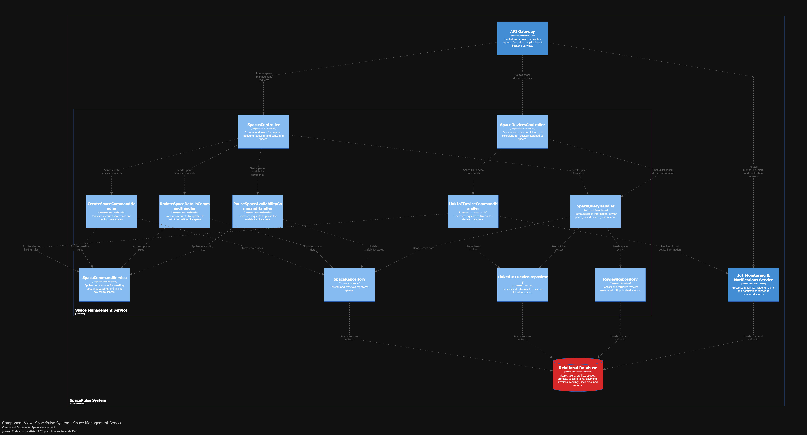

### 2.6.4.6. Bounded Context Software Architecture Code Level Diagrams

### 2.6.4.6.1. Bounded Context Domain Layer Class Diagrams

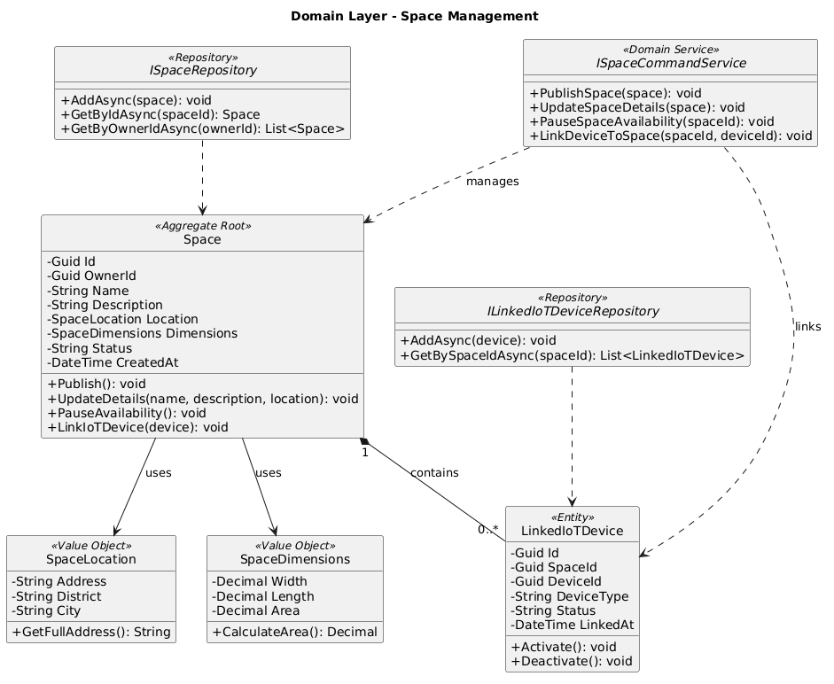

### 2.6.4.6.2. Bounded Context Database Design Diagrams

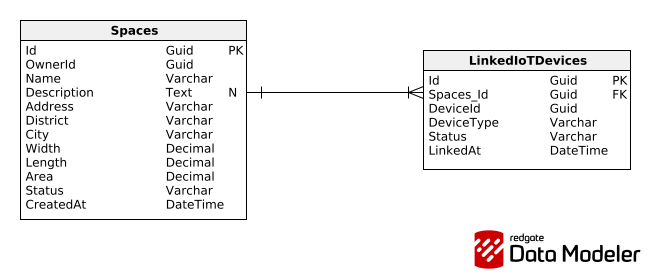

## 2.6.5. Bounded Context: IoT Monitoring and Notifications

### 2.6.5.1 Domain Layer

La capa de dominio de IoT Monitoring and Notifications encapsula la lógica principal para la supervisión de dispositivos IoT, recepción de lecturas, validación de datos y generación de alertas cuando se detectan valores fuera de rango.

### Aggregates

| **Atributo** | **Nombre**  | **Descripción**                                       |
| ------------ | --------- | ----------------------------------------------------- |
| Aggregate Root         | IoTDevice     | Representa el dispositivo IoT registrado en el sistema, asociado a un espacio específico y encargado de emitir lecturas para el monitoreo.       |


**Métodos:**
- IoTDevice.activate: Cambia el estado del dispositivo a activo para permitir la recepción de lecturas.
- IoTDevice.deactivate: Desactiva el dispositivo y evita que siga enviando información al sistema.
- IoTDevice.isActive: Verifica si el dispositivo se encuentra habilitado para operar.

### Entities

| **Atributo** | **Nombre**  | **Descripción**                                       |
| ------------ | --------- | ----------------------------------------------------- |
| ReadingId, DeviceId, MetricType, Value, Unit, ReceivedAt, Status       | Reading      | Entidad que representa una lectura enviada por un dispositivo IoT, incluyendo el tipo de métrica, valor registrado y estado de validación.      |
| AlertId, ReadingId, Severity, Status, CreatedAt          | Alert              | Entidad que representa una alerta generada cuando una lectura se encuentra fuera de los límites permitidos.                  |

### Value Objects

| **Atributo** | **Nombre**  | **Descripción**                                       |
| ------------ | --------- | ----------------------------------------------------- |
| MinValue, MaxValue, Unit  |  ThresholdRange   | Define el rango permitido para una métrica monitoreada.  |
| Value        | SeverityLevel      | Representa el nivel de gravedad de una alerta: baja, media, alta o crítica.      |
| Value        | ReadingStatus      | Indica el estado de una lectura: recibida, validada o fuera de rango.      |
| Value        | AlertStatus      | Indica el estado de una alerta: creada, enviada, reconocida o cerrada.      |

### Commands & Queries

| **Atributo** | **Nombre**  | **Tipo**                                       |
| ------------ | --------- | ----------------------------------------------------- |
| DeviceId, MetricType, Value, Unit       | IngestReadingCommand     | Command      |
| AlertId       | AcknowledgeAlertCommand      | Command      |
| AlertId       | CloseAlertCommand      | Command      |
| SpaceId       | GetAlertsBySpaceQuery      | Query      |
| SpaceId       | GetReadingsBySpaceQuery      | Query      |

### Domain Services

| **Nombre** | **Funcion**  | **Metodos**                                       |
| ------------ | --------- | ----------------------------------------------------- |
| IMonitoringDomainService        |Define las reglas para validar lecturas, detectar valores fuera de rango y generar alertas.      | ValidateReading, DetectOutOfRange, CreateAlert     |
| IAlertPolicyService        | Define criterios para clasificar la severidad de una alerta según el valor detectado.      | EvaluateSeverity, CanDispatchAlert      |

**Métodos:**

- IMonitoringDomainService.ValidateReading: Verifica que la lectura provenga de un dispositivo registrado y activo.
  
- IMonitoringDomainService.DetectOutOfRange: Evalúa si el valor recibido está fuera del rango permitido.
  
- IMonitoringDomainService.CreateAlert: Genera una alerta cuando se detecta una lectura anómala.
  
- IAlertPolicyService.EvaluateSeverity: Determina la severidad de la alerta según la métrica y el valor registrado.
  
- IAlertPolicyService.CanDispatchAlert: Valida si una alerta puede ser enviada al usuario responsable.

### Repositories

| **Nombre** | **Descripción**  | 
| ------------ | --------- |
| IIoTDeviceRepository        |Interfaz para la persistencia y recuperación de dispositivos IoT registrados.      |
| IReadingRepository        | Interfaz para almacenar y consultar lecturas recibidas desde los dispositivos.      |
| IAlertRepository        | Interfaz para gestionar el almacenamiento y consulta de alertas generadas.      |

En la Domain Layer de SpacePulse, dentro del bounded context IoT Monitoring and Notifications, se define la lógica central para monitorear dispositivos, procesar lecturas y generar alertas ante condiciones fuera de rango. La clase IoTDevice actúa como el agregado raíz, mientras que Reading y Alert representan los eventos operativos principales del monitoreo. Finalmente, la validación de lecturas, detección de anomalías y persistencia de información se gestionan mediante servicios de dominio y repositorios especializados.

### 2.6.5.2. Interface Layer

En la Interface Layer de SpacePulse, específicamente para el contexto de IoT Monitoring and Notifications, se definen los puntos de entrada que permiten la comunicación externa con las funcionalidades de monitoreo. Esta capa utiliza controladores REST, recursos DTOs y ensambladores para recibir lecturas IoT, consultar información de monitoreo y gestionar alertas, desacoplando el modelo de dominio de las representaciones externas.

### Resources

| **Nombre** | **Descripción**  |  
| ------------ | --------- | 
| IngestReadingResource        | DTO que encapsula los datos de entrada de una lectura IoT, incluyendo DeviceId, MetricType, Value y Unit.      | 
| ReadingResource        | DTO de salida que representa la información de una lectura registrada, como identificador, dispositivo, métrica, valor, unidad, fecha y estado.      | 
| AlertResource        | DTO de salida que representa una alerta generada por una lectura fuera de rango, incluyendo identificador, severidad, estado y mensaje.     | 
| AcknowledgeAlertResource        | DTO que transporta la información necesaria para reconocer una alerta pendiente.     | 
| CloseAlertResource        | DTO que permite cerrar una alerta luego de haber sido revisada o atendida.     | 

### Controllers

| **Nombre** | **Método HTTP**  | **Parámetro / Resource**  | **Descripción** |
| ------------ | --------- | --------- | --------- |
| IoTMonitoringController        | POST    |IngestReadingResource   | Expone el endpoint para recibir una nueva lectura enviada por un dispositivo IoT.   |
| IoTMonitoringController        | GET     |  SpaceId |  Recupera las lecturas registradas para un espacio monitoreado.  |
| AlertController        | GET      | SpaceId  |  Recupera las alertas asociadas a un espacio específico.  |
| AlertController        | PATCH     |  AcknowledgeAlertResource |  Permite marcar una alerta como reconocida por el usuario responsable.  |
| AlertController        | PATCH     |  CloseAlertResource |  Permite cerrar una alerta cuando ya fue atendida.  |

### Transformers / Assemblers

| **Nombre** | **Descripción**  |  
| ------------ | --------- | 
| IngestReadingCommandFromResourceAssembler        | Transforma los datos recibidos en IngestReadingResource en un comando IngestReadingCommand procesable por la capa de aplicación.   | 
| ReadingResourceFromEntityAssembler        | Convierte la entidad de dominio Reading en un objeto ReadingResource para su envío a través de la API.      | 
| AlertResourceFromEntityAssembler        | Convierte la entidad de dominio Alert en un objeto AlertResource para mostrar la información de la alerta en la aplicación.     | 
| AcknowledgeAlertCommandFromResourceAssembler        | Convierte el recurso AcknowledgeAlertResource en un comando para reconocer una alerta.    | 
| CloseAlertCommandFromResourceAssembler        | Convierte el recurso CloseAlertResource en un comando para cerrar una alerta.     | 

En la Interface Layer de SpacePulse, específicamente para el contexto de IoT Monitoring and Notifications, los controladores reciben las solicitudes HTTP relacionadas con lecturas y alertas, las transforman mediante recursos y ensambladores, y las delegan a los servicios correspondientes. Esta capa no contiene reglas de negocio, sino que actúa como puente entre la aplicación móvil, los dispositivos IoT y la lógica interna del sistema de monitoreo.

### 2.6.5.3. Application Layer

En la Application Layer de SpacePulse, específicamente para el contexto de IoT Monitoring and Notifications, los handlers se encargan de procesar los comandos y consultas relacionados con la recepción de lecturas IoT, la validación de datos y la gestión de alertas. Esta capa actúa como intermediaria entre la interfaz y el dominio, coordinando las operaciones necesarias para registrar lecturas, detectar valores fuera de rango, generar alertas y consultar información de monitoreo sin incluir directamente detalles de infraestructura.

### Commands & Queries Handlers

| **Nombre** | **Descripción**  |   Resumen de Lógica  |
| ------------ | --------- | --------- | 
| IngestReadingCommandHandler        | Procesa la recepción de nuevas lecturas enviadas por dispositivos IoT.      | Valida que el dispositivo exista y esté activo, registra la lectura recibida, evalúa si el valor está fuera del rango permitido y, si corresponde, genera una alerta asociada. | 
| AcknowledgeAlertCommandHandler        | Gestiona el reconocimiento de una alerta pendiente.     | Busca la alerta por su identificador, valida que pueda ser reconocida y actualiza su estado para indicar que el usuario ya tomó conocimiento del evento. | 
| CloseAlertCommandHandler        | Gestiona el cierre de una alerta atendida.  | Recupera la alerta registrada, valida su estado actual y la marca como cerrada cuando ya fue revisada o solucionada. | 
| GetReadingsBySpaceQueryHandler        | Recupera las lecturas asociadas a un espacio monitoreado.     | Consulta el repositorio de lecturas usando el identificador del espacio y devuelve la información organizada para su visualización. | 
| GetAlertsBySpaceQueryHandler        | Recupera las alertas generadas dentro de un espacio específico.   | Consulta las alertas asociadas al espacio, filtrando eventos pendientes, reconocidos o cerrados según sea necesario. | 


### Internal DTOs (Data Transfer Objects)

| **Nombre** | **Descripción**  |  
| ------------ | --------- | 
| ReadingDto        | Objeto que transporta la información principal de una lectura IoT, incluyendo dispositivo, tipo de métrica, valor, unidad, fecha de recepción y estado.    | 
| AlertDto        | DTO que representa una alerta generada por el sistema, incluyendo identificador, mensaje, severidad, estado y fecha de creación.    | 
| MonitoringSummaryDto        | Estructura resumida que agrupa información de monitoreo de un espacio, como cantidad de lecturas recientes, alertas activas y estado general del monitoreo.     | 

### 2.6.5.4. Infrastructure Layer

En la Infrastructure Layer de SpacePulse, específicamente para el contexto de IoT Monitoring and Notifications, se implementan los detalles técnicos necesarios para persistir dispositivos, lecturas y alertas, así como para integrarse con servicios externos relacionados con la recepción de datos IoT y el envío de notificaciones. Esta capa permite que la lógica del dominio se ejecute sobre una infraestructura concreta, manteniendo separadas las reglas de negocio de los mecanismos técnicos de almacenamiento y comunicación.

### Persistence (Repositories Implementation)

| **Nombre** | **Descripción**  |   Tecnologías / Herramientas  |
| ------------ | --------- | --------- | 
| IoTDeviceRepository        | Implementación concreta de IIoTDeviceRepository encargada de registrar, actualizar y consultar dispositivos IoT asociados a los espacios monitoreados.     | Entity Framework Core, LINQ | 
| ReadingRepository        | Implementación de IReadingRepository encargada de almacenar las lecturas recibidas desde los dispositivos y consultarlas por espacio, dispositivo o fecha.    | Entity Framework Core, LINQ | 
| AlertRepository        | Implementación de IAlertRepository encargada de persistir alertas generadas, actualizar su estado y recuperar alertas pendientes o históricas.    | Entity Framework Core, LINQ | 
| IoTDeviceConfiguration        | Define el mapeo entre la entidad IoTDevice y la tabla correspondiente en la base de datos, incluyendo restricciones y relaciones.  | Fluent API | 
| ReadingConfiguration        | Configura el esquema de base de datos para las lecturas IoT, incluyendo tipos de datos, relación con dispositivos y fecha de recepción.   | Fluent API | 
| AlertConfiguration        | Configura el mapeo de las alertas, sus estados, severidad y relación con la lectura que originó la alerta.     | Fluent API | 

## Security Services Implementation

|Nombre|Desripcion |Resumen de Implementacion|
|------|-----------|-------------------------|
| IoTBrokerAdapter      | Adaptador encargado de recibir datos provenientes del broker IoT o dispositivos externos.     | Recibe lecturas externas, normaliza su formato y las transforma en datos procesables por la capa de aplicación. | 
| NotificationDispatcherService        |Servicio técnico encargado de enviar alertas o mensajes hacia los usuarios cuando ocurre un evento importante.   |Integra el sistema con un servicio externo de correo o notificaciones para comunicar alertas generadas por el monitoreo. | 
| ReadingNormalizerService        |Servicio de apoyo encargado de limpiar y estandarizar los valores recibidos desde sensores.    | Convierte unidades, valida estructura básica de datos y prepara la lectura antes de ser enviada al dominio. | 

### 2.6.5.5. Bounded Context Software Architecture Component Level Diagrams

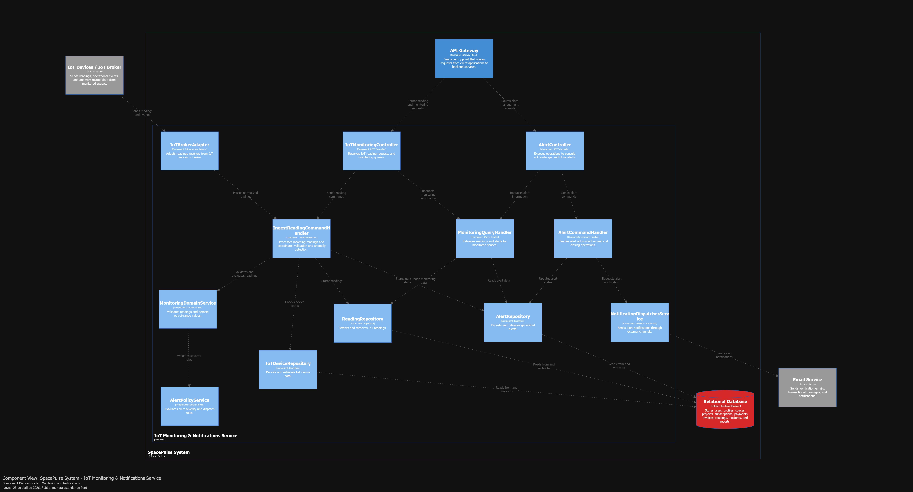

### 2.6.5.6. Bounded Context Software Architecture Code Level Diagrams

### 2.6.5.6.1. Bounded Context Domain Layer Class Diagrams

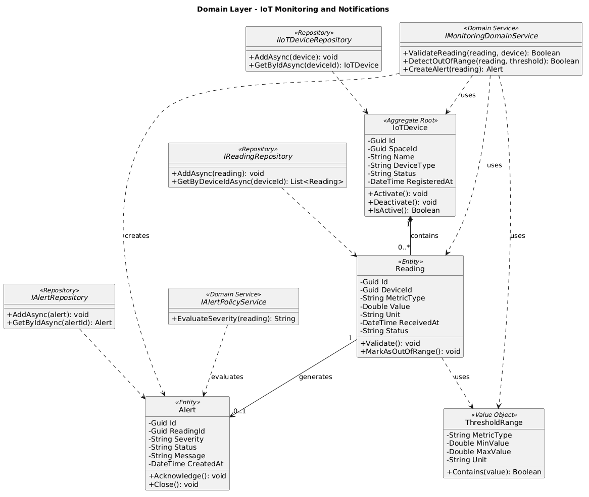

### 2.6.5.6.2. Bounded Context Database Design Diagrams

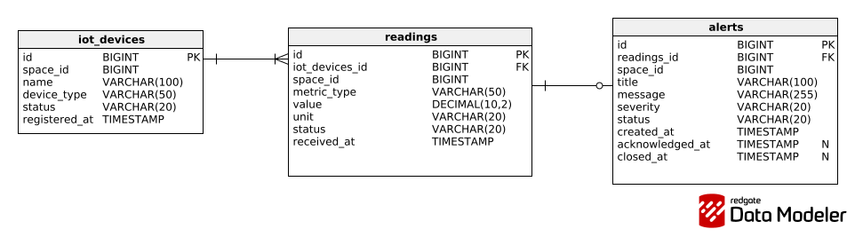

## Capítulo III: Solution UI/UX Design

### 3.1. Product design
El diseño de producto de SpacePulse se plantea como una experiencia digital simple, moderna y confiable, orientada a conectar a clientes que desean remodelar un espacio con especialistas capaces de guiarlos durante el proceso. La propuesta visual y funcional se enfoca en facilitar la publicación de espacios, la solicitud de asesorías, la contratación de servicios, el seguimiento del avance, la revisión de pagos y la recepción de alertas relevantes desde una sola plataforma. Por ello, el diseño prioriza una navegación clara, elementos visuales sobrios y una organización intuitiva de la información, de modo que tanto el cliente como el remodelador puedan comprender rápidamente el estado del proyecto, las acciones pendientes y los servicios disponibles. En conjunto, SpacePulse busca transmitir orden, confianza y acompañamiento profesional durante la transformación de hogares, oficinas y otros espacios privados, manteniendo el componente IoT como un valor complementario para el monitoreo y control del espacio.

#### 3.1.1. Style Guidelines 
Las Style Guidelines de SpacePulse definen los criterios visuales que guían la identidad del producto, tanto en la landing page como en la futura aplicación móvil. La propuesta visual se basa en una estética moderna, sobria y profesional, orientada a transmitir confianza durante el proceso de remodelación de espacios. Para ello, se emplea una paleta de colores compuesta por azul oscuro como tono principal, un acento cálido para botones y elementos destacados, fondos claros para mejorar la lectura y tipografías limpias que facilitan la navegación. Esta línea visual permite que SpacePulse se perciba como una plataforma cercana, ordenada y confiable para clientes y especialistas.

##### 3.1.1.1. General Style Guidelines  
La identidad visual de SpacePulse se construye a partir de un enfoque minimalista, moderno y funcional. El logo representa una casa con una línea tipo pulso, lo cual comunica la idea de un espacio vivo, en seguimiento y en proceso de mejora, sin colocar la tecnología como elemento principal. La landing page utiliza como color principal #2c3e50, como color de acento #d4a373, fondo claro #f8f9fa, texto principal #333333 y blanco #ffffff; además, emplea Roboto para títulos y Open Sans para el cuerpo del texto. Esta combinación permite mantener una apariencia profesional y coherente con el rubro de remodelación, diseño de interiores y gestión de espacios.

**Logo**

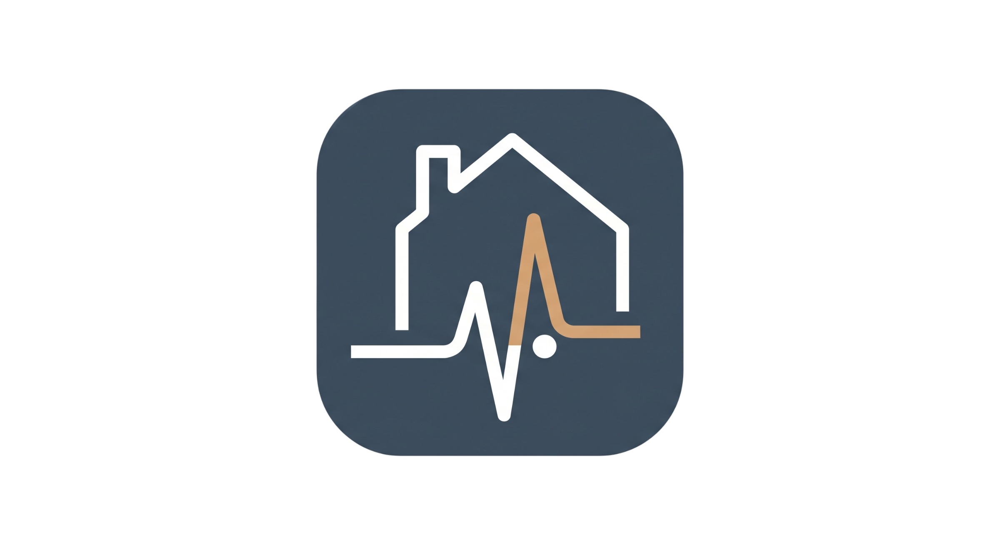

**Paleta de colores**

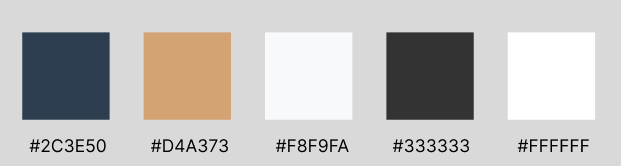

|Color	|Código	|Uso principal|
|---|---|---|
|Azul oscuro	|#2C3E50	|Color principal de marca, encabezados, botones primarios y footer.|
|Acento cálido	|#D4A373	|Botones secundarios, íconos, métricas y elementos destacados.|
|Fondo claro	|#F8F9FA	|Fondo general de secciones y pantallas.|
|Texto principal	|#333333	|Textos descriptivos y contenido general.|
|Blanco	|#FFFFFF	|Tarjetas, formularios, contrastes y espacios limpios.|

**Tipografía**

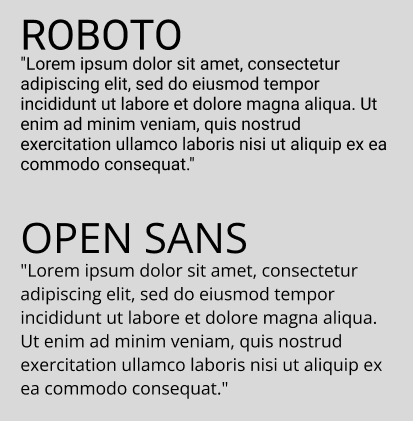

|Tipo	|Fuente	|Uso|
|---|---|---|
|Títulos	|Roboto	|Encabezados, logo, botones y títulos principales.|
|Cuerpo de texto	|Open Sans	|Párrafos, formularios, descripciones y contenido informativo.|

#### 3.1.2. Information Architecture

La Information Architecture de SpacePulse organiza el contenido y las funcionalidades de la plataforma para que los usuarios puedan encontrar rápidamente la información que necesitan y realizar sus acciones principales sin dificultad. La estructura se divide entre la landing page, orientada a presentar el servicio, explicar sus beneficios y captar solicitudes de asesoría, y la aplicación móvil, enfocada en la gestión del proceso de remodelación. En la app, la información se organiza según las tareas principales del usuario: revisar espacios publicados, solicitar servicios, monitorear avances, consultar pagos, recibir alertas y comunicarse con especialistas. De esta manera, la arquitectura de información busca mantener una navegación clara, reducir la confusión del usuario y facilitar el seguimiento de cada etapa del proyecto desde una sola plataforma

##### 3.1.2.1. Organization Systems  

La organización de la información en SpacePulse se plantea de forma jerárquica y secuencial, permitiendo que el usuario avance desde una comprensión general del servicio hasta acciones concretas dentro de la plataforma. En la landing page, el contenido se organiza jerárquicamente, iniciando con una presentación clara del valor de SpacePulse, seguida por servicios, beneficios, especialistas y formulario de contacto. Esto permite que el visitante comprenda rápidamente qué ofrece la plataforma y cómo puede iniciar una solicitud. En la aplicación móvil, la organización se estructura principalmente por tareas y por tipo de usuario, separando las funciones del cliente y del remodelador experto. Para el cliente, la información se agrupa en espacios, avances, pagos, alertas y solicitudes; mientras que para el remodelador se priorizan proyectos asignados, registro de avances, materiales, incidencias y comunicación con el cliente.

|Sistema de organización	|Aplicación en SpacePulse|
|---|---|
|Jerárquico |Se usa para ordenar la información desde lo más importante hasta lo más específico, como el resumen del espacio, detalles del proyecto, pagos, alertas e historial.|
|SecuenciaL |Se aplica en procesos paso a paso, como registrar un espacio, solicitar una asesoría, contratar un servicio o reportar una incidencia.|
|Por audiencia |Separa las funcionalidades según el tipo de usuario: cliente o remodelador experto.|
|Por tópicos |Agrupa el contenido en módulos como espacios, remodelaciones, pagos, monitoreo, reportes y notificaciones.|
|Cronológico |Se utiliza en el seguimiento de avances, historial de cambios, pagos realizados, alertas recibidas y reportes generados.|

##### 3.1.2.2. Labelling Systems 

El Labelling System de SpacePulse se plantea a partir de etiquetas simples y directamente asociadas a los módulos principales de la aplicación móvil. Estas etiquetas se relacionan con los bounded contexts definidos en el diseño del sistema, pero se adaptan a un lenguaje más claro para el usuario final. De esta manera, en lugar de mostrar nombres técnicos como Identity & Access Management o IoT Monitoring & Notifications, la aplicación utiliza términos más familiares como Perfil, Monitoreo o Alertas. Esta decisión permite que la navegación sea más intuitiva y que cada sección represente una responsabilidad funcional clara dentro de la plataforma, tal como se solicita para los sistemas de etiquetado del producto. 

|Etiqueta en la aplicación	|Uso dentro de SpacePulse|
|---|---|
|Perfil |Permite al usuario revisar y administrar su información personal, rol, datos de cuenta y configuración básica.|
|Mis Espacios |Permite visualizar, crear, actualizar, publicar o eliminar los espacios registrados por el usuario.|
|Pagos |Centraliza pagos pendientes, pagos realizados, comprobantes, recordatorios y estado de las transacciones.|
|Monitoreo |Muestra el estado del espacio, lecturas relevantes de sensores, alertas activas e incidencias detectadas.|
|Reportes |Permite consultar reportes de avance, métricas del proyecto, historial de cambios, costos e información resumida para la toma de decisiones.|

Estas etiquetas fueron seleccionadas para mantener coherencia entre la arquitectura del sistema y la experiencia del usuario. Mis Espacios funciona como el punto de partida para administrar los ambientes registrados; Monitoreo representa el seguimiento del estado del espacio y las alertas importantes; Pagos agrupa la gestión financiera; Reportes organiza la información analítica; y Perfil permite acceder a la configuración del usuario. Con ello, la aplicación mantiene una navegación simple, pero alineada con la estructura modular definida en el proyecto.

##### 3.1.2.3. SEO Tags and Meta Tags 

Para SpacePulse, los SEO Tags y Meta Tags se definen con el objetivo de mejorar la identificación del producto en buscadores y mantener una presentación clara del servicio en la landing page. Las etiquetas se enfocan en comunicar la propuesta principal: remodelación de espacios, asesoría profesional, seguimiento del avance y monitoreo inteligente como valor complementario. Además, para la aplicación móvil se consideran elementos de ASO, orientados a que el usuario pueda reconocer rápidamente el propósito de la app en una tienda de aplicaciones.

**SEO Tags y Meta Tags para Landing Page**

|Elemento	|Valor propuesto|
|---|---|
|Title |SpacePulse / Remodelación y gestión inteligente de espacios|
|Meta Description |SpacePulse conecta clientes con especialistas en remodelación, permitiendo gestionar espacios, revisar avances, controlar pagos y recibir alertas desde una sola plataforma.|
|Meta Keywords |remodelación, diseño de interiores, gestión de espacios, remodeladores, seguimiento de proyectos, espacios inteligentes, SpacePulse
|Meta Author |Coder-Placing|

**ASO Elements para Mobile Application**

|Elemento	|Valor propuesto|
|---|---|
|App Title |SpacePulse|
|App Subtitle |Remodela y gestiona tus espacios|
|App Keywords |remodelación, espacios, hogar, oficina, avances, pagos, alertas, especialistas|
|App Description	|SpacePulse es una aplicación móvil que permite gestionar espacios en remodelación, conectar con especialistas, revisar avances, controlar pagos y recibir alertas importantes del proyecto desde un solo lugar.|

##### 3.1.2.4. Searching Systems  
Las funciones de búsqueda en SpacePulse han sido diseñadas para que los usuarios puedan encontrar rápidamente información relevante dentro de la aplicación móvil, sin tener que navegar manualmente por todos los módulos. El objetivo es ofrecer una experiencia más ordenada y eficiente, especialmente porque la plataforma manejará datos relacionados con espacios, avances, pagos, alertas y reportes. A continuación, se detallan las principales opciones de búsqueda consideradas para la aplicación y la forma en que se mostrarán los resultados.

**Barra de búsqueda global:** En la pantalla principal de la aplicación se implementa una barra de búsqueda que permite localizar espacios, pagos, alertas o reportes ingresando palabras clave. Esta barra se encontrará en una zona visible de la interfaz y permitirá acceder rápidamente a información importante relacionada con el proceso de remodelación.

**Búsqueda de espacios:** En el módulo de Mis Espacios, los usuarios podrán buscar espacios registrados por nombre, dirección o tipo de ambiente. Los resultados mostrarán tarjetas con el nombre del espacio, estado actual, imagen referencial y última actualización, permitiendo acceder de forma directa al detalle del espacio seleccionado.

**Búsqueda de alertas y monitoreo:** En el módulo de Monitoreo, los usuarios podrán buscar alertas, incidencias o lecturas asociadas a un espacio específico. Además, podrán filtrar la información por fecha, tipo de evento, prioridad o estado de atención. Los resultados se mostrarán en orden cronológico, priorizando las alertas más recientes o relevantes.

**Búsqueda de pagos:** En el módulo de Pagos, se permitirá localizar pagos pendientes, pagos realizados o comprobantes mediante palabras clave, fecha o estado de transacción. Los resultados mostrarán el monto, la fecha, el estado del pago y el acceso al detalle correspondiente, facilitando el control financiero del proyecto.

**Búsqueda de reportes:** En la sección de Reportes, los usuarios podrán buscar informes relacionados con avance, costos, incidencias o monitoreo del espacio. Esta búsqueda permitirá encontrar reportes por título, fecha de generación o espacio asociado. Al seleccionar un resultado, se mostrará una vista detallada con la información resumida del proyecto.

**Búsqueda por filtros combinados:** SpacePulse también permitirá aplicar filtros combinados para visualizar información más específica. Por ejemplo, el usuario podrá buscar alertas críticas de un espacio determinado, pagos pendientes de un proyecto o reportes generados dentro de un rango de fechas. Esta funcionalidad ayudará a revisar información puntual sin recorrer toda la aplicación.

##### 3.1.2.5. Navigation Systems

La estructura de navegación de SpacePulse ha sido diseñada para ofrecer una experiencia clara, fluida y coherente entre la landing page y la aplicación móvil. Su objetivo es facilitar el acceso a la información principal del servicio, orientar al usuario durante el proceso de remodelación y permitir una interacción ordenada con las funciones más importantes de la plataforma. La navegación busca que tanto clientes como remodeladores puedan identificar rápidamente las secciones disponibles y acceder a ellas sin dificultad.

**Landing Page (Web):**

La barra de navegación principal, ubicada en la parte superior de la página, permite que los visitantes se desplacen rápidamente por las secciones informativas del sitio. Además, se incluye un botón de llamada a la acción para iniciar el contacto con un especialista. Las secciones disponibles son:

•	Inicio: Presenta la propuesta principal de SpacePulse y comunica el valor del servicio de remodelación y asesoría. 

•	Servicios: Muestra las opciones principales que ofrece la plataforma, como consultoría, visitas de diagnóstico y planos o renders. 

•	Especialistas: Presenta el enfoque profesional del servicio y refuerza la confianza en los expertos que acompañan el proceso. 

•	Contacto: Permite al usuario dejar sus datos para solicitar información o reservar una asesoría. 

•	Agendar Cita: Funciona como acceso directo para iniciar una solicitud de atención o asesoramiento. 

**Aplicación Móvil:**

En la versión móvil, la navegación se organizará mediante una barra inferior fija con iconos simples y etiquetas claras. Esta estructura permitirá acceder a los módulos principales de la aplicación sin depender de menús complejos. Las opciones principales son:

•	Mis Espacios: Permite visualizar, crear y administrar los espacios registrados por el usuario. 

•	Monitoreo: Muestra el estado del espacio, alertas activas, incidencias y lecturas relevantes. 

•	Pagos: Centraliza pagos pendientes, pagos realizados, comprobantes y estados de transacción. 

•	Reportes: Permite consultar reportes de avance, costos, incidencias y seguimiento del proyecto. 

•	Perfil: Permite al usuario revisar y editar su información personal, rol, configuración y preferencias.


#### 3.1.3. Landing Page UI Design  

##### 3.1.3.1. Landing Page Wireframe  
<br>

<p align="center">
  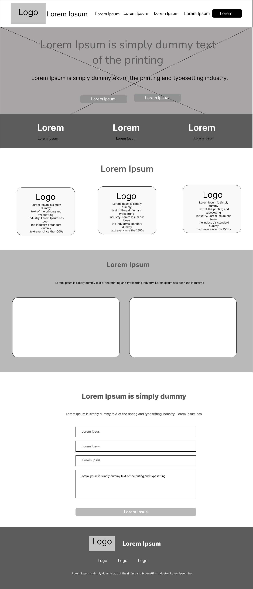
</p>
##### 3.1.3.2. Landing Page Mock-up  
<br>

<p align="center">
  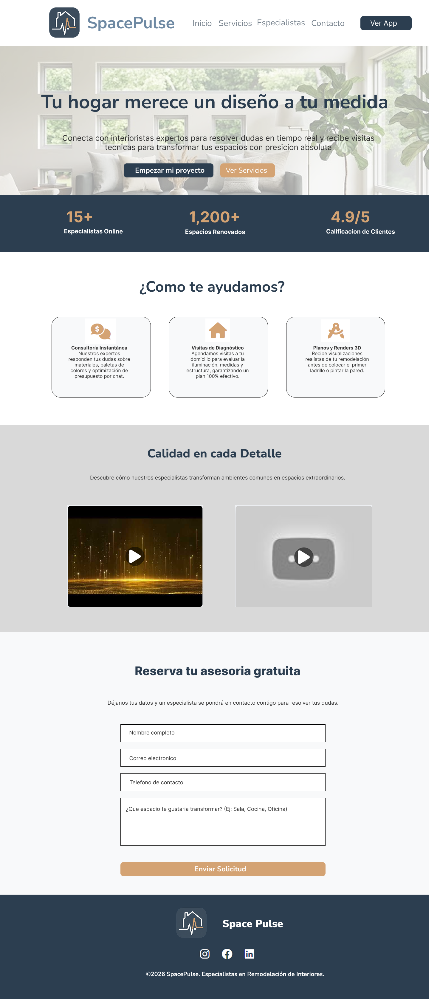
</p>


#### 3.1.4. Mobile Applications UX/UI Design  

El diseño UX/UI de la aplicación móvil de SpacePulse se desarrolló con el objetivo de representar de forma clara las principales interacciones de los usuarios dentro de la plataforma. Para ello, se consideraron dos perfiles principales: el cliente, quien registra espacios, revisa avances, monitorea alertas, consulta pagos y visualiza reportes; y el remodelador, quien gestiona proyectos asignados, revisa tareas, actualiza avances y consulta su calendario de trabajo. A partir de estos flujos, se elaboraron wireframes, wireflows, mock-ups, user flows y un prototipo interactivo que permite visualizar cómo funcionaría la aplicación desde la experiencia del usuario. Todo realizado en figma y visible en el siguiente enlace: [Lienzo en Figma](https://www.figma.com/design/wM4jmVau4dlkKhGnMwnJ93/SpacePulse?node-id=0-1&p=f&t=P0AsdIr3Pfa4T79N-0)

##### 3.1.4.1. Mobile Applications Wireframes  

Los wireframes de la aplicación móvil de SpacePulse representan la estructura inicial de las pantallas, sin aplicar todavía la identidad visual final del producto. En esta etapa se definió la distribución de los elementos principales, como formularios, botones, tarjetas, menús inferiores, filtros, estados vacíos, ventanas emergentes y pantallas diferenciadas para cliente y remodelador. Estos wireframes permitieron organizar la navegación de la app y validar que cada módulo principal, como espacios, monitoreo, pagos, reportes y perfil, cuente con una estructura clara antes de pasar al diseño visual final.

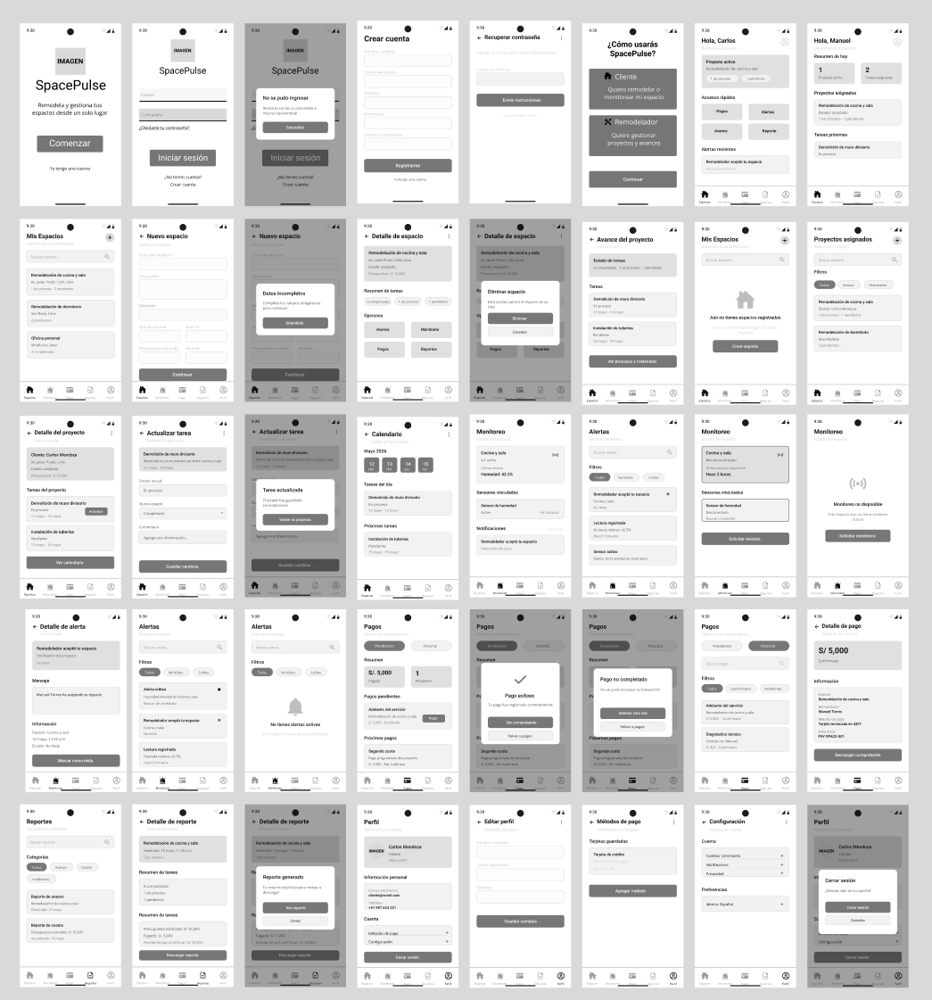

##### 3.1.4.2. Mobile Applications Wireflow Diagrams  

Los wireflow diagrams muestran cómo se conectan las diferentes pantallas de la aplicación móvil de SpacePulse a partir de las acciones del usuario. En estos diagramas se representan rutas como el inicio de sesión, el registro, la selección de rol, la gestión de espacios, la revisión de alertas, el proceso de pagos, la consulta de reportes y la actualización de tareas por parte del remodelador. Además, se incluyen interacciones específicas como botones, tarjetas, pestañas, navegación inferior y ventanas modales, permitiendo entender cómo el usuario avanza de una pantalla a otra dentro de la aplicación.

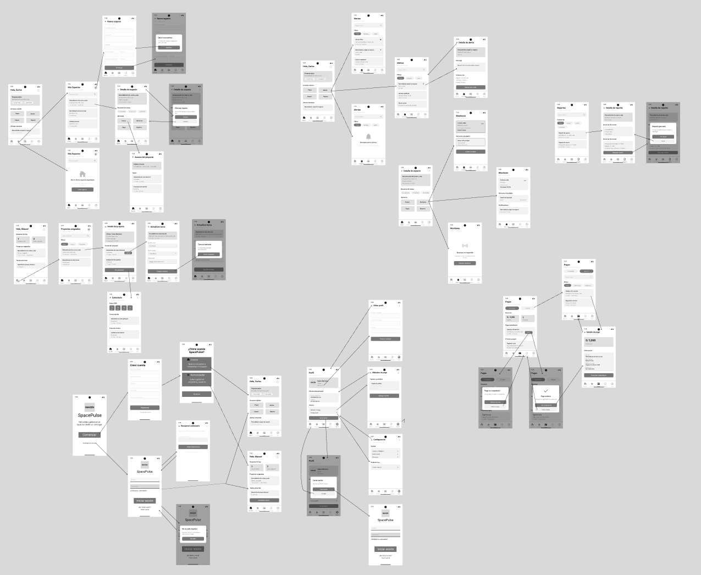

##### 3.1.4.3. Mobile Applications Mock-ups  

Los mock-ups de la aplicación móvil de SpacePulse corresponden a la versión visual final de los wireframes. En esta etapa se aplicó la identidad gráfica del producto, incluyendo la paleta de colores, tipografías, iconografía, logo, fotografías de perfil, estilos de botones, tarjetas, formularios y estados visuales. El diseño mantiene una apariencia moderna, limpia y profesional, usando tonos sobrios para transmitir confianza y un acento cálido para resaltar acciones importantes. De esta manera, los mock-ups permiten visualizar con mayor precisión cómo se verá la aplicación para clientes y remodeladores.

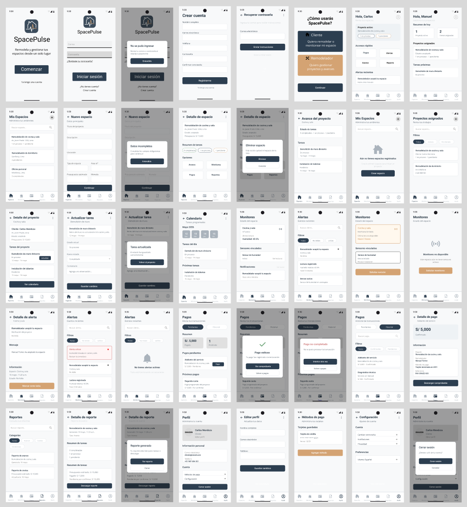

##### 3.1.4.4. Mobile Applications User Flow Diagrams  

Los user flow diagrams describen los recorridos principales que realizan los usuarios dentro de la aplicación móvil. Para el cliente, se consideran flujos como registrarse, crear un espacio, revisar el avance del proyecto, consultar alertas, realizar pagos y visualizar reportes. Para el remodelador, se consideran flujos como revisar proyectos asignados, consultar tareas, actualizar el estado de una tarea y acceder al calendario de actividades. Estos diagramas ayudan a representar de forma ordenada las decisiones y acciones del usuario durante el uso de SpacePulse.

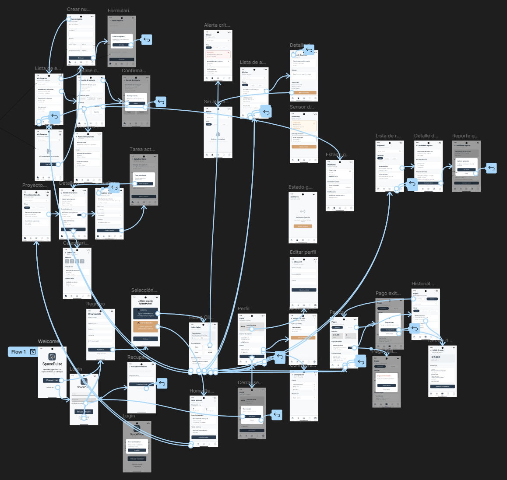

##### 3.1.4.5. Mobile Applications Prototyping  

El prototipo interactivo de la aplicación móvil de SpacePulse fue desarrollado a partir de los mock-ups, conectando las pantallas mediante interacciones básicas en Figma. Este prototipo permite simular la navegación real de la app, incluyendo el uso del menú inferior, botones principales, tarjetas seleccionables, pestañas internas, formularios y ventanas emergentes. Gracias a ello, se puede probar el recorrido del cliente y del remodelador antes de una implementación funcional, identificando si los flujos son comprensibles y si las acciones principales están correctamente conectadas.

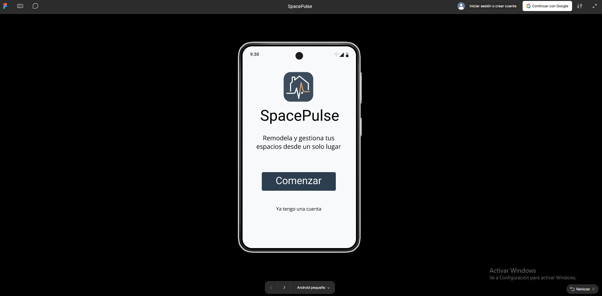

Se puede ver directamente en el siguiente enlace: [Prototipo SpacePulse](https://www.figma.com/proto/wM4jmVau4dlkKhGnMwnJ93/SpacePulse?node-id=64-4412&p=f&t=D39hUrnmO2gtsP5t-1&scaling=scale-down&content-scaling=fixed&page-id=0%3A1&starting-point-node-id=64%3A4412)

## Capítulo IV: Product Implementation & Validation 


### 4.1. Software Configuration Management  
#### 4.1.1. Software Development Environment Configuration  
En este apartado se describe la configuración del entorno de desarrollo de Task Master, establecida para garantizar la correcta integración, colaboración y trazabilidad de las actividades realizadas por los miembros del equipo.  
Se definen las herramientas, plataformas y productos de software utilizados a lo largo del ciclo de vida del desarrollo, desde la gestión del proyecto hasta el despliegue y la documentación técnica.

| Plataforma / Herramienta | Descripción | Enlace |
|---------------------------|--------------|---------|
| GitHub | Plataforma de control de versiones basada en Git que permite la colaboración entre desarrolladores, la gestión de ramas, control de cambios y automatización del despliegue continuo (CI/CD). | [https://github.com](https://github.com) |
| Render | Servicio de despliegue automatizado para backend y frontend. Facilita la integración continua, escalado automático y monitoreo del sistema en producción. | [https://render.com](https://render.com) |
| Figma | Herramienta colaborativa de diseño de interfaces, utilizada para la creación de wireframes, mockups y prototipos interactivos de Task Master. Permite trabajo simultáneo entre diseñadores y desarrolladores. | [https://www.figma.com](https://www.figma.com) |
| Structurizr | Herramienta usada para representar la arquitectura C4 de Task Master (Contexto, Contenedor, Componente, Código), mostrando la relación entre los módulos principales (Gestión de Tareas, Tableros, Usuarios, Visualización). | [https://structurizr.com](https://structurizr.com) |
| C4 Model | Modelo conceptual que permite documentar las decisiones arquitectónicas del sistema de manera jerárquica y comprensible para todo el equipo. | [https://c4model.com](https://c4model.com) |
| Trello | Plataforma de gestión de proyectos que facilita la organización de tareas y entregables mediante tableros, listas y tarjetas. Se emplea para la planificación ágil (sprints, backlogs, revisiones). | [https://trello.com](https://trello.com) |
| UXPressia | Utilizada para la creación de User Personas y Customer Journey Maps, ayudando a entender las necesidades, frustraciones y objetivos de los usuarios que gestionan tareas dentro de la app. | [https://uxpressia.com](https://uxpressia.com) |

#### 4.1.2. Source Code Management 

En esta sección, el equipo de desarrollo de SpacePulse establece los medios y el esquema de organización aplicados para el seguimiento de modificaciones, utilizando GitHub como plataforma principal de control de versiones.  
De esta manera, se configuró un repositorio remoto en GitHub para almacenar el código fuente, documentar los cambios y colaborar de manera eficiente entre los miembros del equipo durante todo el ciclo de desarrollo.

Se utiliza GitHub como sistema centralizado para el versionado y la colaboración.  
Los repositorios oficiales del proyecto Task Master son los siguientes:

- Landing Page: `https://github.com/Coder-Placing/LandingPage-SpacePulse.git`
- Movile App Application: ``
- Backend Web Services: `https://github.com/Coder-Placing/Backend.git`

#### Implementación de GitFlow

Para mantener una estructura organizada y evitar conflictos durante el desarrollo colaborativo, el equipo adopta la estrategia **GitFlow**, con ramas bien definidas para diferentes etapas y propósitos del proyecto.

**Ramas base:**

- **main**: Contiene la versión estable del código desplegada en producción.  
- **develop**: Incluye las últimas actualizaciones y desarrollos en curso que eventualmente serán fusionados a `main`.

**Feature branches:**

Cada nueva funcionalidad o módulo inicia desde `develop`.  
Convención de nombres: `feature/nombre-descriptivo`  
Ejemplo: `feature/task-calendar-sync`

Cada repositorio cuenta con flujos de trabajo independientes, integraciones de despliegue automático en Render y acciones de CI/CD configuradas en GitHub Actions.

#### 4.1.3. Source Code Style Guide & Conventions 

El equipo ha definido las siguientes convenciones de nombres y estilos de codificación para el proyecto SpacePulse, aplicadas en los lenguajes HTML, CSS, JavaScript, Kotlin y C#. Todas las nomenclaturas están en inglés, buscando claridad, estandarización y buenas prácticas de desarrollo. Se han adoptado guías de estilo reconocidas y actualizadas para cada tecnología.

## HTML

- Guía adoptada: [W3C HTML Style Guide](https://www.w3.org/TR/html5/)
- Nomenclatura y convenciones:
  - Minúsculas para etiquetas y atributos: `<div class="container">`
  - Indentación: 2 espacios
  - Atributos entre comillas dobles: ``
  - Uso semántico de etiquetas: `<header>`, `<section>`, `<footer>`
  - Comentarios HTML: `<!-- This is a comment -->`

## CSS

- Guía adoptada: [Google HTML/CSS Style Guide](https://google.github.io/styleguide/htmlcssguide.html)
- Nomenclatura y convenciones:
  - `kebab-case` para clases e IDs  
    Ejemplo: `.main-header`, `#footer-section`
  - Agrupación de estilos por componente
  - Evitar el uso de `!important` salvo en casos necesarios
  - Indentación: 2 espacios

## JavaScript

- Guía adoptada: [Google JavaScript Style Guide](https://google.github.io/styleguide/jsguide.html)
- Nomenclatura y convenciones:
  - `camelCase` para variables y funciones  
    Ejemplo: `let Name = 'Luis';`, `function calculateAverage() {}`
  - `PascalCase` para clases  
    Ejemplo: `class DashboardManager {}`
  - Evitar `snake_case`
  - Usar `const` y `let` en lugar de `var`


## C#

- Nomenclatura y convenciones:
  - `PascalCase` para clases  
    Ejemplo: `public class CourseService {}`
  - `camelCase` para variables, métodos y atributos  
    Ejemplo: `int totalCourses;`, `calculateProgress();`
  - Constantes en MAYÚSCULAS con `snake_case`  
    Ejemplo: `public static final int MAX_MEMBERS = 50;`
  - Paquetes en minúsculas separados por punto  
    Ejemplo: `com.spacepulse.backend.controller`


## SQL / Data Modeling (Vertabelo)

- Guía adoptada: [SQL Style Guide](https://www.sqlstyle.guide/)
- Nomenclatura y convenciones:
  - Nombres en inglés, en singular
  - Prefijos según entidad o módulo
  - Palabras reservadas en mayúsculas
  - Relaciones consistentes entre tablas
  - Ejemplo:
    ```sql
    CREATE TABLE Member (
      member_id INT PRIMARY KEY,
      first_name VARCHAR(50),
      last_name VARCHAR(50),
      enrollment_date DATE
    );
    ```

## Kotlin / XML (Aplicativo móvil – Android Studio)

- Guía adoptada: [Android Kotlin Style Guide](https://developer.android.com/kotlin/style-guide)
- Nomenclatura y convenciones:
  - Código limpio, reutilizable y seguro
  - `camelCase` para variables y funciones  
    Ejemplo: `val userName: String = "Eric"`
  - `PascalCase` para clases y componentes de UI  
    Ejemplo: `class DashboardActivity : AppCompatActivity()`
  - XML en `snake_case`  
    Ejemplo: `<TextView android:id="@+id/student_name_text" />`
  - Comentarios claros y concisos


#### 4.1.4. Software Deployment Configuration 

## Despliegue del Frontend (Landing Page)

La landing page de SpacePulse fue desarrollada utilizando HTML, CSS y JavaScript, enfocándose en un diseño responsivo, limpio y rápido.  
El sitio se publica mediante GitHub Pages, lo que permite una distribución gratuita, confiable y accesible desde cualquier navegador.  
Durante el proceso de preparación para producción, se aplican optimizaciones de carga como la reducción de archivos CSS y JS, la organización modular del código y la compresión de imágenes en formatos .jpg, .png y .svg.  

## Despliegue del Backend (API – .NET)

El backend de SpacePulse está implementado con C#, siguiendo principios de arquitectura modular y escalable.  Actualmente, el entorno de despliegue se realiza en la nube en Render.  
Se manejan variables de entorno para gestionar las credenciales y configuraciones sensibles, manteniendo la seguridad y trazabilidad del sistema.  
La API REST está diseñada para gestionar tareas, usuarios y tableros de forma eficiente, garantizando una comunicación estable con el frontend y la aplicación móvil.

## Configuración del Aplicativo Móvil (Android)

La versión móvil de SpacePulse fue desarrollada en Android Studio, empleando Kotlin para la lógica y XML para el diseño de interfaces.  
En la etapa actual, las pruebas se realizan mediante emuladores locales y dispositivos físicos, asegurando la compatibilidad con diferentes versiones del sistema operativo Android.  
El despliegue se gestiona mediante la generación de archivos .apk y su distribución interna para pruebas cerradas.  
El aplicativo mantiene sincronización con el backend en tiempo real, permitiendo a los usuarios gestionar tareas, recibir actualizaciones y visualizar su progreso desde el móvil.

### 4.2. Landing Page & Mobile Application Implementation 

#### 4.2.1. Sprint 1  


##### 4.2.1.1. Sprint Planning 1  

| Elemento | Detalle |
|-----------|----------|
| Sprint # | Sprint 1 |
| Fecha | 9 de mayo del 2026 |
| Hora | 3:00 p.m. |
| Lugar | Virtual – Google Meet |
| Elaborado por | Gabriel Perez Tuesta |
| Participantes (Reunión de planificación) | Aliaga Urbina, Wilder Gonzalo, Via Luna, Bruce, Martinez Gaona, Pablo Afranio, Perez Tuesta, Gabriel, Landa Ortiz, Sergio Javier |
| Resumen de la revisión anterior | Al ser el primer sprint, aún no se completa|
| Resumen de la retrospectiva anterior |Al ser el primer sprint, aún no se completa |
| Objetivo del Sprint | El objetivo de este sprint es establecer la base técnica y visual del proyecto SpacePulse, desarrollando la landing page y los módulos principales del backend para la gestión de usuarios y tareas. Se busca garantizar que los usuarios puedan gestionar sus primeras tareas. Resultado esperado: Desplegar la primera versión funcional del sistema. Impacto: Validar la propuesta de valor e iniciar pruebas internas. Usuarios objetivo: Personas interesadas en organizar sus actividades y proyectos. Evento clave: Los usuarios pueden registrarse, iniciar sesión y visualizar sus tareas dentro del sistema. |
| Velocidad del Sprint | El equipo puede atender hasta 43 Story Points. |
| Suma de Story Points | La suma de Story Points planificados para este sprint es de 43 Story Points. |

##### 4.2.1.2. Sprint Backlog 1 

El objetivo principal del Sprint 1 fue implementar las secciones principales de la Landing Page de SpacePulse y desarrollar las funcionalidades base del backend para la gestión de proyectos y tareas.  
Este sprint combinó tareas de diseño visual, estructura HTML, desarrollo en JavaScript y construcción de endpoints.

# Sprint Backlog - SpacePulse

| Código US / TS | Título | Id de Tarea | Título de la Tarea | Descripción | Estimación (hrs) | Story Points | Asignado a | Estado |
|---|---|---|---|---|---|---|---|---|
| US01 | Visualización de Landing Page | TS01 | Diseño de estructura Landing Page | Crear estructura inicial de la landing con navbar, hero section y footer. | 6 | 3 | Frontend Dev | To Do |
| US01 | Visualización de Landing Page | TS02 | Implementación sección servicios | Mostrar los beneficios y servicios ofrecidos por SpacePulse. | 5 | 2 | Frontend Dev | To Do |
| US01 | Visualización de Landing Page | TS03 | Diseño responsive Landing | Adaptar la Landing Page para móviles y tablets. | 4 | 2 | Frontend Dev | To Do |
| US02 | Acceso a la aplicación | TS04 | Botón de ingreso a la app | Implementar botón “Ingresar” con redirección al sistema principal. | 2 | 1 | Frontend Dev | To Do |
| US03 | Registro de Usuarios | TS05 | Crear endpoint de registro | Desarrollar endpoint backend para registrar usuarios nuevos. | 6 | 3 | Backend Dev | To Do |
| US03 | Registro de Usuarios | TS06 | Validación de datos de registro | Validar correo único, contraseña y campos obligatorios. | 5 | 2 | Backend Dev | To Do |
| US03 | Registro de Usuarios | TS07 | Persistencia de usuarios | Guardar usuarios registrados en la base de datos. | 4 | 1 | Backend Dev | To Do |
| US04 | Inicio de Sesión | TS08 | Endpoint de login | Implementar autenticación mediante correo y contraseña. | 6 | 3 | Backend Dev | To Do |
| US04 | Inicio de Sesión | TS09 | Generación de JWT | Generar token JWT para sesiones autenticadas. | 4 | 2 | Backend Dev | To Do |
| US04 | Inicio de Sesión | TS10 | Manejo de errores login | Mostrar respuesta adecuada cuando las credenciales sean inválidas. | 3 | 1 | Backend Dev | To Do |
| US07 | Selección de Roles | TS16 | Gestión de roles de usuario | Implementar selección de roles durante el registro. | 4 | 2 | Backend Dev | To Do |
| US07 | Selección de Roles | TS17 | Restricción de permisos por rol | Validar acceso a funcionalidades según rol asignado. | 5 | 2 | Backend Dev | To Do |
| US08 | Creación de Espacio | TS18 | Endpoint crear espacio | Permitir registrar espacios con dimensiones, fotos y tipo. | 6 | 3 | Backend Dev | To Do |
| US08 | Creación de Espacio | TS19 | Modelo entidad Espacio | Crear entidad y relaciones en base de datos para espacios. | 4 | 2 | Backend Dev | To Do |
| US08 | Creación de Espacio | TS20 | Validación de formulario espacio | Validar datos obligatorios y formato correcto de espacios. | 3 | 1 | Backend Dev | To Do |
| US11 | Subir espacio para edición | TS21 | Publicación de espacios | Permitir publicar espacios para cotización pública. | 5 | 2 | Backend Dev | To Do |
| US11 | Subir espacio para edición | TS22 | Endpoint listado público | Crear endpoint para mostrar espacios disponibles. | 4 | 2 | Backend Dev | To Do |
| US38 | Visualización de espacios | TS25 | Endpoint listar espacios | Mostrar espacios registrados del usuario autenticado. | 5 | 2 | Backend Dev | To Do |
| US38 | Visualización de espacios | TS26 | Consulta de detalles de espacio | Obtener información completa de cada espacio registrado. | 4 | 2 | Backend Dev | To Do |
| US48 | Configuración de tareas automáticas | TS31 | Endpoint crear tarea monitoreo | Permitir registrar tareas automáticas de monitoreo IoT. | 6 | 3 | Backend Dev | To Do |
| US48 | Configuración de tareas automáticas | TS32 | Programación de tareas | Configurar ejecución periódica de tareas automáticas. | 5 | 2 | Backend Dev | To Do |


##### 4.2.1.3. Development Evidence for Sprint Review  

### Development Evidence for Landing Page

| Repository| Branch | Commit Id| Commit Message | Commit Message Body|Commited on (Date)|
|--------|---------------|------------|---------------|---------|--|
| LandingPage-SpacePulse|main|31a5b09|commit add landing page|-| 09/05/2026
| LandingPage-SpacePulse|main|3656e7c|Logo Agregado|-|13/05/2026
| LandingPage-SpacePulse|main|77aa98c|carpetas borradas|-|04/05/2026

### Development Evidence for FrontEnd

| Repository| Branch | Commit Id| Commit Message | Commit Message Body|Commited on (Date)|
|--------|---------------|------------|---------------|---------|--|
|SpacePulse-AppMobile|main|6cd6ed9|Primer commit|-|14/05/2026
|SpacePulse-AppMobile|develop|23a2ca3|added screen views and functions|-|14/05/2026
|SpacePulse-AppMobile|main|c5f39e0|Merge pull request #1 from Coder-Placing/develop|update app|15/05/2026

### Development Evidence for Backend

| Repository| Branch | Commit Id| Commit Message | Commit Message Body|Commited on (Date)|
|--------|---------------|------------|---------------|---------|--|
|Backend|main|7bcc684|Adjusted Backend|-|11/05/2026
|Backend|main|62e90ae|Update README.md|-|12/05/2026
|Backend|main|8c79443|Updated IoT|-|13/05/2026
|Backend|main|a20c326|updated Readings|-|13/05/2026
|Backend|main|7175560|Update README.md|-|13/05/2026
|Backend|main|b96298b|Updated and finished IoT - Before Notifications|-|14/05/2026
|Backend|main|fa707b2|Finished notifications - pre corrections|-|14/05/2026
|Backend|testing|5aa2c9c|added Testing Suite|-|14/05/2026
|Backend|testing|7462a11|updated testing suite|-|14/05/2026
|Backend|testing|0ff001e|fix testing suite|-|14/05/2026
|Backend|testing|e38a96f|finished testing suite for sprint 1|-|14/05/2026
|Backend|main|382827f|Update environment variable and expose port in Dockerfile|-|15/05/2026
|Backend|main|cfcf477|Updated: Fixed mistakes for deploying|-|15/05/2026

##### 4.2.1.4. Testing Suite Evidence for Sprint Review 

En esta sección se explica y presenta el conjunto de Unit Tests, Integration Tests y Acceptance Tests automatizados para los Web Services relacionados con los User Stories especificados en el Sprint 1.

En el caso de los tests de BDD, se han elaborado los archivos .feature utilizando el lenguaje Gherkin y los archivos Steps correspondientes en el lenguaje de programación C#. A continuación, se detalla la relación de tests diseñados y la evidencia de su implementación.

### 1. Relación de Unit Tests
Los Unit Tests se han enfocado en validar la lógica de negocio y las validaciones de las entidades de dominio y servicios de aplicación.

* User Registration & Authentication: Relacionados con User, RegisterUserCommandHandler, y TokenGenerationService. Validan la unicidad del correo, el hasheo de contraseñas y la correcta generación del JWT (Relacionado con US03, US04).
* Space Management: Relacionados con Space, CreateSpaceCommand, y SpaceAppService. Validan que la creación de espacios cumpla con las dimensiones, restricciones de tipo de espacio y reglas de publicación (Relacionado con US08, US11, US38).
* Monitoring Tasks: Relacionados con WorkItem, IoTDevice, y los Command Handlers de monitoreo. Validan la correcta programación y persistencia de las tareas automáticas (Relacionado con US48).

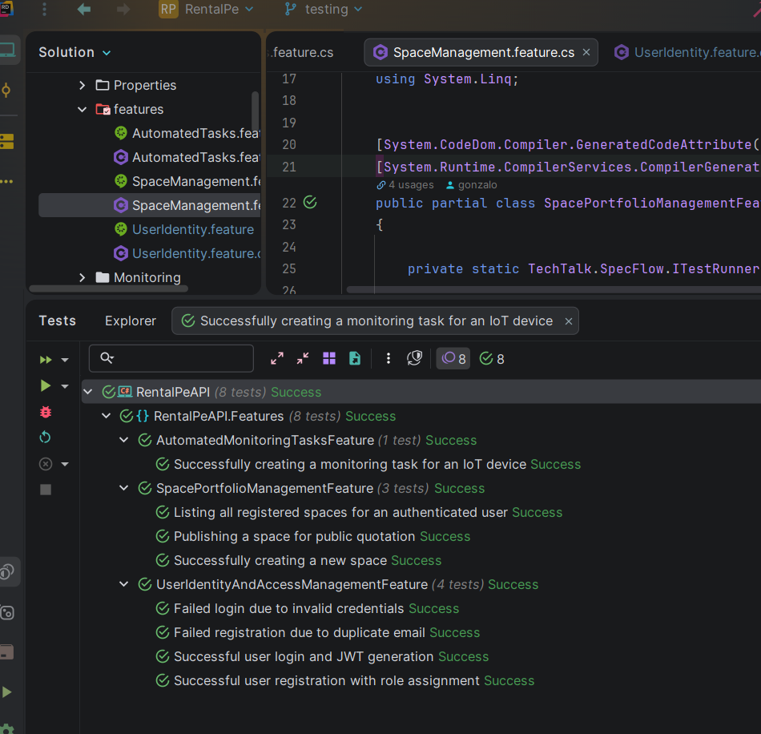


### 2. Acceptance Tests (BDD - Gherkin)
Bajo el enfoque BDD, se han diseñado escenarios que cubren los flujos principales de las User Stories del backend. Estos archivos .feature validan el comportamiento desde la perspectiva del usuario final interactuando con los endpoints de la API.

UserIdentity.feature

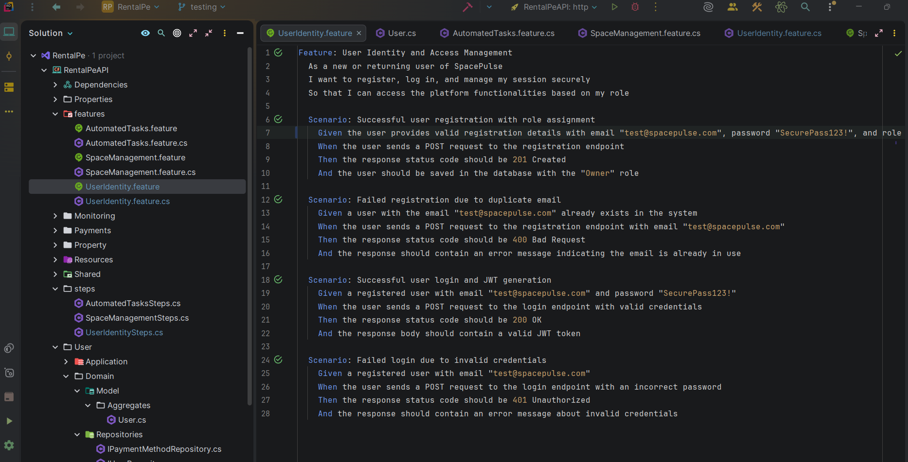

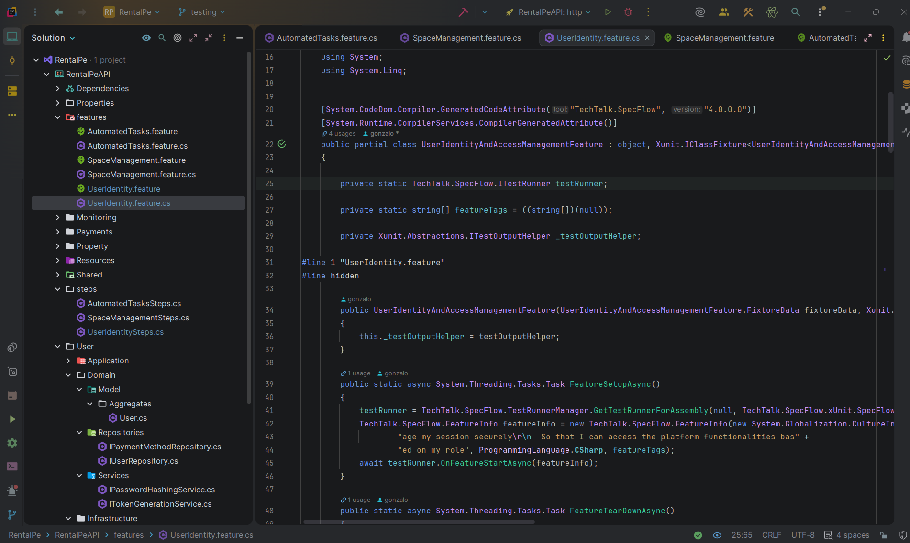

SpaceManagement.feature

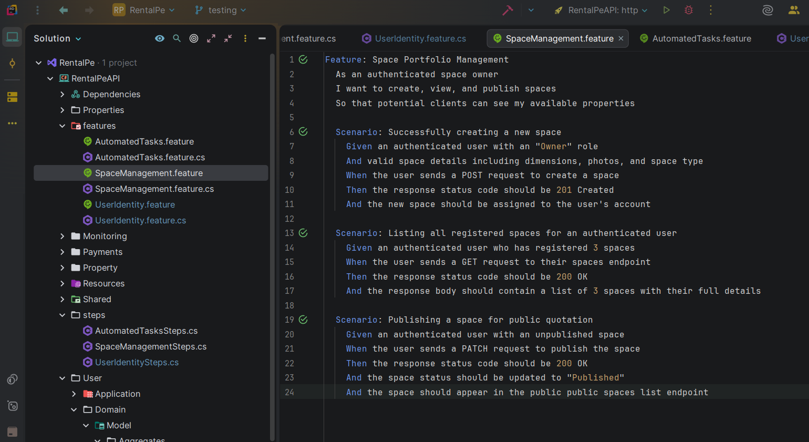

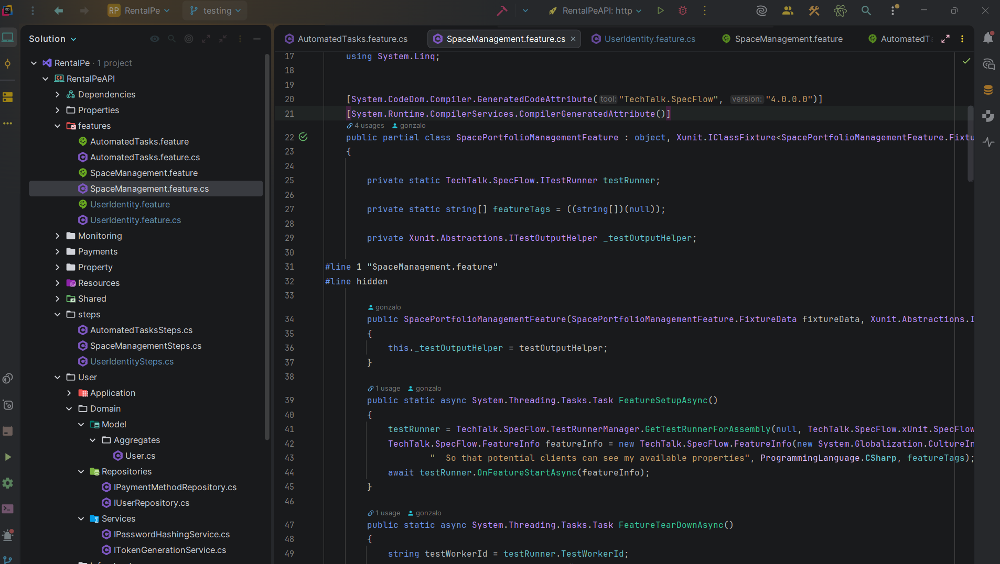

AutomatedTasks.feature

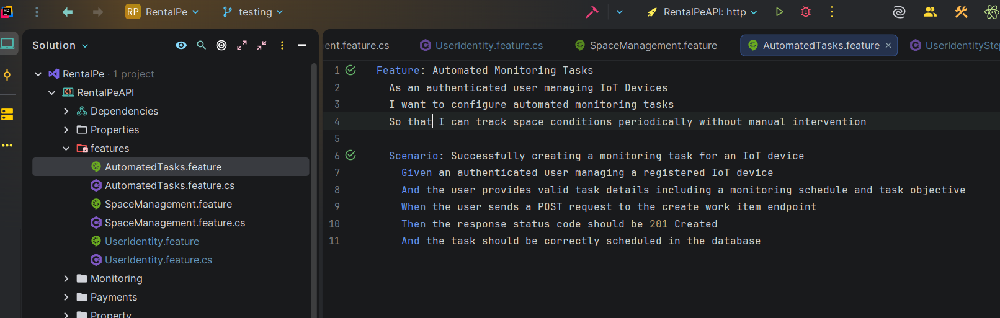

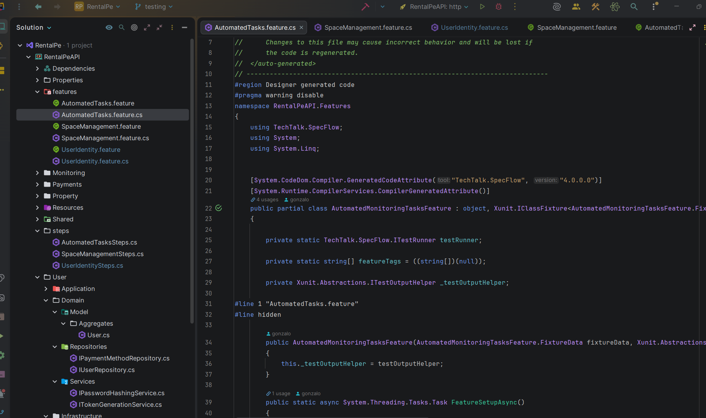


### 3. Step Definitions (C#)

UserIdentitySteps.cs

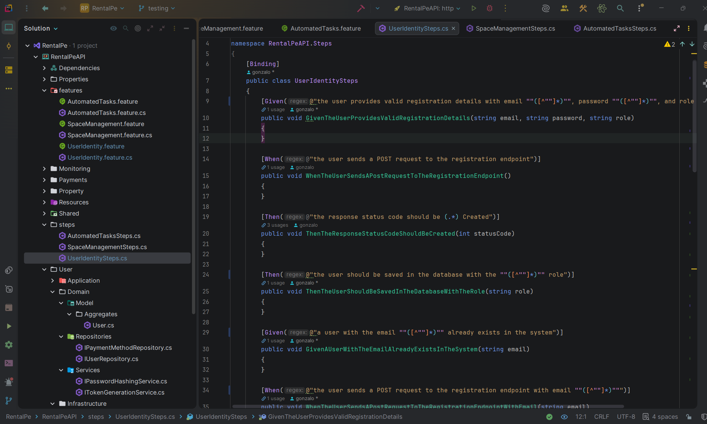

SpaceManagementSteps.cs

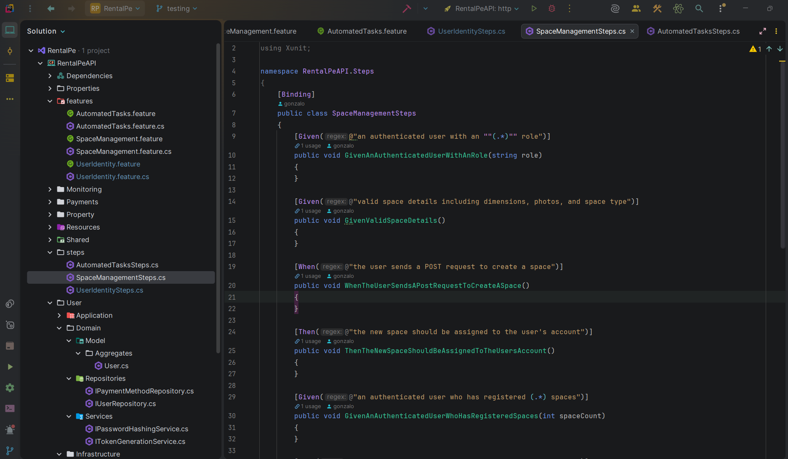

AutomatedTasksSteps.cs

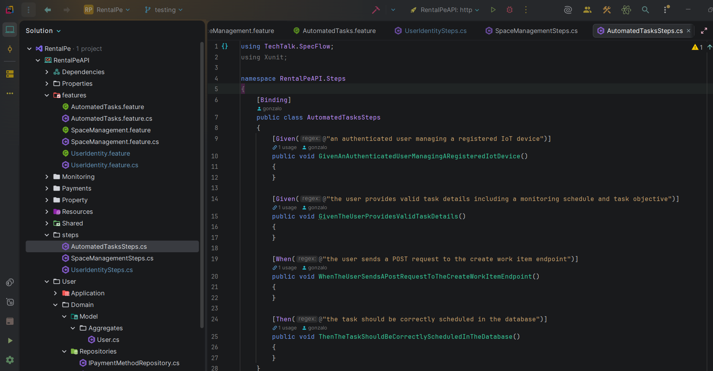


### 4. Repositorio y Trazabilidad de Commits

**Ruta del repositorio de Testing:** https://github.com/Coder-Placing/Backend/tree/testing

A continuación, se presentan los commits relacionados con los avances en Testing y Backend para este Sprint 1:

| Repository | Branch | Commit Id | Commit Message | Commit Message Body | Commited on (Date) |
| :--- | :--- | :--- | :--- | :--- | :--- |
| Coder-Placing/Backend | testing | e38a96f | finished testing suite for sprint 1 | | 14/05/2026 |
| Coder-Placing/Backend | testing | 0ff001e | fix testing suite | | 14/05/2026 |
| Coder-Placing/Backend | testing | 7462a11 | updated testing suite | | 14/05/2026 |
| Coder-Placing/Backend | testing | 5aa2c9c | added Testing Suite | | 14/05/2026 |


##### 4.2.1.5. Execution Evidence for Sprint Review  

* US01: Visualización de Landing Page
* US02: Acceso a la aplicación

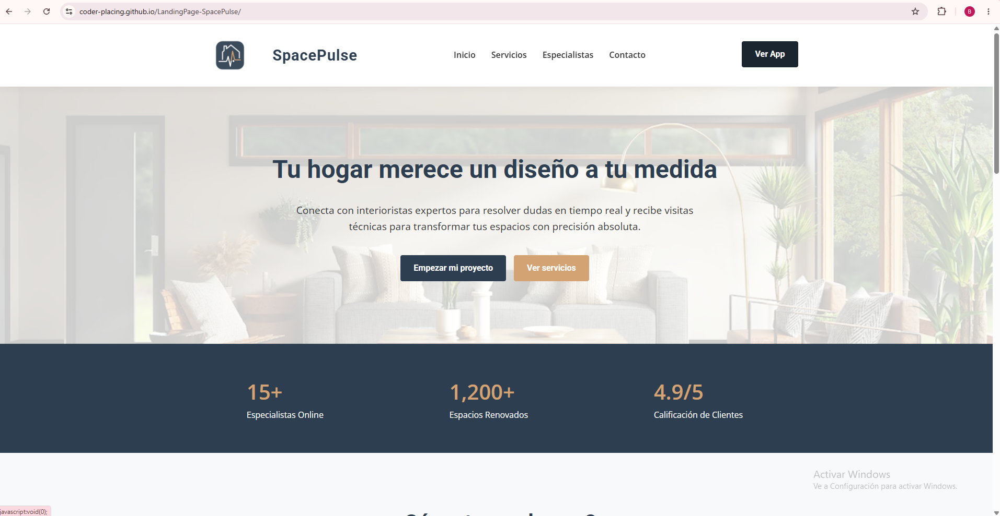

* US03: Registro de Usuarios
* US04: Inicio de Sesión
* US07: Selección de Roles

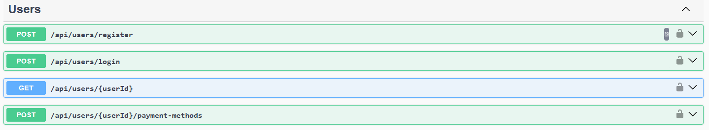

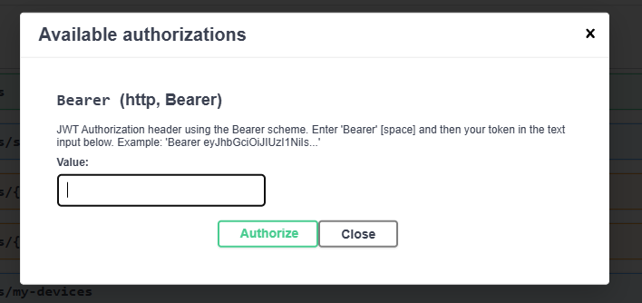

* US08: Creación de Espacio
* US11: Subir espacio para edición
* US38: Visualización de espacios

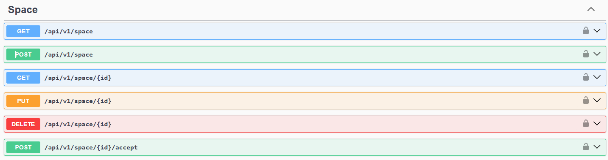

* US48: Configuración de tareas automáticas

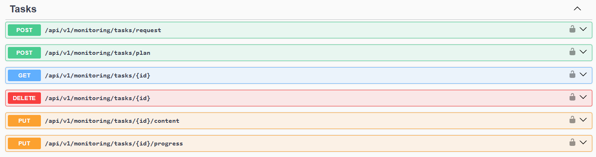
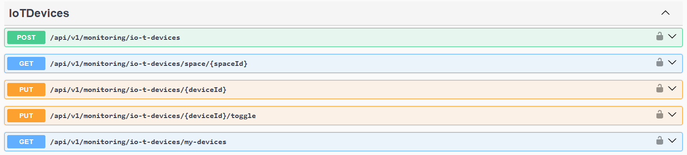
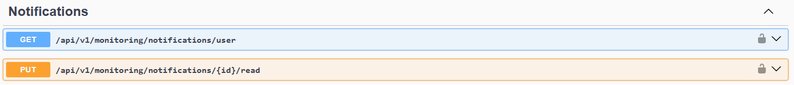
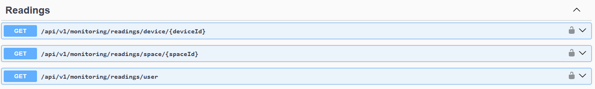

##### 4.2.1.6. Services Documentation Evidence for Sprint Review  
En esta sección, el equipo define los endpoints implementados en el desarrollo del Backend API:

|HTTP VERB| Endpoint URL (Local)a | Operation ID | Summary| 
|--------|-------|-------------------|-------------------------|
| POST|/api/v1/monitoring/io-t-devices | CreateDevice| Creates an IoT device in the System|
| GET| /api/v1/monitoring/io-t-devices/space/{spaceId} | GetDeviceById| Get the information of all the IoT Devices|
| PUT| /api/v1/monitoring/io-t-devices/{deviceId}| UpdateDeviceContent| Update IoT device specific content|
| PUT| /api/v1/monitoring/io-t-devices/{deviceId}/toggle| UpdateDeviceOn| Turn on/off IoT device|
| GET| /api/v1/monitoring/io-t-devices/my-devices| GetDeviceByUser| Get general information of IoT device by User Id|
| GET| /api/v1/monitoring/notifications/user| GetNotificationsByUser| Get all the notifications by the user JWT Token|
| PUT| /api/v1/monitoring/notifications/{id}/read| UpdateNotificationsReadStatus| Update notification "Is_Read" status from 0 to 1 (yes to no)|
| GET| /api/v1/monitoring/readings/device/{deviceId}| GetDeviceReadingsByDeviceId| Get the complete information from IoT device by DeviceId|
| GET| /api/v1/monitoring/readings/space/{spaceId}| GetDeviceReadingsBySpaceId| Get the complete information from IoT device by SpaceId|
| GET| /api/v1/monitoring/readings/user| GetDeviceReadingsByUser| Get the complete information from IoT device by user JWT Token|
| GET| /api/v1/space| GetAllSpaces| Get All the Spaces Information |
| POST| /api/v1/space| CreateSpace| Create a Space in the system|
| GET| /api/v1/space/{id}| GetSpaceById| Get information from the Space By SpaceId|
| PUT| /api/v1/space/{id}| UpdateSpacesContent| Update Space content|
| DELETE| /api/v1/space/{id}| DeleteSpaceById| Delete Space By SpaceId|
| POST| /api/v1/space/{id}/accept| AceptSpaceById| Acept remodel Space by SpaceId|
| POST| /api/v1/monitoring/tasks/request| CreateTaskRequest| Create a Task Request to a Space|
| POST| /api/v1/monitoring/tasks/plan| CreateTaskPlan| Update a Task Plan to a Space|
| GET| /api/v1/monitoring/tasks/{id}| GetTaskById| Get Task information by TaskId|
| DELETE| /api/v1/monitoring/tasks/{id}| DeleteTaskById| Delete Task by TaskId|
| PUT| /api/v1/monitoring/tasks/{id}/content| UpdateTaskContent| Update specific content from Task by TaskId and homeowner JWT Token|
| PUT| /api/v1/monitoring/tasks/{id}/progress| UpdateTaskProgress| Update specific content from Task by TaskId and remodeler JWT Token|
| POST| /api/users/register| SignUp| Creates a new user in the system.|
| POST| /api/users/login| SignIn| Authenticates a user and returns a basic session payload.|
| GET| /api/users/{userId}| GetUserById| Gets a user by id.|
| POST| /api/users/{userId}/payment-methods| CreateUserPaymentMethods| Creates the payment methods for the user|


##### 4.2.1.7. Software Deployment Evidence for Sprint Review  


### Deployment for Landing Page

Usaremos las herramientas del despliegue de GitHub para desplegar la landing page

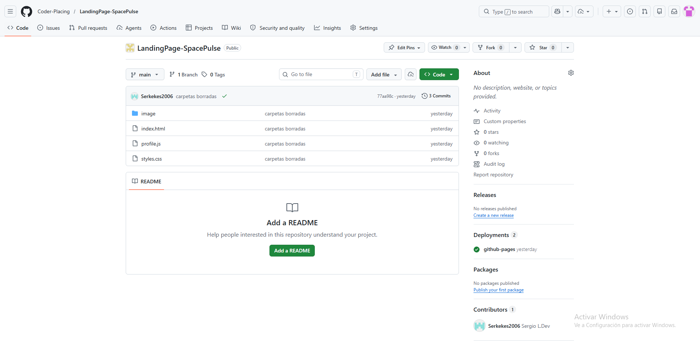

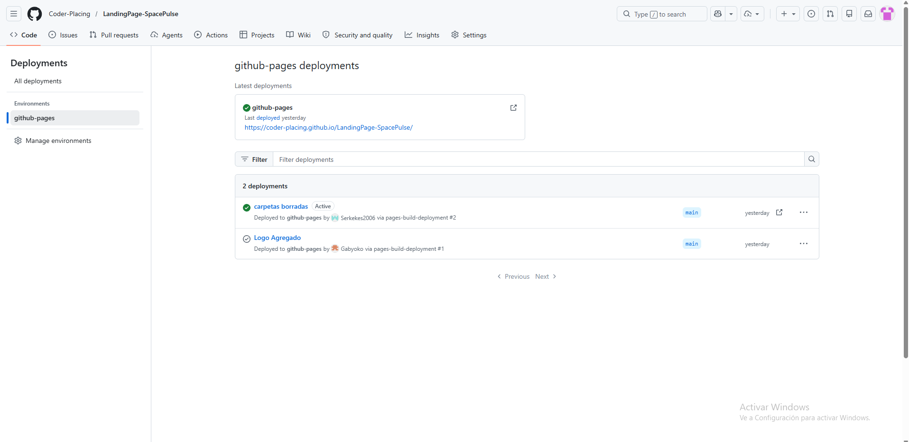

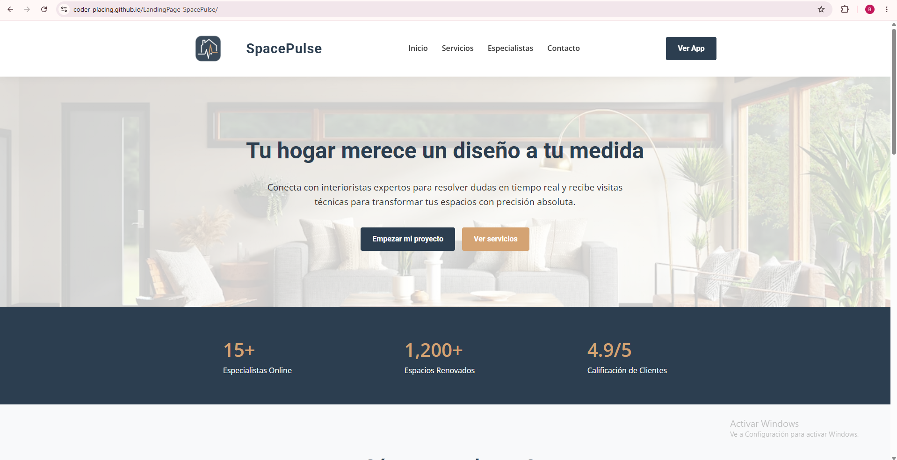

### Deployment for Backend

Primero seleccionaos una base de datos online para el despliegue, en ese caso es TiDB, la cual se encargara de almacenar y registrar los datos que guardemos desde el swagger

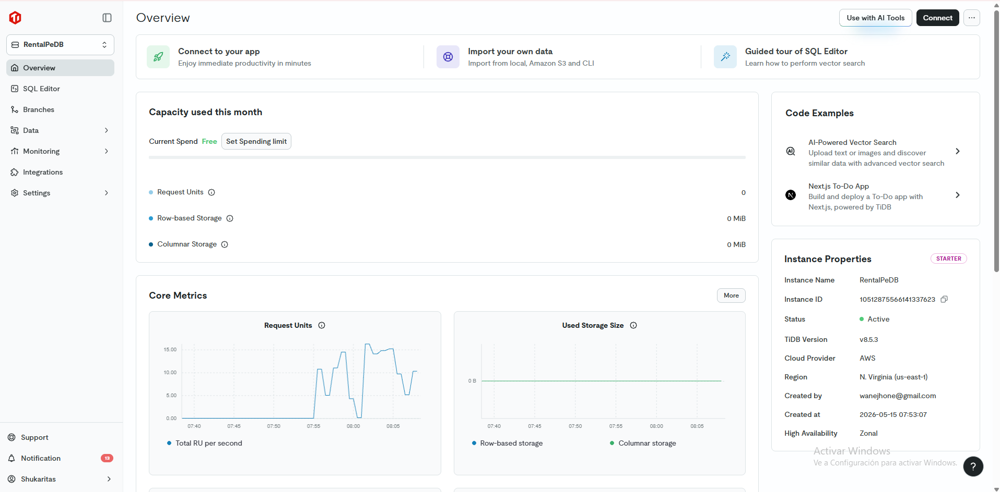

Con esa decision iniciaremos sesion en render y vincularemos el repositorio para asi desplegarlo

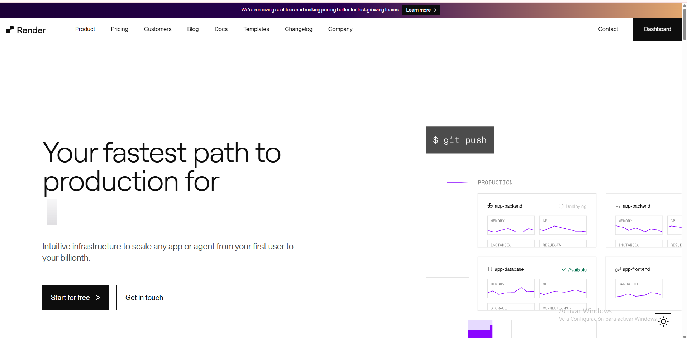

Procederemos a agregar la informacion del repositorio y proceder al proceso de despliegue

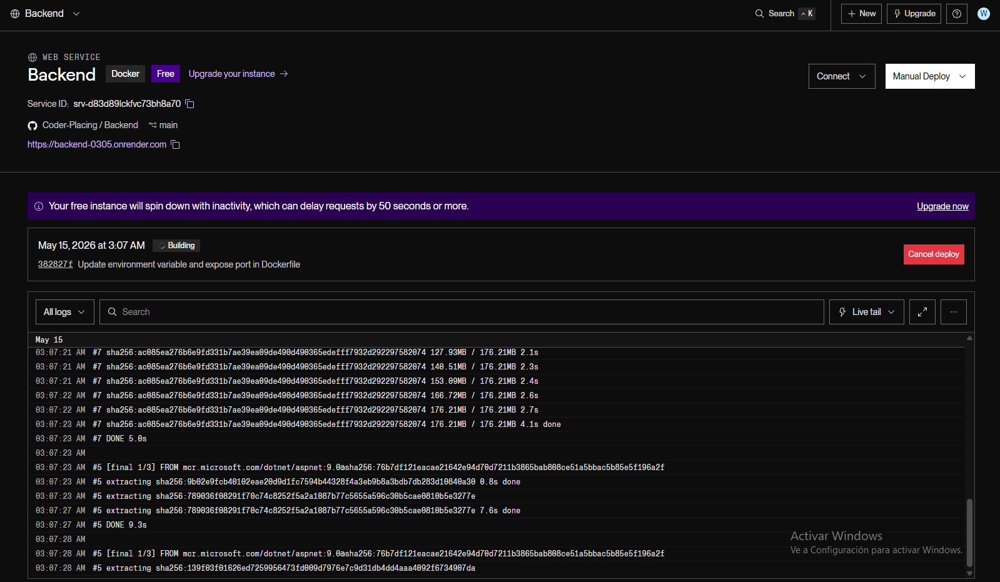

Finalmente se despliegueara y se comprobara que todo este conectado para su corecto funcionamiento

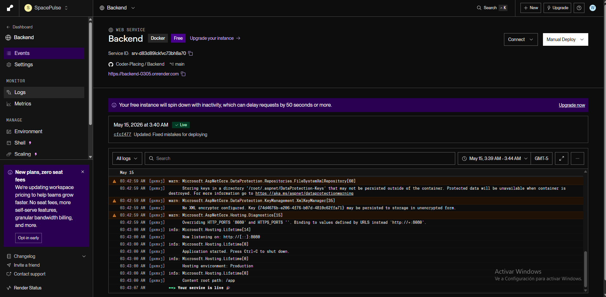

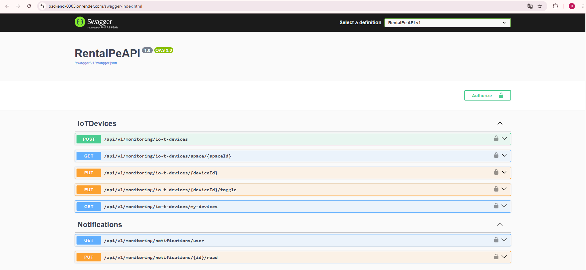

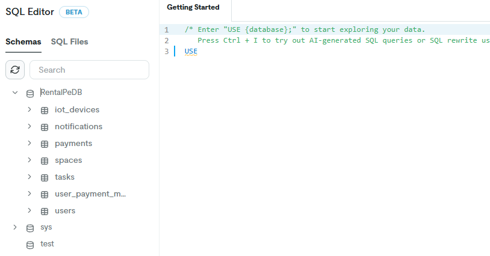

### Deployment for Frontend

Debido a las limitantes para la ejecucion de una aplicacion estatica usaremos appetize.io el cual servira para probar los mockups a mayor detalle

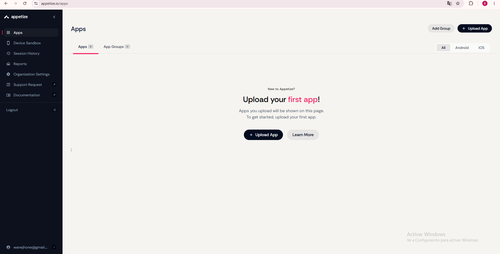

Para eso generaremos el APK de la aplicacion movil y la subiremos a esta pagina para que asi genera esta version de prueba publica

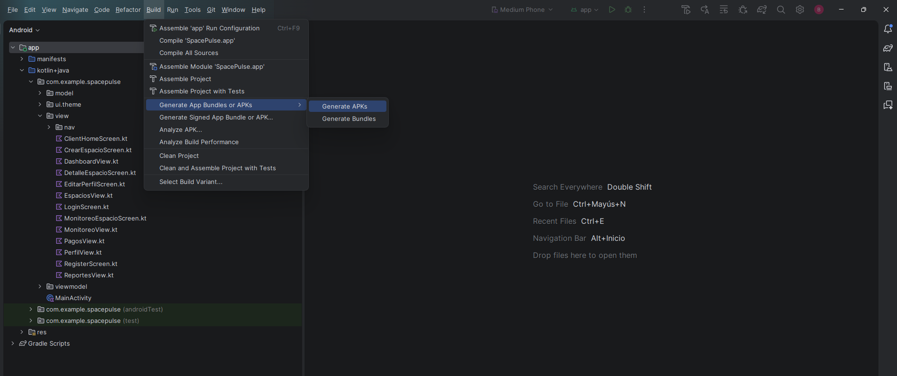

Finalmente veremos que la aplicacion es accesible en esta pagina, actuando como el despliegue de la aplicacion estatica

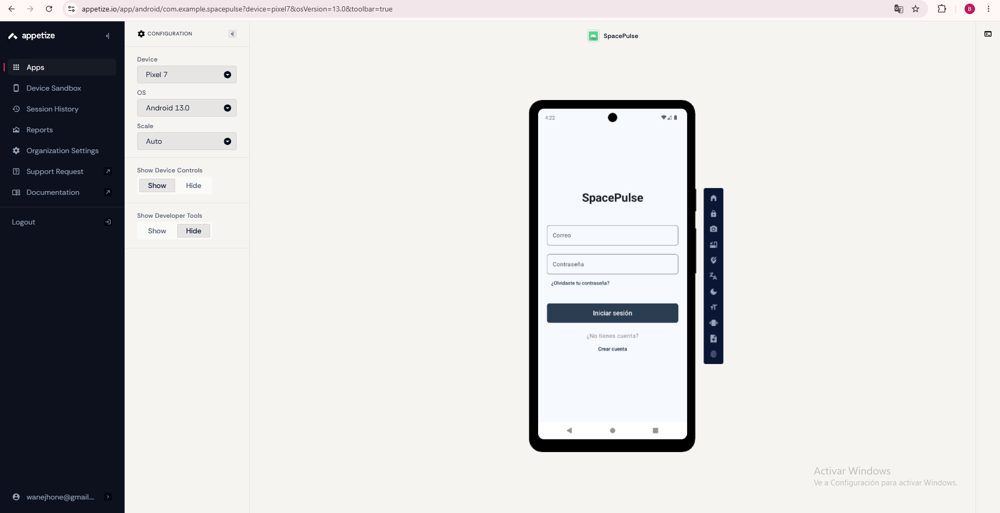


Enlace a la Landing Page Desplegada: https://coder-placing.github.io/LandingPage-SpacePulse/

Enlace al Backend Desplegado: https://backend-0305.onrender.com/swagger/index.html

Enlace al Frontend Desplegado: https://appetize.io/app/b_cjyekwwt6wtlqt7dfdhvnlrdey 

##### 4.2.1.8. Team Collaboration Insights during Sprint  

### Team Collaboration for Landing Page

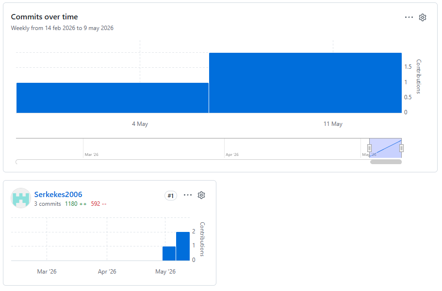

### Team Collaboration for Frontend

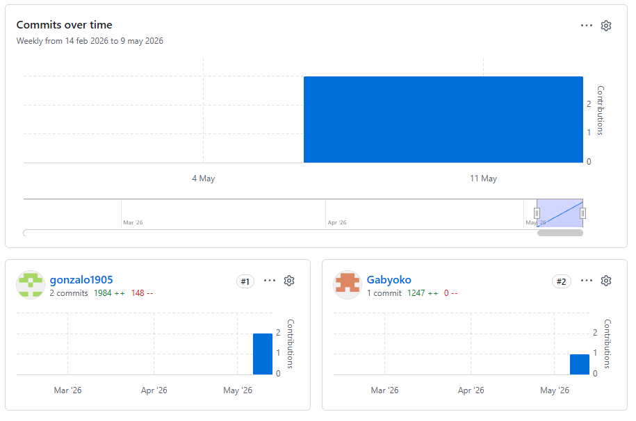

### Team Collaboration for Backend

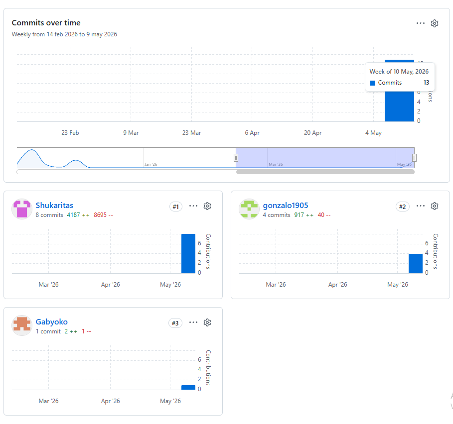

## Conclusiones

### Conclusiones:

#### Conclusiones TB1:

SpacePulse ataca un problema real y frecuente: la gestión de remodelaciones está fragmentada entre canales informales, lo que genera baja trazabilidad, retrasos y sobrecostos.

La oportunidad de mercado es viable: el contexto de conectividad móvil en Perú y la intención de remodelación en hogares respaldan la adopción de una solución digital mobile-first.

La propuesta de valor está bien diferenciada frente a soluciones tradicionales, al integrar en una sola plataforma contratación, seguimiento operativo, control de pagos y monitoreo IoT.

El trabajo de descubrimiento está sólido: entrevistas, needfinding, personas, journey y Lean UX permitieron traducir necesidades del usuario en hipótesis y funcionalidades concretas.

### Recomendaciones:

#### Recomendaciones TB1:

Priorizar un MVP corto con 3 capacidades núcleo: seguimiento de avance, registro de incidencias y notificaciones; dejar funciones avanzadas para iteraciones posteriores.

Convertir las hipótesis en métricas operativas con metas trimestrales claras (activación, frecuencia de uso, tiempo de respuesta a alertas y retención por rol).

Ejecutar pruebas de usabilidad con ambos segmentos antes de desarrollar en grande, enfocándose en tareas críticas de menos de 3 pasos.

Diseñar un onboarding guiado para remodeladores, porque su constancia en registrar avances y materiales es clave para el éxito del producto.

## Bibliografía

Ipsos Perú. (2019). El 35% de hogares alista obras, remodelación y decoración en casa. https://www.ipsos.com/sites/default/files/ct/publication/documents/2019-02/el_35_de_hogares_alista_obras_remodelacion_y_decoracion_en_casa.pdf

Redacción Perú21. (2023). El 17% de los peruanos desea realizar remodelaciones en sus viviendas, según estudio. Perú21. https://peru21.pe/peru/17-de-los-peruanos-desea-realizar-remodelaciones-en-sus-viviendas-casa-remodelacion-peru-viviendas-espacio-libre-noticia/

Cámara Peruana de la Construcción. (s. f.). CAPECO: El 2024 será un año retador para la industria de la construcción (y para el Perú) – Proyecciones sectoriales. https://capeco.org/el-2024-sera-un-ano-retador-para-la-construccion-y-para-el-peru/

Cámara Peruana de la Construcción. (2023). Informe Económico de la Construcción (N.° 64). https://iec.capeco.org/descargas/IEC64_0423.pdf

Designer landing page. (2024, 29 marzo). Houzz. https://pro.houzz.es/for-pros/interior-design-software

SmartThings Developer Center - Build Connected Experiences for Millions of Users - SmartThings Developers. (s. f.). https://developer.smartthings.com/

## Anexos

Enlace de presentacion: https://www.canva.com/design/DAHHzlj_6zg/G0jspEwKZyDt-XbYZQxLvQ/edit 

Enlace de Repositorio: https://github.com/Coder-Placing
