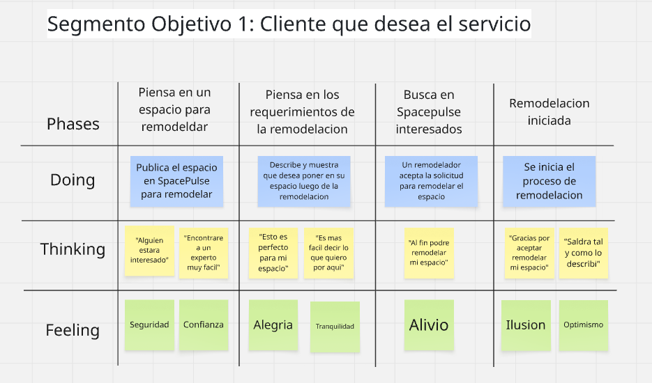
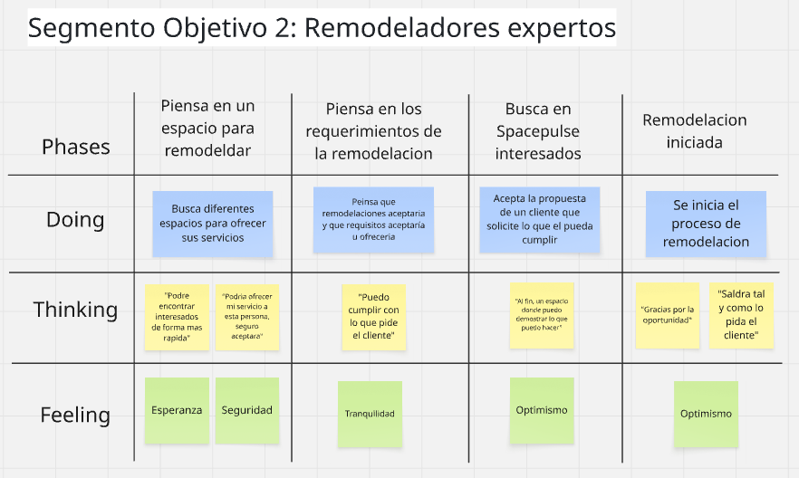

  

<h3 align="center">
Universidad Peruana de Ciencias Aplicadas
</h3>

<h3 align="center">
Ingeniería de Software  
  
Periodo: 202610 
  
1ACC0238 - Aplicaciones para Dispositivos Móviles
  
NRC: 3667  
  
Docente: Eduardo Martin Reyes Rodriguez  
  
<strong>Informe de TB1</strong>  
  
Startup: Coder-Placing
  
Producto: SpacePulse
  
  
<strong>Integrantes</strong>  
  
Aliaga Urbina, Wilder Gonzalo (U202222001)
  
Via Luna, Bruce (U202313403)
  
 (U) 
  
 (U) 
  
 (U)
  
2026
</h3>

## Registro de Versiones del Informe

| Versión | Fecha      | Autor    | Descripción de modificación |              
| ------- |------------| -------- | ----------------------------|
| 1.0  | 09/04/2026 | Bruce Via Luna | Creacion del documento |
| 1.01 | 20/04/2026 | Bruce Via      | Creacion de Epicas y correccion del documento|
| 1.02 | 22/04/2026 |                |         |
| 1.03 | 22/04/2026 |                |             |
| 1.04 | 22/04/2026 |                |    |

## Project Report Collaboration Insights

**AUTHORS:**

- Bruce Via Luna

|  URL del repositorio del reporte  |
| :-----------------------------------: |
| [https://github.com/Coder-Placing/Proyect-Report](https://github.com/Coder-Placing/Proyect-Report) |

**TB1:**

## Contenido

- [Student Outcome](#student-outcome)

- [Objetivos SMART](#objetivos-smart)

- [Capítulo I: Presentación](#capítulo-i:-presentacion)
    - [1.1. Startup Profile](#11-startup-profile)
        - [1.1.1. Descripción de la Startup](#111-descripción-de-la-startup)
        - [1.1.2. Perfiles de integrantes del equipo](#112-perfiles-de-integrantes-del-equipo)
    - [1.2. Solution Profile](#12-solution-profile)
        - [1.2.1. Antecedentes y problemática](#121-antecedentes-y-problemática)
        - [1.2.2. Lean UX Process](#122-lean-ux-process)
            - [1.2.2.1. Lean UX Problem Statements](#1221-lean-ux-problem-statements)
            - [1.2.2.2. Lean UX Assumptions](#1222-lean-ux-assumptions)
            - [1.2.2.3. Lean UX Hypothesis Statements](#1223-lean-ux-hypothesis-statements)
            - [1.2.2.4. Lean UX Canvas](#1224-lean-ux-canvas)
    - [1.3. Segmentos Objetivo](#13-segmentos-objetivo)
- [Capítulo II: Requirements Elicitation & Analysis](#capítulo-ii-requirements-elicitation-analysis)
    - [2.1. Competidores](#21-competidores)
        - [2.1.1. Análisis competitivo](#211-análisis-competitivo)
        - [2.1.2. Estrategias y tácticas frente a competidores](#212-estrategias-y-tácticas-frente-a-competidores)
    - [2.2. Entrevistas](#22-entrevistas)
        - [2.2.1. Diseño de entrevistas](#221-diseño-de-entrevistas)
        - [2.2.2. Registro de entrevistas](#222-registro-de-entrevistas)
        - [2.2.3. Análisis de entrevistas](#223-análisis-de-entrevistas)
    - [2.3. Needfinding](#23-needfinding)
        - [2.3.1. User Personas](#231-user-personas)
        - [2.3.2. User Task Matrix](#232-user-task-matrix)
        - [2.3.3. User Journey Mapping](#233-user-journey-mapping)
        - [2.3.4. Empathy Mapping](#234-empathy-mapping)
        - [2.3.5. As-Is Scenario Mapping](#235-as-is-scenario-mapping)
    - [2.4. Ubiquitous Language](#24-ubiquitous-language)
- [Capítulo III: Requirements specification](#capítulo-iii-requirements-specification)
    - [3.1. To-Be Scenario Mapping](#31-to-be-scenario-mapping)
    - [3.2. User Stories](#32-user-stories)
    - [3.3. Impact Mapping](#33-impact-mapping)
    - [3.4. Product Backlog](#34-product-backlog)
- [Capítulo IV: Solution Software Design](#capítulo-iv-solution-software-design)
    - [4.1. Strategic-Level Domain-Driven Design](#41-strategic-level-domain-driven-design)
        - [4.1.1. EventStorming](#411-eventstorming)
            - [4.1.1.1. Candidate Context Discovery](#4111-candidate-context-discovery)
            - [4.1.1.2. Domain Message Flows Modeling](#4112-domain-message-flows-modeling)
            - [4.1.1.3. Bounded Context Canvases](#4113-bounded-context-canvases)
        - [4.1.2. Context Mapping](#412-context-mapping)
        - [4.1.3. Software Architecture](#413-software-architecture)
            - [4.1.3.1. Software Architecture Context Level Diagrams](#4131-software-architecture-context-level-diagrams)
            - [4.1.3.2. Software Architecture Container Level Diagrams](#4132-software-architecture-container-level-diagrams)
            - [4.1.3.3. Software Architecture Deployment Level Diagrams](#4133-software-architecture-deployment-level-diagrams)
    - [4.2. Tactical-Level Domain-Driven Design](#42-tactical-level-domain-driven-design)
        - [4.2.1. Bounded Context: NOMBRE](#421-bounded-context-registro-y-autenticación-de-usuario)
            - [4.2.1.1. Domain Layer](#4211-domain-layer)
            - [4.2.1.2. Interface Layer](#4212-interface-layer)
            - [4.2.1.3. Application Layer](#4213-application-layer)
            - [4.2.1.4. Infrastructure Layer](#4214-infrastructure-layer)
            - [4.2.1.5. Bounded Context Software Architecture Component Level Diagrams](#4215-bounded-context-software-architecture-component-level-diagrams)
            - [4.2.1.6. Bounded Context Software Architecture Code Level Diagrams](#4216-bounded-context-software-architecture-code-level-diagrams)
                - [4.2.1.6.1. Bounded Context Domain Layer Class Diagrams](#42161-bounded-context-domain-layer-class-diagrams)
                - [4.2.1.6.2. Bounded Context Database Design Diagrams](#42162-bounded-context-database-design-diagrams)

- [Conclusiones](#conclusiones)
- [Bibliografía](#bibliografía)
- [Anexos](#anexos)

## Student Outcome
El curso contribuye al cumplimiento del Student Outcome ABET:
**ABET - EAC - Student Outcome 7 Criterio**: La capacidad de adquirir y aplicar nuevos conocimientos según sea
necesario, utilizando estrategias deaprendizaje apropiadas.
En elsiguiente cuadro se describe las accionesrealizadas y enunciados de conclusiones por parte del grupo, que permiten sustentar el haber alcanzado los criterios especificos.

| Criterio específico | Acciones realizadas  | Conclusiones |
|--------|----------|------|
| Actualiza conceptos y conocimientos necesarios para su desarrollo profesional y en especial para su proyecto en soluciones de software. | - **Aliaga Urbina, Wilder Gonzalo – TB1**   |         |
| Reconoce la necesidad del aprendizaje permanente para el desempeño profesional y el desarrollo de proyectos en soluciones de software. | - **Aliaga Urbina, Wilder Gonzalo – TB1** |         |

## Objetivos SMART

<h3> Wilder Gonzalo Aliaga Urbina </h3>

## Capítulo I: Presentación
### 1.1. Startup Profile

#### 1.1.1. Descripción de la Startup

**Objetivo:**

**Misión**

**Visión**

#### 1.1.2. Perfiles de integrantes del equipo
|  Foto   | Miembros del equipo        | Código de Estudiante |   Descripción          |
|---------| -------------------------- |----------------------| ---------------------- |
|  |Wilder Gonzalo Aliaga Urbina |U202222001    |     |
|                     |Via Luna Bruce|U202313403|  |
|                     |   |                      |  |
|                     |   |                      |  |
|                     |   |                      |  |

### 1.2. Solution Profile

#### 1.2.1. Antecedentes y problemática

#### 1.2.2. Lean UX Process

##### 1.2.2.1. Lean UX Problem Statements

##### 1.2.2.2. Lean UX Assumptions

##### 1.2.2.3. Lean UX Hypothesis Statements

##### 1.2.2.4. Lean UX Canvas

### 1.3. Segmentos Objetivos

## Capítulo II: Presentación

### 2.1. Competidores

#### 2.1.1. Análisis competitivo

#### 2.1.2. Estrategias y tácticas frente a competidores

### 2.2. Entrevistas

#### 2.2.1. Diseño de entrevistas

#### 2.2.2. Registro de entrevistas

#### 2.2.3. Análisis de entrevistas

### 2.3. Needfinding

#### 2.3.1. User Personas

User Persona 1:

User Persona 2:

#### 2.3.2. User Task Matrix

|Task|Importancia (Julio Mendoza)|Frecuencia (Julio Mendoza)|Importancia (Manuel Nelson)|Frecuencia (Manuel Nelson)|
|--|----|---|----|---|
|Verificar la publicacion del espacio|Alta|Constante|Alta|Diaria|
|Verificar el avance del espacio|Alta|Semanal|Alta|Semanal|
|Actualizar el estado o avance del espacio|Alta|Ocasional|Media|Semanal|
|Administrar pagos por el servicio|Alta|Constante|Alta|Constante|
|Acordar condiciones del espacio|Media|Constante|Alta|Constante|
|Evaluar el precio de los muebles y procesos|Alta|Constante|Alta|Constante|
|Cotizar precio de objetos IoT|Media|Constante|Alta|Semanal|
|Demostrar el estado del espacio finalizado|Alta|Mensual|Media|Semanal|

#### 2.3.3. User Journey Map

User Journey Map Segmento objetivo 1:

User Journey Map Segmento objetivo 2:

#### 2.3.4. Empathy Mapping

Empathy Map Segmento Objetivo 1:

Empathy Map Segmento Objetivo 2:

#### 2.3.5. As-Is Scenario Mapping

### 2.4. Ubiquitous Language

|Termino|Definicion|
|-------|----------|
|Cliente|Persona que busa publicar su espacio para una remodelacion|
|Espacio|Lugar demilitado por paredes o espacio legal, ya sea cuarto, pasillo, o zona de la casa a remodelar|
|Propiedad|Activo Fisico y tangible donde se encuentra el espacio|
|Contrato|Acuerdo documentado que formaliza la alianza de trabajo y el pago del cliente|
|Cotizacion|Forma de asignar el valor monetario en comparacion a lo que se pide|
|Procesos|Trabajos que se hacen de forma tangible en el espacio, ejemplo (Cambio de suelos, remodelado de paredes, creacion de enchufes)|
|Pago|egistro de dinero entregado o recibido, ya sea para trabajos o instalaciones.|
|Incidencia|Problema o desperfecto reportado durante el uso o remodelación del espacio|
|Dispositivos IoT|Dispositivos especializados en conectarse mediante coneccion Wi-fi para su control desde celulares|

## Capitulo III: Requirements specification

### 3.1. To-Be Scenario Mapping

To-Be Scenario Mapping de Segmento Objetivo 1:

 

To-Be Scenario Mapping de Segmento Objetivo 2:

 

### 3.2. User Stories

En esta seccion detallaremos la existencia, escenarios y diferentes historias de usuarios o 
User Stories que usaremos a lo largo del proyecto, para mejor orden se iniciara con la creacion de 
Epicas para poder agrupar a todas las historias de usuario en categorias para su posterior
cumplimiento

|Epic ID | Titulo | Descripción|
|--------|--------|------------|
|EP01    | Landing Page | Como usuario de SpacePulse quiero navegar por una Landing Page con una experiencia de usuario fluida y agil, para verificar y experimentar sus funcionalidades y el acceso a la informacion util del producto.
|EP02    |Gestion de usuarios|Como usuario de SpacePulse, quiero crear un perfil, modificarlo, abrir y cerrar sension en cualquier dispositivo y recuperar la contraseña de mi cuenta para crear mi identidad dentro de la aplicacion y acceder a sus funcionalidades.
|EP03    |Gestion de espacios| Como usuario de SpacePulse, quier crear, eliminar y editar espacios para tener un control de su remodelacion en tiempo real y actualizado usando las funcionalidades de SpacePulse.|
|EP04    |Funcionalidades Avanzadas de Cliente|Como usuario de SpacePulse, quiero acceder a funcionalidades apegadas a mi rol como usuario para saber que herramientas poseo para la remodelacion de mi espacio|
|EP05    |Monitoreo de Remodelaciones| Como usuario de SpacePulse, quiero analizar y evaluar el proceso de mi espacio para su control durante el proceso de remodelacion|
|EP06    |Funcionalidades Avanzadas| Como usuario de SpacePulse, quiero ver las funcionalidades y acceder a ellas en todo momento para mejorar el flujo de la aplicacion y optimizarlo|
|EP07    |Seguridad de informacion| Como administrador de SpacePulse, quiero gestionar y cuidar el perfil de mis usuario, para asegurar su estadia dentro de la aplicacion y no sientan un riesgo de sus datos al navegar dentro de ella.|
|EP08    | Accesibilidad|Como usuario de SpacePulse, quiero funcionalidades que ayuden a que la aplicacion sea mas accesible en aspectos como color, configuracion y optimizacion para no tener problemas durante su uso.

Una vez concluidas las epicas, ahora podemos proceder a encapsular las multiples historias de usuario que poseemos para definir los requerimientos de nuestra aplicacion y saber como desarrollarla correctamente

| Epic / Story ID | Titulo | Descripción | Criterios de Aceptación | Epic ID | 
|-----------------|--------|-------------|-------------------------|--------------------------|
|Landing Page / US01|Visualizacion de Landing Page|Como usuario de SpacePulse, quiero acceder a una Landing Page informativa para ver los beneficios y lo que ofrece la aplicacion | Dado que el usuario accede a la web pública  Cuando abre la sección de servicios   Entonces el sistema muestra los servicios que ofrece. |EP01|
|Landing Page / US02| Acceso a la aplicacion | Como usuario de SpacePulse, quiero acceder a la aplicacion desde la Landing Page para acceder a la aplicacion desde otros medios|  Dado que el usuario accede a la Landing Page   Cuando acceda al boton "Ingresar"   Entonces sera redirigido a la aplicacion | EP01|
|Gestion de Usuarios / US03| Registro de Usuarios | Como usuario de SpacePulse, quiero crear una cuenta para acceder a la aplicacion|Dado que el usuario accede a la aplicacion   Cuando llene el formulario con su informacion personal   Y los datos sean permitidos   Entonces la aplicacion creara una cuenta para el usuario | EP02|
| Gestion de Usuarios / US04 | Inicio de Sesion | Como usuario de SpacePulse, quiero iniciar sesion con mis datos personales para acceder a la aplicacion con una cuenta personalizada para mi | Escenario 1:   Dado que el usuario esta en la ventana de "Iniciar Sesion"   Cuando llene el formulario de inicio de sesion   Y los datos sean correctos   Entonces acceder con el inicio de sesion     Escenario 2:   Dado que el usuario esta en la ventana de "Iniciar Sesion"   Cuando llene el formulario de inicio de sesion   Y los datos sean incorrectos   Entonces no podra acceder al inicio de sesion | EP02|
Gestion de Usuarios / US05 | Recuperar Contraseña | Como usuario de SpacePulse, quiero recuperar la contraseña de mi cuenta, para recuperar el acceso a mi cuenta en caso se me olvide | Dado el usuario no recuerde la contraseña de su cuenta   Cuando el usuario presione el boton de "Recuperar contraseña"   Entonces el sistema iniciaria el proceso para recuperar o reemplazar su anterior contraseña | EP02|
|Gestion de Usuarios/ US06| Editar Perfil | Como usuario de SpacePulse, quiero editar mi perfil en ciertos aspectos para mayor personalizacion de mi cuenta |Escenario 1:   Dado el usuario esta en al seccion "Mi Perfil"   Cuando el usuario presione el boton "Editar Perfil"   Entonces el sistema iniciara el formulario de datos editables del perfil de usuario    Escenario 2: Edicion de Perfil   Dado que el usuario esta en el formulario de editar perfil   Cuando el usuario modifique los datos que desee   Entonces el sistema lo actualizara y su perfil mostrara los nuevos datos | EP02|
| Gestion de Usuarios / US07 | Seleccion de Roles | Como usuario de Space Pulse, quiero seleccionar el rol que sere para acceder a las funcionalidades de dicho rol para evitar problemas a futuro | Dado que el usuario esta creando su cuenta   Cuando vea la opcion de seleccionar rol   Entonces podra seleccionar si es dueño o remodelador | EP02|
|Gestion de espacios / US08 | Creación de Espacio |Como cliente, quiero crear un espacio para que sea publico y se pueda remodelar mas adelante |Dado que el cliente se encuentra en la sección "Mis Espacios", Cuando llena el formulario con los detalles del inmueble (dimensiones, fotos, tipo) y presiona "Guardar", Entonces el sistema registra el espacio y lo marca como disponible para recibir propuestas de remodelación. | EP03|
|Funcionalidades Avanzadas / US09 | Recibir notificaciones IoT |Como cliente, quiero recibir notificacion de los dispositivos IoT instalados para mantener controlado mi espacio | Dado que los dispositivos IoT están activos en el local, Cuando un sensor registra una métrica fuera de los parámetros normales (ej. temperatura elevada), Entonces el sistema envía inmediatamente una notificación push al celular del cliente indicando la anomalía|EP06 |
|Monitoreo de Remodelaciones / US10 | Reportes de remodelación |Como cliente, quiero pedir reportes que desmuestren como va avanzando la remodelacion del espacio para mantenerme informado |Dado que el cliente ingresa a su proyecto en ejecución, Cuando presiona el botón "Generar Reporte de Avance", Entonces el sistema recopila las tareas completadas y genera un documento descargable con el progreso porcentual de la obra. | EP05|
|Gestion de espacios / US11 | Subir espacio para edicion |Como cliente, quiero subir los diferentes espacios que este por pedir remodelar para asi tener multiples remodeladores | Dado que el cliente tiene un espacio guardado en su cuenta, Cuando selecciona la opción "Publicar para cotización", Entonces el espacio se vuelve visible en el directorio público para que los contratistas puedan revisarlo y enviar sus propuestas.| EP03|
|Seguridad de informacion / US12 | Seguridad de datos |Como administrador, quiero proteger los multiples datos ingresados para mantener una fidelidad de los clientes | Dado que un usuario registra información personal o de pagos en la plataforma, Cuando la información se envía al servidor, Entonces el sistema aplica protocolos de encriptación antes de almacenarla en la base de datos para prevenir accesos no autorizados.|EP07 |
|Monitoreo de Remodelaciones / US13 | Historial de proyectos | Como cliente, quiero ver un registro histórico de todas mis remodelaciones y equipos IoT instalados, para auditar los cambios realizados en mi propiedad a lo largo del tiempo |Dado que el cliente tiene proyectos finalizados, Cuando accede a la pestaña "Historial", Entonces el sistema lista los proyectos ordenados por fecha con sus métricas finales. |EP05 |
|Funcionalidades Avanzadas de Cliente / US14 | Dejar opiniones |Como cliente, quiero dejar una reseña sobre el servicio del contratista y la calidad de la instalación IoT, para ayudar a otros propietarios a tomar decisiones informadas |Dado que un proyecto cambia a estado "Entregado", Cuando el cliente completa el formulario de estrellas y texto, Entonces el sistema publica la reseña en el perfil del contratista. |EP04 |
|Funcionalidades Avanzadas / US15 | Alertas de seguridad |Como propietario, quiero recibir notificaciones inmediatas si los sensores IoT detectan una intrusión o movimiento inusual fuera de horario en mi local, para contactar a las autoridades rápidamente |Dado que el local está fuera del horario comercial, Cuando el sensor de movimiento detecta actividad, Entonces el sistema envía una alerta Push y un correo al propietario |EP06 |
|Gestion de espacios / US16 | Seguimiento en tiempo real |Como cliente, quiero monitorear el avance de la remodelación en tiempo real a través del panel de control, para conocer el progreso sin necesidad de visitar físicamente la obra |Dado que el remodelador marca una tarea como completada, Cuando el cliente abre su panel, Entonces la barra de progreso general aumenta su porcentaje automáticamente. | EP03|
|Funcionalidades Avanzadas / US17 | Comparación de presupuestos |Como cliente, quiero comparar múltiples cotizaciones de diferentes proveedores para la misma remodelación, para evaluar fácilmente costos, tiempos e inclusiones tecnológicas |Dado que el cliente encuentra la mejor opción, Cuando hace clic en "Aceptar cotización", Entonces el sistema notifica al proveedor y rechaza automáticamente las demás. |EP06 |
|Monitoreo de Remodelaciones / US18 | Gestión de pagos |Como cliente, quiero  realizar y administrar los pagos de la remodelación por hitos dentro de la plataforma, para mantener un control financiero seguro y centralizado de la obra | Escenario 1: Dado que un hito de obra ha sido validado, Cuando el cliente procesa el pago con su tarjeta, Entonces el sistema cambia el estado de la factura a "Pagado" y libera los fondos.    Escenario 2: Dado que una transacción es rechazada por el banco, Cuando ocurre el fallo, Entonces el sistema mantiene el hito como "Pendiente" y notifica al usuario del error.|EP05 |
|Funcionalidades Avanzadas / US19 | Recordatorios de pago |Como cliente, quiero recibir recordatorios automáticos de los próximos pagos de la remodelación, para evitar penalizaciones por retraso o paralizaciones de la obra |Dado que faltan 3 días para el vencimiento de una cuota, Cuando el sistema ejecuta el cron diario, Entonces envía un correo recordatorio al cliente con el enlace de pago. |EP06 |
|Funcionalidades Avanzadas de Cliente / US20 | Registro de incidencias |Como cliente, quiero reportar problemas detectados en la obra o fallas en los sensores IoT, para que el equipo técnico los atienda en el menor tiempo posible |Dado que se detecta una tubería rota, Cuando el supervisor sube una foto y descripción, Entonces el sistema crea un ticket urgente y notifica al dueño del espacio. | EP04|
|Funcionalidades Avanzadas de Cliente / US21 | Confirmación de entrega de materiales | Como remodelador, quiero confirmar la recepción de los materiales y dispositivos IoT en el local, para mantener la trazabilidad del inventario y autorizar los pagos a proveedores| Dado que llega un envío de sensores, Cuando el encargado marca el pedido como "Recibido", Entonces el sistema actualiza el inventario del proyecto y notifica a contabilidad.|EP04 |
|Funcionalidades Avanzadas / US22 | Descarga de reportes |Como cliente, quiero descargar reportes en PDF sobre el avance físico de la obra y el rendimiento de los dispositivos IoT, para presentarlos en reuniones de directorio o registros contables |Dado que un reporte mensual ha sido generado, Cuando el cliente presiona "Descargar PDF", Entonces el navegador descarga un archivo formateado con la gráfica de avance y consumos. |EP06 |
|Funcionalidades Avanzadas / US23 | Panel de control de dispositivos IoT |Como cliente, quiero visualizar el estado, la batería y la conectividad de todos mis dispositivos IoT instalados en un único dashboard, para asegurar que la red de monitoreo funcione correctamente |Dado que todos los sensores están operativos, Cuando el usuario entra al panel, Entonces se muestran indicadores en verde con la última fecha de sincronización. |EP06 |
|Gestion de espacios / US24 | Sugerencias de mejoras |Como cliente, quiero que el sistema analice los datos de mis sensores ambientales y me ofrezca sugerencias de remodelación automáticas, para optimizar el consumo de energía y agua del local | Dado que el usuario usa la aplicacion, Cuando entre en l area de Sugerencias de la aplicacion, Entonces podra dejar una opinion para que el equipo de SpacePulse la escuche| EP03|
|Funcionalidades Avanzadas de Cliente /  US25 | Calificación del servicio |Como cliente, quiero evaluar el trabajo general de la remodelación una vez concluida, para proveer retroalimentación sobre la calidad, la limpieza y la puntualidad del contratista | Dado que el proyecto cambia a estado "Finalizado", Cuando el usuario ingresa a la plataforma, Entonces aparece un modal emergente solicitando calificar el servicio del 1 al 5.|EP04 |
|Seguridad de informacion / US26 | Control de acceso de usuarios (RBAC) | Como administrador, quiero gestionar permisos por rol para controlar accesos.|Dado que el usuario edita un perfil, Cuando intente cambiar su rol de usuario, Entonces el sistema evitara que se haga dicho cambio de rol. |EP07 |
|Funcionalidades Avanzadas / US27 | Configuración de notificaciones | Como usuario, quiero personalizar el tipo de notificaciones que voy a recibir tanto por dispositivos IoT como por procesos de la aplicacion para mantener mi espacio de notificaciones ordenado|Dado que el usuario guarda sus preferencias, Cuando inicia sesión en un dispositivo, Entonces el sistema permitira configurar la llegada de notificaciones al dispositivo |EP06 |
|Accesibilidad / US28 | Multilenguaje |Como usuario internacional, quiero cambiar el idioma de la plataforma (ej. español a inglés), para comprender con claridad los manuales de los dispositivos IoT y los contratos de remodelación |Dado que el usuario selecciona "Inglés" en el selector superior, Cuando la página recarga, Entonces todos los menús, botones y alertas se muestran traducidos correctamente. |EP08 |
|Funcionalidades Avanzadas / US29 | Filtrado de proyectos | Como usuario con multiples espacios, quiero filtrar mi lista de locales en remodelación por estado, distrito o contratista, para ubicar rápidamente la obra que necesito revisar.|Dado que el usuario tiene 10 propiedades, Cuando aplica el filtro "En ejecución", Entonces la tabla oculta las obras terminadas y solo muestra las activas. |EP06 |
|Monitoreo de Remodelaciones / US30 | Conexion con dispositivos IoT|Como remodelador, quiero registrar y emparejar un nuevo sensor inteligente a la cuenta de la propiedad, para integrarlo a la red y que empiece a reportar datos de telemetría |Dado que el técnico ingresa el MAC Address del nuevo sensor, Cuando presiona "Vincular", Entonces el backend valida la autenticidad y lo asocia al proyecto de monitoreo. |EP05 |
|Funcionalidades Avanzadas / US31 | Reportes personalizados |Como remodelador , quiero construir gráficos combinando diferentes métricas (ej. costo de obra vs. reducción de consumo eléctrico post-IoT), para analizar el ROI exacto |Dado que el usuario selecciona las variables "Gasto" y "Energía", Cuando presiona "Generar Gráfico", Entonces el sistema renderiza un reporte comparativo cruzando ambos datos. |EP06 |
|Accesibilidad / US32 | Carga de fotos de avance |Como remodelador, quiero poder tomar fotos con mi celular y subirlas directamente, para mantener un registro visual que el cliente pueda auditar |Dado que el contratista termina de pintar, Cuando selecciona "Subir Evidencia" desde su móvil, Entonces la cámara se activa, captura la foto y la adjunta al hito correspondiente. |EP08 |
|Funcionalidades Avanzadas / US33 | Chat en tiempo real | Como cliente, quiero comunicarme de forma directa y fluida mediante un chat interno con el supervisor del proyecto, para resolver dudas rápidas sin necesidad de usar WhatsApp o correos|Dado que el cliente envía un mensaje, Cuando el supervisor lo recibe, Entonces aparece una burbuja de notificación en su panel y el mensaje se añade al historial del proyecto. |EP06 |
|Funcionalidades Avanzadas / US34 | Integración con facturación electrónica |Como usuario, quiero que la plataforma genere automáticamente una factura electrónica (XML/PDF) con validez fiscal peruana por cada pago realizado, para simplificar mi declaración de impuestos |Dado que un pago por S/ 5000 es confirmado, Cuando el sistema se comunica con la API de facturación (SUNAT/OSE), Entonces emite la boleta/factura y se la envía al correo del cliente.|EP06 |
|Gestion de Usuarios / US35 | Roles de usuario |Como administrador, quiero poder crear, editar y eliminar los permisos asociados a cada rol de usuario (Remodelador, cliente), para mantener la arquitectura de seguridad del sistema | Dado que el administrador edita el rol "Remodelador", Cuando le quita el permiso de "Editar Pagos", Entonces todos los usuarios con ese rol pierden inmediatamente esa capacidad.|EP02 |
|Funcionalidades Avanzadas / US36 | API para integración externa |Como empresa, quiere exponer acceso a una API de datos IoT para integrar con otros sistemas. |Dado que la empresa utiliza un token JWT válido, Cuando realiza un GET al endpoint de lecturas, Entonces el sistema retorna un JSON con los datos de temperatura y consumo de sus locales. |EP06 |
|Accesibilidad / US37 | Modo oscuro | Como usuario, quiero  activar el modo oscuro en la interfaz, para reducir el brillo y la fatiga visual al revisar planos o alertas nocturnas|Dado que el usuario selecciona el ícono de la luna, Cuando se actualiza el tema, Entonces los fondos cambian a tonos oscuros y los textos a colores claros automáticamente. |EP08 |
|Gestion de espacios / US38 | Visualización de espacios para remodelacion |Como cliente, quiero visualizar un catálogo con mis espacios y locales registrados (con metraje y distribución básica), para evaluar rápidamente a cuál le daré prioridad de remodelación |Dado que el usuario tiene 3 locales, Cuando accede al módulo de Espacios, Entonces ve tarjetas con la foto principal, dirección y metros cuadrados de cada uno. |EP03 |
|Gestion de espacios / US39 | Actualización de Espacio |Como propietario, quiero poder modificar los datos de mi espacio (ej. si amplié un ambiente o cambié la dirección legal), para mantener la información exacta antes de pedir una cotización |Dado que el usuario deja el campo de "Metraje" en blanco, Cuando intenta guardar, Entonces el sistema resalta el campo en rojo pidiendo que introduzca un valor numérico válido. |EP03 |
|Gestion de espacios / US40 | Eliminación de Espacio |Como propietario, quiero poder borrar o archivar del sistema un inmueble que concluyo su remodelacion, para que mi panel solo muestre mis activos actuales |Dado que un espacio no tiene deudas ni obras activas, Cuando el cliente selecciona "Eliminar", Entonces el sistema realiza un soft-delete ocultándolo del listado principal. |EP03 |
|Monitoreo de Remodelaciones / US41 | Creación de Pago |Como sistema de gestión, quiero generar automáticamente una orden de cobro al inicio de cada nueva etapa de la remodelación, para asegurar el flujo de caja del contratista |Dado que el proyecto avanza a la etapa 2, Cuando se dispara el evento de dominio, Entonces el sistema crea un nuevo Payment en estado "PENDING" y notifica al cliente. |EP05 |
|Monitoreo de Remodelaciones / US42 | Consulta de Pagos |Como usuario, quiero  buscar y listar todos los recibos y comprobantes de pago de un proyecto específico, para tener control del presupuesto y auditar las salidas de dinero. | Dado que un cliente quiere ver los pagos del mes, Cuando filtra en la tabla de pagos, Entonces el sistema devuelve solo los comprobantes de ese periodo con su estado respectivo.|EP05 |
|Funcionalidades Avanzadas / US43 | Procesamiento y Confirmación de Pagos |Como cliente, quiero iniciar el procesamiento de un pago pendiente y posteriormente confirmarlo, para garantizar que la transacción bancaria ha sido exitosa antes de habilitar el servicio o proyecto | Dado que un pago se encuentra en estado PENDING, Cuando el sistema procesa la solicitud de inicio, Entonces el estado del pago cambia a INITIATED y se notifica la aceptación del proceso.| EP06 |
|Funcionalidades Avanzadas / US44 | Cancelación y Reembolso de Pagos |Como cliente, quiero  cancelar pagos que no se hayan procesado o reembolsar pagos ya completados, para gestionar devoluciones, errores de cobro o cancelaciones de clientes cumpliendo las políticas de la empresa |Dado que existe un pago en estado PENDING o INITIATED, Cuando el administrador solicita la cancelación, Entonces el estado cambia a CANCELLED y se detiene cualquier intento de cobro. |EP06  |
|Funcionalidades Avanzadas / US45 | Registro de Proyecto de Monitoreo IoT | Como remodelador, quiero registrar un nuevo proyecto de monitoreo en la plataforma, para centralizar toda la configuración, alertas y dispositivos IoT que se instalarán en una propiedad específica.|Dado que el supervisor provee información válida y un nombre único, Cuando guarda el proyecto, Entonces el sistema crea el proyecto de monitoreo y devuelve el identificador generado. | EP06 |
|Monitoreo de Remodelaciones / US46 | Visualización de Detalles de Proyecto IoT |Como cliente, quiero consultar los detalles de configuración de un proyecto de monitoreo específico, para revisar los umbrales establecidos y el estado general de la instalación tecnológica |Dado que proporciono un ID de proyecto válido al que tengo acceso, Cuando realizo la consulta, Entonces el sistema muestra todos los detalles, configuraciones y reglas de monitoreo asociadas. | EP05|
|Monitoreo de Remodelaciones / US47 | Recepción Masiva de Datos de Sensores |Como cliente, quiero tener la capacidad de recibir y procesar grandes volúmenes de lecturas de los sensores IoT en lote, para mantener la información ambiental actualizada sin saturar el rendimiento de la aplicación |Dado que los dispositivos envían un paquete de lecturas con firmas y formatos correctos, Cuando el sistema las recibe, Entonces encola las lecturas para su procesamiento asíncrono y responde que han sido aceptadas. |EP05 |
|Monitoreo de Remodelaciones / US48 | Configuración de Tareas de Monitoreo Automático |Como cliente, quiero crear y programar tareas automáticas de revisión de datos, para que la plataforma analice periódicamente la telemetría y detecte anomalías sin intervención humana. |Dado que proporciono parámetros válidos (ej. periodicidad, tipo de tarea), Cuando guardo la tarea, Entonces queda registrada y activa para ejecutarse en el intervalo establecido. |EP05 |
|Funcionalidades Avanzadas / US49 | Auditoría de Tareas de Monitoreo |Como cliente, quiero consultar el estado y registro de ejecución de una tarea de monitoreo, para verificar si se ejecutó correctamente o si hubo fallos técnicos en el análisis de datos. |Dado que existe una tarea de monitoreo en ejecución, Cuando consulto sus detalles, Entonces el sistema muestra su configuración base, la última hora de ejecución y el resultado (éxito o fallo).|EP06  |
|Funcionalidades Avanzadas / US50 | Registro de Dispositivo IoT |Como remodelador, quiero vincular un nuevo dispositivo físico (sensor/cámara) al sistema asociándolo a un proyecto de monitoreo, para que la plataforma comience a registrar su actividad. | Dado que escaneo o ingreso el código único de un dispositivo válido, Cuando lo asocio a un proyecto activo, Entonces el dispositivo queda registrado y listo para transmitir. | EP06|
|Monitoreo de Remodelaciones / US51 | Consulta de Dispositivos por Proyecto |Como remodelador, quiero visualizar un listado de todos los dispositivos IoT instalados y agrupados por proyecto, para auditar el equipamiento tecnológico de la remodelación|Dado que el remodelador ingresa a los detalles de un proyecto específico, Cuando navega a la pestaña de "Dispositivos IoT", Entonces el sistema carga una lista completa de los sensores asociados a esa obra, mostrando su ID, tipo y estado actual de conexión. |EP05 |
|Monitoreo de Remodelaciones / US52 | Consulta de Incidentes por Proyecto |Como cliente, quiero ver una lista de todos los incidentes o anomalías detectadas en mi proyecto, para poder tomar decisiones correctivas o de mantenimiento |Dado que existen incidentes registrados (ej. fugas de agua, picos de voltaje), Cuando ingreso a la pestaña de incidentes del proyecto, Entonces puedo ver la lista ordenada por fecha y severidad. |EP05 |
|Monitoreo de Remodelaciones / US53 | Reconocimiento y Gestión de Incidentes |Como cliente, quiero poder marcar un incidente crítico como "reconocido" , para detener el envío de notificaciones repetitivas y avisar al resto del equipo que ya estoy atendiendo el problema. | Dado que existe una alerta activa sonando o enviando correos, Cuando marco el incidente como reconocido, Entonces el sistema actualiza su estado, silencia las notificaciones recurrentes y registra a qué usuario se le asignó.| EP05|
|Funcionalidades Avanzadas / US54 | Registro Histórico de Notificaciones |Como cliente, quiero tener acceso a un registro completo de todas las notificaciones emitidas por el sistema en mi proyecto, para revisar alertas pasadas que pude haber omitido. |Dado que recibí múltiples alertas durante la semana, Cuando entro al panel de notificaciones del proyecto, Entonces visualizo un historial paginado con fecha, tipo de notificación y mensaje detallado. |EP06 |

### 3.3. Impact Mapping

Impact Mapping Segmento Objetivo 1:

Impact Mapping Segmento Objetivo 2:

### 3.4. Product Backlog

| # Order |User Story ID|Titulo|Story Points (1/2/3/5/8)|
|---------|-------------|------|------------------------|
|1|US01|Visualizacion de Landing Page|1|
|2|US02|Acceso a la aplicacion|1|
|3|US03|Registro de Usuarios|3|
|4|US04|Inicio de Sesion|2|
|5|US05|Recuperar Contraseña|3|
|6|US06|Editar Perfil|2|
|7|US07|Seleccion de Roles|1|
|8|US08|Creación de Espacio|3|
|9|US09|Recibir notificaciones IoT|5|
|10|US10|Reportes de remodelación|3|
|11|US11|Subir espacio para edicion|1|
|12|US12|Seguridad de datos|5|
|13|US13|Historial de proyectos|2|
|14|US14|Dejar opiniones|1|
|15|US15|Alertas de seguridad|2|
|16|US16|Seguimiento en tiempo real|3|
|17|US17|Comparación de presupuestos|2|
|18|US18|Gestión de pagos|3|
|19|US19|Recordatorios de pago|1|
|20|US20|Registro de incidencias|2|
|21|US21|Confirmación de entrega de materiales|2|
|22|US22|Descarga de reportes|3|
|23|US23|Panel de control de dispositivos IoT|3|
|24|US24|Sugerencias de mejoras|1|
|25|US25|Calificación del servicio|2|
|26|US26|Control de acceso de usuarios (RBAC)|2|
|27|US27|Configuración de notificaciones|2|
|28|US28|Multilenguaje|2|
|29|US29|Filtrado de proyectos|2|
|30|US30|Conexion con dispositivos IoT|3|
|31|US31|Reportes personalizados|3|
|32|US32|Carga de fotos de avance|2|
|33|US33|Chat en tiempo real|3|
|34|US34|Integración con facturación electrónica|5|
|35|US35|Roles de usuario|2|
|36|US36|API para integración externa|2|
|37|US37|Modo oscuro|1|
|38|US38|Visualización de espacios para remodelacion|3|
|39|US39|Actualización de Espacio|2|
|40|US40|Eliminación de Espacio|2|
|41|US41|Creación de Pago|2|
|42|US42|Consulta de Pagos|2|
|43|US43|Procesamiento y Confirmación de Pagos|3|
|44|US44|Cancelación y Reembolso de Pagos|2|
|45|US45|Registro de Proyecto de Monitoreo IoT|3|
|46|US46|Visualización de Detalles de Proyecto IoT|5|
|47|US47|Recepción Masiva de Datos de Sensores|3|
|48|US48|Configuración de Tareas de Monitoreo Automático|5|
|49|US49|Auditoría de Tareas de Monitoreo|2|
|50|US50|Registro de Dispositivo IoT|3|
|51|US51|Consulta de Dispositivos por Proyecto|5|
|52|US52|Consulta de Incidentes por Proyecto|5|
|53|US53|Reconocimiento y Gestión de Incidentes|5|
|54|US54|Registro Histórico de Notificaciones|3|

## Capitulo IV: Solution Software Design

## 4.1. Strategic-Level Domain-Driven Design
Esta sección describe cómo el diseño orientado al dominio (DDD) guio la arquitectura estratégica de nuestra solución. Nos enfocamos en segmentar el sistema en contextos delimitados (Bounded Contexts) para mejorar la organización del desarrollo. Mediante el uso de Event Storming y Bounded Context Canvases, definimos con precisión el alcance y las interacciones de cada componente. Como resultado, logramos una estructura de software totalmente alineada con las necesidades reales del negocio.

### 4.1.1. EventStorming
El proceso de modelado comenzó con una fase de descubrimiento deliberado mediante una dinámica de lluvia de ideas. Durante esta actividad, se utilizaron notas adhesivas de color naranja para representar los Domain Events (eventos de dominio). Estos elementos son fundamentales, ya que capturan hechos significativos que ocurren dentro del sistema y reflejan cambios de estado críticos para el negocio. Esta identificación visual permitió al equipo mapear la cronología de los procesos e identificar los puntos de interacción más relevantes de la aplicación.

### 4.1.1.1. Candidate Context Discovery
Esta sección describe la dinámica de los procesos de negocio mediante el flujo de eventos. Al identificar los pivotal events, logramos detectar los puntos de cambio donde una responsabilidad termina y otra comienza, lo que resulta fundamental para la creación de los Bounded Contexts. Esta delimitación estratégica permite estructurar el dominio de forma coherente, facilitando el desarrollo modular y permitiendo que el software escale de manera ordenada según las necesidades de la organización.

## Conclusiones

### Conclusiones:

#### Conclusiones TB1:

### Recomendaciones:

#### Recomendaciones TB1:

## Bibliografía

## Anexos