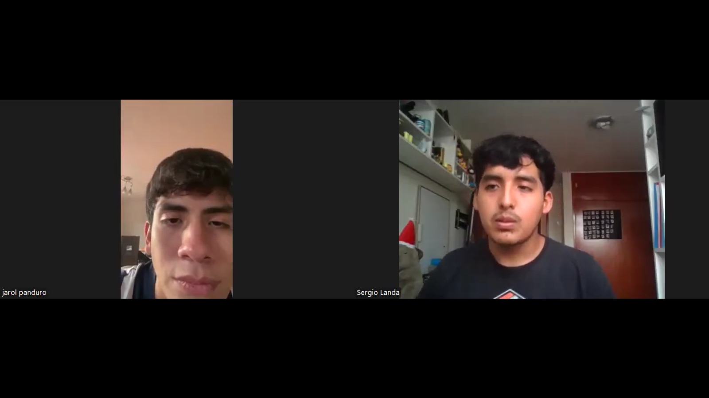

  

<h3 align="center">
Universidad Peruana de Ciencias Aplicadas
</h3>

<h3 align="center">
Ingeniería de Software  
  
Periodo: 202610 
  
1ACC0238 - Aplicaciones para Dispositivos Móviles
  
NRC: 3667  
  
Docente: Eduardo Martin Reyes Rodriguez  
  
<strong>Informe de TB1</strong>  
  
Startup: Coder-Placing
  
Producto: SpacePulse
  
  
<strong>Integrantes</strong>  
  
Aliaga Urbina, Wilder Gonzalo (U202222001)
  
Via Luna, Bruce (U202313403)
  
 Landa Ortiz, Sergio Javier(U202311086) 
  
 (U) 
  
 (U)
  
2026
</h3>

## Registro de Versiones del Informe

| Versión | Fecha      | Autor    | Descripción de modificación |              
| ------- |------------| -------- | ----------------------------|
| 1.0  | 09/04/2026 | Bruce Via Luna | Creacion del documento |
| 1.01 | 20/04/2026 | Bruce Via      | Creacion de Epicas y correccion del documento|
| 1.02 | 22/04/2026 |                |         |
| 1.03 | 22/04/2026 |                |             |
| 1.04 | 22/04/2026 |                |    |

## Project Report Collaboration Insights

**AUTHORS:**

- Bruce Via Luna

|  URL del repositorio del reporte  |
| :-----------------------------------: |
| [https://github.com/Coder-Placing/Proyect-Report](https://github.com/Coder-Placing/Proyect-Report) |

**TB1:**

## Contenido

- [Student Outcome](#student-outcome)

- [Objetivos SMART](#objetivos-smart)

- [Capítulo I: Presentación](#capítulo-i:-presentacion)
    - [1.1. Startup Profile](#11-startup-profile)
        - [1.1.1. Descripción de la Startup](#111-descripción-de-la-startup)
        - [1.1.2. Perfiles de integrantes del equipo](#112-perfiles-de-integrantes-del-equipo)
    - [1.2. Solution Profile](#12-solution-profile)
        - [1.2.1. Antecedentes y problemática](#121-antecedentes-y-problemática)
        - [1.2.2. Lean UX Process](#122-lean-ux-process)
            - [1.2.2.1. Lean UX Problem Statements](#1221-lean-ux-problem-statements)
            - [1.2.2.2. Lean UX Assumptions](#1222-lean-ux-assumptions)
            - [1.2.2.3. Lean UX Hypothesis Statements](#1223-lean-ux-hypothesis-statements)
            - [1.2.2.4. Lean UX Canvas](#1224-lean-ux-canvas)
    - [1.3. Segmentos Objetivo](#13-segmentos-objetivo)
- [Capítulo II: Requirements Elicitation & Analysis](#capítulo-ii-requirements-elicitation-analysis)
    - [2.1. Competidores](#21-competidores)
        - [2.1.1. Análisis competitivo](#211-análisis-competitivo)
        - [2.1.2. Estrategias y tácticas frente a competidores](#212-estrategias-y-tácticas-frente-a-competidores)
    - [2.2. Entrevistas](#22-entrevistas)
        - [2.2.1. Diseño de entrevistas](#221-diseño-de-entrevistas)
        - [2.2.2. Registro de entrevistas](#222-registro-de-entrevistas)
        - [2.2.3. Análisis de entrevistas](#223-análisis-de-entrevistas)
    - [2.3. Needfinding](#23-needfinding)
        - [2.3.1. User Personas](#231-user-personas)
        - [2.3.2. User Task Matrix](#232-user-task-matrix)
        - [2.3.3. User Journey Mapping](#233-user-journey-mapping)
        - [2.3.4. Empathy Mapping](#234-empathy-mapping)
        - [2.3.5. As-Is Scenario Mapping](#235-as-is-scenario-mapping)
    - [2.4. Ubiquitous Language](#24-ubiquitous-language)
- [Capítulo III: Requirements specification](#capítulo-iii-requirements-specification)
    - [3.1. To-Be Scenario Mapping](#31-to-be-scenario-mapping)
    - [3.2. User Stories](#32-user-stories)
    - [3.3. Impact Mapping](#33-impact-mapping)
    - [3.4. Product Backlog](#34-product-backlog)
- [Capítulo IV: Solution Software Design](#capítulo-iv-solution-software-design)
    - [4.1. Strategic-Level Domain-Driven Design](#41-strategic-level-domain-driven-design)
        - [4.1.1. EventStorming](#411-eventstorming)
            - [4.1.1.1. Candidate Context Discovery](#4111-candidate-context-discovery)
            - [4.1.1.2. Domain Message Flows Modeling](#4112-domain-message-flows-modeling)
            - [4.1.1.3. Bounded Context Canvases](#4113-bounded-context-canvases)
        - [4.1.2. Context Mapping](#412-context-mapping)
        - [4.1.3. Software Architecture](#413-software-architecture)
            - [4.1.3.1. Software Architecture Context Level Diagrams](#4131-software-architecture-context-level-diagrams)
            - [4.1.3.2. Software Architecture Container Level Diagrams](#4132-software-architecture-container-level-diagrams)
            - [4.1.3.3. Software Architecture Deployment Level Diagrams](#4133-software-architecture-deployment-level-diagrams)
    - [4.2. Tactical-Level Domain-Driven Design](#42-tactical-level-domain-driven-design)
        - [4.2.1. Bounded Context: NOMBRE](#421-bounded-context-registro-y-autenticación-de-usuario)
            - [4.2.1.1. Domain Layer](#4211-domain-layer)
            - [4.2.1.2. Interface Layer](#4212-interface-layer)
            - [4.2.1.3. Application Layer](#4213-application-layer)
            - [4.2.1.4. Infrastructure Layer](#4214-infrastructure-layer)
            - [4.2.1.5. Bounded Context Software Architecture Component Level Diagrams](#4215-bounded-context-software-architecture-component-level-diagrams)
            - [4.2.1.6. Bounded Context Software Architecture Code Level Diagrams](#4216-bounded-context-software-architecture-code-level-diagrams)
                - [4.2.1.6.1. Bounded Context Domain Layer Class Diagrams](#42161-bounded-context-domain-layer-class-diagrams)
                - [4.2.1.6.2. Bounded Context Database Design Diagrams](#42162-bounded-context-database-design-diagrams)

- [Conclusiones](#conclusiones)
- [Bibliografía](#bibliografía)
- [Anexos](#anexos)

## Student Outcome
El curso contribuye al cumplimiento del Student Outcome ABET:
**ABET - EAC - Student Outcome 7 Criterio**: La capacidad de adquirir y aplicar nuevos conocimientos según sea
necesario, utilizando estrategias deaprendizaje apropiadas.
En elsiguiente cuadro se describe las accionesrealizadas y enunciados de conclusiones por parte del grupo, que permiten sustentar el haber alcanzado los criterios especificos.

| Criterio específico | Acciones realizadas  | Conclusiones |
|--------|----------|------|
| Actualiza conceptos y conocimientos necesarios para su desarrollo profesional y en especial para su proyecto en soluciones de software. | - **Aliaga Urbina, Wilder Gonzalo – TB1**   |         |
| Reconoce la necesidad del aprendizaje permanente para el desempeño profesional y el desarrollo de proyectos en soluciones de software. | - **Aliaga Urbina, Wilder Gonzalo – TB1** |         |

## Objetivos SMART

<h3> Wilder Gonzalo Aliaga Urbina </h3>

## Capítulo I: Presentación
### 1.1. Startup Profile

#### 1.1.1. Descripción de la Startup

**Objetivo:**

**Misión**

**Visión**

#### 1.1.2. Perfiles de integrantes del equipo
|  Foto   | Miembros del equipo        | Código de Estudiante |   Descripción          |
|---------| -------------------------- |----------------------| ---------------------- |
|  |Wilder Gonzalo Aliaga Urbina |U202222001    |     |
|                     |Via Luna Bruce|U202313403|  |
|                     |   |                      |  |
|                     |   |                      |  |
|                     |   |                      |  |

### 1.2. Solution Profile

#### 1.2.1. Antecedentes y problemática

#### 1.2.2. Lean UX Process

##### 1.2.2.1. Lean UX Problem Statements

##### 1.2.2.2. Lean UX Assumptions

##### 1.2.2.3. Lean UX Hypothesis Statements

##### 1.2.2.4. Lean UX Canvas

### 1.3. Requirements Elicitation & Analysis

## Capítulo II: Presentación

### 2.1. Competidores
En esta sección se detallará el panorama competitivo de SpacePulse, identificando a los actores clave en el mercado de la remodelación y automatización. El análisis abarcará desde plataformas de diseño 3D hasta integradores de domótica y servicios tradicionales, con el fin de exponer las brechas existentes en la oferta actual. Se enfatizará la falta de una solución integral que combine la estética del diseño con la implementación técnica de objetos IoT, justificando así el valor diferencial de SpacePulse como una plataforma "todo en uno" para la creación de espacios inteligentes.
 
 1. Houzz Pro

Descripcion:

 Es una solución de gestión "todo en uno" diseñada específicamente para profesionales del diseño y la remodelación de interiores. Su plataforma facilita la administración de proyectos desde la etapa de planificación hasta la ejecución final, permitiendo una comunicación fluida entre el cliente y el profesional.

 Caracteristicas Principales:

 . Herramientas de gestión de proyectos y CRM para contratistas.

 . Gestión financiera integral que incluye presupuestos, facturación y pagos en línea.

 . Biblioteca de productos y materiales para especificaciones de diseño detalladas.

 . Portal del cliente personalizado para aprobación de presupuestos y seguimiento de avances.

 . Cronograma de proyecto dinámico mediante diagramas de Gantt para control de plazos.

 . Escaneo de habitaciones con Inteligencia Artificial para la generación automática de planos.

 . Tableros de ideas (moodboards) interactivos vinculados directamente a los costos del proyecto.

 2. Planner 5D

 Caracteristicas:
 
 Es una herramienta de diseño de interiores sumamente accesible que permite a usuarios avanzados y principiantes crear planos de casas y diseños de interiores de manera intuitiva. Se destaca por integrar elementos tecnológicos en sus catálogos, permitiendo una previsualización estética de los espacios.

 Caracteristicas Principales:

 . Interfaz intuitiva de "arrastrar y soltar" para la creación y edición de planos en modos 2D y 3D.

 . Uso de Inteligencia Artificial para el reconocimiento de planos, permitiendo convertir bocetos hechos a mano en proyectos digitales editables.

 .Catálogo extenso con más de 5,000 artículos decorativos y estructurales, incluyendo una sección dedicada a dispositivos inteligentes para el hogar.

 . Funcionalidad de Realidad Virtual (VR) que permite a los usuarios realizar recorridos inmersivos por sus diseños antes de iniciar la obra física.

 . Herramientas de renderizado fotorrealista de alta definición para visualizar texturas, sombras e iluminación con precisión.

 . Capacidad de personalización total de materiales, colores y superficies para adaptar los objetos a cualquier estilo de remodelación.

 . Sincronización multiplataforma que permite editar proyectos en dispositivos móviles, tablets y computadoras de escritorio.

 .Editor de muebles integrado que permite ajustar las dimensiones y acabados de los objetos para que encajen exactamente en el espacio disponible.

 3. SmartThings (Samsung)

 Caracteristicas:
 Es una de las plataformas de automatización del hogar más robustas del mercado, enfocada en la interconectividad y el control de dispositivos IoT. Actúa como el cerebro tecnológico de una vivienda, permitiendo que dispositivos de diversas marcas trabajen juntos de manera armoniosa.

 Caracteristicas principales:

 . Compatibilidad universal con protocolos de comunicación estándar como Matter, Zigbee, Z-Wave y Wi-Fi para una interconectividad sin interrupciones.

 . Creación de rutinas y escenas personalizadas que permiten automatizar múltiples dispositivos con un solo comando o basados en condiciones del entorno.

 . Panel de control centralizado (SmartThings Hub) que permite gestionar dispositivos de cientos de marcas desde una única interfaz móvil o Smart TV.

 . Monitoreo detallado del consumo de energía en tiempo real (SmartThings Energy) para optimizar el uso de electrodomésticos y reducir costos.

 . Funcionalidad de geofencing que activa o desactiva dispositivos y sistemas de seguridad automáticamente al detectar la ubicación del usuario.

 . Integración profunda con asistentes de voz como Bixby, Google Assistant y Amazon Alexa para el control manos libres de todo el hogar.

 . Sistema de notificaciones inteligentes y alertas de seguridad que informan al usuario sobre movimientos detectados, fugas de agua o puertas abiertas.

 . Herramientas de diagnóstico y mantenimiento predictivo que notifican fallos técnicos o necesidades de servicio en los dispositivos conectados.

#### 2.1.1. Análisis competitivo
<table border="1">
  <thead>
    <tr>
      <th colspan="5">Competitive Analysis Landscape</th>
    </tr>
  </thead>
  <tbody>
    <!-- OBJETIVO -->
    <tr>
      <td>¿Por qué llevar a cabo este análisis?</td>
      <td colspan="4">Analizar a la competencia permite entender el mercado en el que se introducirá nuestro producto, ofreciendo una visión clara de las funcionalidades que ofrecen y cómo satisfacen las necesidades de sus clientes.</td>
    </tr>
    <!-- CABECERA -->
    <tr>
      <td>(Nombre y logo de cada competidor)</td>
      <td></td>
      <td>Houzz Pro </td>
      <td>Planner 5D  </td>
      <td>SmartThings (Samsumg)  </td>
      <td>Space Pulse  </td>
    </tr>
    <!-- PERFIL -->
    <tr>
      <td rowspan="3">Perfil</td>
      <td>Overview</td>
      <td>Plataforma de gestión de proyectos y marketing "todo en uno" diseñada específicamente para profesionales de la remodelación.</td>
      <td>Herramienta intuitiva de diseño de interiores y arquitectura que permite crear planos en 2D y visualizaciones 3D fotorrealistas de casas, oficinas y paisajes.</td>
      <td>Plataforma y aplicación de domótica que permite conectar, automatizar y controlar dispositivos inteligentes del hogar (luces, electrodomésticos, TVs, cámaras).</td>
      <td>Plataforma para consultarias y/o solicitudes de ayuda para servicio domestico de Diseño de Interiores y uso de objetos IOT para facilitar el trabajo.</td>
    </tr>
    <tr>
      <td>Ventaja competitiva  ¿Qué valor ofrece a los clientes?</td>
      <td>Es una solución todo en uno que fusiona herramientas de marketing para captar clientes con software de gestión de proyectos y diseño 3D.</td>
      <td>Capacidad para equilibrar una interfaz extremadamente intuitiva y fácil de usar con funciones potentes de inteligencia artificial (IA).</td>
      <td>Tiene enorme interoperabilidad y ecosistema abierto, compatible con más de 300 marcas y miles de dispositivos</td>
      <td>Facil de operar, tiene una interfaz comoda y rapida, se ajusta a lo que el cliente necesite con herramientas de marketing y diseño 3D</td>
    </tr>
    <tr>
      <td>Mercado objetivo</td>
      <td>Pequeñas y medianas empresas, autónomos y profesionales del sector de remodelación, construcción residencial y diseño de interiores.</td>
      <td>Aficionados al interiorismo, propietarios de viviendas y entusiastas del bricolaje (DIY) sin experiencia técnica que buscan diseñar, remodelar o amueblar espacios.</td>
      <td>Consumidores individuales (B2C) que buscan comodidad y conectividad, y empresas (B2B).</td>
      <td>Toda persona que este en busca de remodelacion o necesite algun feedback o idea de como empezar con una remodelacion efectiva en su hogar.</td>
    </tr>
    <!-- PERFIL DE MARKETING -->
    <tr>
      <td rowspan="2">Perfil de Marketing</td>
      <td>Estrategias de marketing</td>
      <td>Perfiles premium, optimización SEO para directorios, gestión de leads con Project Match y herramientas visuales como paneles de inspiración 3D.</td>
      <td>Que la creación de planos y la decoración en 3D sea accesible para cualquier persona, sin necesidad de conocimientos técnicos.</td>
      <td>Transforma la venta de dispositivos individuales en la promoción de un "estilo de vida inteligente" y conectado, impulsado por la IA.</td>
      <td>Una interfaz de llamativa y rapida, una interaccion veloz y eficiente para dar el mejor servicio</td>
    </tr>
    <tr>
      <td>Mercado objetivo</td>
      <td>Estudiantes, startups en etapa temprana, empresas innovadoras.</td>
      <td>Profesionales, empresas medianas y grandes.</td>
      <td>Startups tecnológicas, inversores, emprendedores.</td>
      <td>Personas primerisas en adquiri un hogar propio, diseñadores, empresas de Instalación Domótica.</td>
    </tr>
    <!-- PERFIL DE PRODUCTO -->
    <tr>
      <td rowspan="3">Perfil de Producto</td>
      <td>Productos & Servicios</td>
      <td>Herramientas para crear presupuestos rápidos, gestionar proyectos, facturar, recibir pagos en línea y mejorar la relación con el cliente (CRM) desde una única plataforma web o app</td>
      <td>Herramienta multiplataforma (Web, iOS, Android, Windows, macOS) para crear planos 2D y 3D.</td>
      <td>Automatización, seguridad, gestión energética y control de iluminación, incluyendo cámaras, cerraduras, enchufes y electrodomésticos.</td>
      <td>Ayuda instantanea y especializada para realizar cambios en tu hogar.</td>
    </tr>
    <tr>
      <td>Precios & Costos</td>
      <td>Modelo preemium .</td>
      <td>Gratis con funciones premium de pago .</td>
      <td>Gratis con servicios premium para empleadores e inversores.</td>
      <td>Gratis con opciones premium para mayor visibilidad.</td>
    </tr>
    <tr>
      <td>Canales de distribución (Web y/o Móvil)</td>
      <td>App móvil (iOS/Android) y versión web.</td>
      <td>App móvil y web.</td>
      <td>App móvil y web.</td>
      <td>App móvil y web.</td>
    </tr>
    <!-- SWOT -->
    <tr>
      <td rowspan="4">Análisis SWOT</td>
      <td>Fortalezas</td>
      <td>Gestión de proyectos, CRM y marketing para diseñadores.</td>
      <td>IA avanzada para diseño rápido y gran accesibilidad para principiantes.</td>
      <td>El ecosistema más robusto de compatibilidad con marcas de hardware IoT.</td>
      <td>Especialización única en cobertura de red y ubicación de sensores IoT.</td>
    </tr>
    <tr>
      <td>Debilidades</td>
      <td>Curva de aprendizaje alta y herramientas de diseño 3D menos potistas.</td>
      <td>Enfoque puramente estético; ignora la infraestructura técnica y redes.</td>
      <td>No es una herramienta de diseño; solo sirve para control post-instalación.</td>
      <td>Producto nuevo en fase de desarrollo con menor catálogo que gigantes.</td>
    </tr>
    <tr>
      <td>Oportunidades</td>
      <td>Convertirse en el estándar de gestión para el mercado de remodelaciones.</td>
      <td>Expandirse hacia el mercado de "hogar inteligente" mediante plugins.</td>
      <td>Alianzas con softwares de diseño para planificación previa (pre-venta).</td>
      <td>Alianzas con estudios que buscan "diseño inteligente" sin ser expertos.</td>
    </tr>
    <tr>
      <td>Amenazas</td>
      <td>Competidores más ágiles o especializados en nichos tecnológicos.</td>
      <td>Pérdida de usuarios profesionales que requieren mayor precisión técnica.</td>
      <td>Sistemas cerrados (Apple/Google) que limitan su expansión en ciertos hogares.</td>
      <td>Grandes softwares de diseño (Revit/Planner 5D) integrando funciones similares.</td>
    </tr>
  </tbody>
</table>
#### 2.1.2. Estrategias y tácticas frente a competidores
 

## Afrontando las fortalezas de nuestros competidores:

 

**Fortalezas de competidores:**
- Planner 5D: gran base de usuarios y herramientas de IA estética consolidadas.

- Houzz Pro: ecosistema completo de gestión de proyectos y marca reconocida.

- SmartThings: compatibilidad masiva con hardware y respaldo de grandes fabricantes.

- SpacePulse: estándar de la industria para documentación arquitectónica técnica.

## Comprendemos que nuestras fortalezas son:
- Enfoque exclusivo en infraestructura técnica de red y sensores IoT.

- Simulación predictiva: capacidad de prever cobertura Wi-Fi antes de la construcción.

- Nicho especializado: herramienta diseñada para cerrar la brecha entre diseño y conectividad. 

## Estrategias:
- Diferenciarnos mediante el posicionamiento técnico-estético, no solo visual.

- Crear una herramienta de validación de ingeniería accesible para no expertos.

- Alianzas estratégicas con firmas de diseño de interiores y proveedores de domótica.

## Tácticas:
- Implementar simuladores de mapas de calor Wi-Fi intuitivos en la interfaz.

- Incentivar a estudios de diseño a certificar sus planos con el "Sello de Conectividad SpacePulse".

- Marketing digital enfocado en el ahorro de tiempo y reducción de errores de instalación. 

---

## Afrontando las debilidades de nuestros competidores:

 

**Debilidades de competidores:**

- Planner 5D: ignora por completo la infraestructura técnica y la red.

- Houzz Pro: carece de herramientas de simulación IoT avanzadas.

- SmartThings: no permite la planificación previa sobre planos arquitectónicos.

- SpacePulse: alta curva de aprendizaje y costo para diseñadores independientes.

## Comprendemos que nuestras debilidades son:

- Startup nueva con poca base de usuarios inicial.

- Catálogo de dispositivos limitado frente a ecosistemas globales.

## Estrategias:

- Crecer a través de nichos específicos (remodelaciones inteligentes) antes de expandir.

- Apoyarnos en alianzas con marcas IoT para integrar sus catálogos y atraer usuarios.

## Tácticas:

- Campañas de captación en facultades de diseño y arquitectura (ej. UPC).

- Programas de referidos para los primeros "Early Adopters" del sector diseño.

- Construir una comunidad sólida en el sector de Smart Home Design.
---

## Afrontando las oportunidades de nuestros competidores:

 

**Oportunidades de competidores:**
- Expansión de la domótica residencial (SmartThings).

- Crecimiento de las herramientas de IA generativa (Planner 5D).

- Demanda de gestión digital de obras (Houzz Pro).
## Comprendemos que nuestras oportunidades son:
- Conectar el diseño de interiores con la ingeniería de redes.

- Posicionarnos como la herramienta estándar para el hogar inteligente.

- Aprovechar el auge de dispositivos Matter y Zigbee en el mercado global.

## Estrategias:
- Crear un espacio que combine diseño estético + eficiencia tecnológica.

- Aliarnos con instaladores y empresas de tecnología para el hogar.

## Tácticas:
- Organizar webinars de capacitación técnica para diseñadores tradicionales.

- Ofrecer planes gratuitos iniciales a estudios emergentes para ganar tracción.

- Automatizar el cálculo de ubicación de sensores para maximizar la cobertura.

---

## Afrontando las amenazas de nuestros competidores:

 

**Amenazas de competidores:**
- Recursos masivos de grandes plataformas para copiar funcionalidades.

- Alta competencia en el software de diseño de interiores generalista.

- Barreras de entrada por lealtad a softwares tradicionales.

## Comprendemos que nuestras amenazas son:
- Riesgo de que grandes plataformas incorporen capas de simulación de red.

- Dificultad de escalar sin un catálogo de hardware masivo.

## Tácticas:
- Innovar en funcionalidades (ej. "match" automático entre dispositivos y metros cuadrados).

- Fidelizar a la comunidad con reportes técnicos listos para impresión.

- Monitorear tendencias IoT para adaptar la plataforma a nuevos protocolos rápidamente.
### 2.2. Entrevistas

#### 2.2.1. Diseño de entrevistas

Segmentos Encontrados:

. Dueño de Propiedad:
Personas que buscan remodelar su hogar integrando tecnología inteligente para mejorar el confort, la seguridad y la eficiencia energética.

. Diseñador/Arquitecto de Interiores: Profesionales que planifican los espacios y necesitan herramientas técnicas para integrar dispositivos IoT sin sacrificar la estética.

Preguntas:

Para asegurar que SpacePulse resuelva los problemas reales de sus usuarios, se han formulado las siguientes preguntas para los dos segmentos objetivo:

Segmento: Dueño de Propiedad

Principales: 

¿Tiene planeado realizar una remodelación en su hogar próximamente o ha realizado una recientemente?

¿Qué tan familiarizado está con el concepto de "Hogar Inteligente" (Smart Home) y qué dispositivos IoT le gustaría tener?

¿Cuáles son sus mayores temores o dificultades al planificar una remodelación (costos, tiempo, falta de asesoría técnica)?

¿Ha intentado instalar objetos inteligentes antes? ¿Tuvo problemas de configuración o conectividad?

¿Qué tan importante es para usted ver cómo quedarán los sensores o luces inteligentes antes de instalarlos?

¿Estaría dispuesto a usar una app que no solo diseñe la estética, sino que le asegure que toda la tecnología instalada funcionará correctamente?

¿Le interesaría que su remodelación incluya simulaciones de ahorro energético mediante el uso de objetos IoT?

Complementarias

¿Qué preocupaciones tiene respecto a la privacidad de los datos recopilados por los dispositivos IoT en su hogar?

¿Qué expectativas tiene sobre el soporte técnico después de terminada la remodelación?

¿Qué tan importante es para usted controlar todos los dispositivos desde una sola aplicación móvil?

Segmento: Diseñador/Arquitecto de Interiores

Principales:

¿Cuál es su enfoque principal al diseñar un espacio residencial y con qué frecuencia integra tecnología en sus proyectos?

¿Cómo coordina actualmente la instalación técnica (electricidad, red Wi-Fi) con la parte estética del diseño?

¿Cuáles son los principales problemas que enfrenta al intentar incluir objetos IoT en sus diseños tradicionales?

¿Qué software utiliza actualmente para el diseño de interiores? ¿Le permite simular la funcionalidad de dispositivos inteligentes?

¿Cómo le explica a un cliente los beneficios técnicos y la ubicación de los objetos inteligentes en un plano?

¿Cuánto tiempo pierde coordinando con técnicos externos para asegurar la compatibilidad de los dispositivos seleccionados?

¿Cómo cree que la demanda de remodelaciones inteligentes afectará su profesión en los próximos 5 años?

Complementarias:

¿Qué tan crucial es para usted que una herramienta de diseño sea intuitiva y no requiera conocimientos profundos de ingeniería de redes?

¿Qué tan importante es para usted tener un catálogo amplio de diferentes marcas de dispositivos IoT para ofrecer a sus clientes?

¿Estaría dispuesto a colaborar en el ajuste de una herramienta que automatice el cálculo de cobertura de red y ubicación de sensores en sus planos?

#### 2.2.2. Registro de entrevistas
*Entrevistas a Diseñadores*
---
 

<table align="center">
  <tr>
    <th colspan="2" style="text-align:center">Entrevista 1</th>
  </tr>
  <tr>
    <td><strong>Entrevistado</strong></td>
    <td>Olivia Carmelino</td>
  </tr>
  <tr>
    <td><strong>Edad</strong></td>
    <td>30</td>
  </tr>
  <tr>
    <td><strong>Distrito</strong></td>
    <td>Santiago de Surco</td>
  </tr>
  <tr>
    <td><strong>Timing</strong></td>
    <td>0:24-6:41</td>
  </tr>
  <tr>
    <td><strong>URL</strong></td>
    <td>
      
  `https://youtu.be/GgHrGeZUhwA`

  </td>
  </tr>
  <tr>
    <td colspan="2" style="text-align:justify">
      Resumen:  
      Olivia, diseñadora de interiories, reside en el destrito de Santiago de Surco, habla sobre como esta implementando tecnologia IoT en los espacios que remodela con permiso de sus clientes, relata como, pese a ser nueva, siente que el mercado de als remodelaciones pasara o dejara de enfocarse tanto en lo estetico para llegar al diseño tecnologico funcional, sin dejar de lado lo primero, diciendo como con mayor gente interesada y que ofrece dicho servicio.
    </td>
  </tr>
  <tr>
    <td colspan="2"> 
       
    </td>
  </tr>
</table>

<table align="center">
  <tr>
    <th colspan="2" style="text-align:center">Entrevista 2</th>
  </tr>
  <tr>
    <td><strong>Entrevistado</strong></td>
    <td>Jarol Panduro Sedillo</td>
  </tr>
  <tr>
    <td><strong>Edad</strong></td>
    <td>28</td>
  </tr>
  <tr>
    <td><strong>Distrito</strong></td>
    <td>Cercado de Lima</td>
  </tr>
  <tr>
    <td><strong>Timing</strong></td>
    <td>0:10 - 4:22</td>
  </tr>
  <tr>
    <td><strong>URL</strong></td>
    <td>
      
  `https://drive.google.com/file/d/1VUPeKRScP4pmlAPUAXPYoO35EDITJ83n/view?usp=sharing`

  </td>
  </tr>
  <tr>
    <td colspan="2" style="text-align:justify">
      Resumen:  
     Especialista en diseño de interiores enfocado en el confort funcional, Jarol integra tecnología en todos sus proyectos para garantizar espacios actualizables. Utiliza el concepto de "tecnología invisible" para ocultar instalaciones técnicas en el mobiliario, enfrentando retos como la falta de infraestructura previa y el contraste estético entre dispositivos modernos y estilos clásicos. Al emplear software como SketchUp y Revit, siente la limitación de no poder simular alcances de sensores de forma nativa, lo que lo lleva a perder hasta un 20% de su tiempo en validaciones técnicas con proveedores. Considera vital el uso de herramientas intuitivas que automaticen cálculos de red sin requerir conocimientos de ingeniería, y está totalmente dispuesto a colaborar en el desarrollo de soluciones que faciliten la transición hacia el estándar del Smart Home en los próximos años.
    </td>
  </tr>
  <tr>
    <td colspan="2"> 
       
    </td>
  </tr>
</table>

  

<table align="center">
  <tr>
    <th colspan="2" style="text-align:center">Entrevista 3</th>
  </tr>
  <tr>
    <td><strong>Entrevistado</strong></td>
    <td>Javier Landa</td>
  </tr>
  <tr>
    <td><strong>Edad</strong></td>
    <td>56</td>
  </tr>
  <tr>
    <td><strong>Distrito</strong></td>
    <td>San Isidro</td>
  </tr>
  <tr>
    <td><strong>Timing</strong></td>
    <td>00:00 - 10:49</td>
  </tr>
  <tr>
    <td><strong>URL</strong></td>
    <td>
    
  `https://drive.google.com/file/d/1FOXb-YgKV8XFmEQ1tMuSJFX5ZpAndt2v/view?usp=sharing`

  </td>
  </tr>
  <tr>
    <td colspan="2" style="text-align:justify">
      Resumen:  
      Especialista en diseño de interiores con una visión centrada en la habitabilidad emocional, Javier integra tecnología en el 100% de sus proyectos actuales, enfrentando el reto constante de ocultar componentes técnicos para no romper la armonía estética. Reporta una pérdida del 20% de su tiempo en coordinación con técnicos externos debido a que sus herramientas de diseño (Revit/SketchUp) no permiten simular funcionalidades inteligentes, por lo que considera crítico contar con soluciones intuitivas que automaticen el cálculo de coberturas. Proyecta que en los próximos 5 años su profesión mutará hacia una curaduría de interfaces espaciales, donde el diseño invisible será tan vital como el mobiliario, mostrando total disposición para colaborar en el desarrollo de herramientas que simplifiquen esta transición tecnológica.
    </td>
  </tr>
  <tr>
    <td colspan="2"> 
       
    </td>
  </tr>
</table>

  

*Entrevistas a Dueños de Casas*
---

<table align="center">
  <tr>
    <th colspan="2" style="text-align:center">Entrevista 1</th>
  </tr>
  <tr>
    <td><strong>Entrevistado</strong></td>
    <td>Sebastian Altamirando</td>
  </tr>
  <tr>
    <td><strong>Edad</strong></td>
    <td>25 </td>
  </tr>
  <tr>
    <td><strong>Distrito</strong></td>
    <td>Miraflores</td>
  </tr>
  <tr>
    <td><strong>Timing</strong></td>
    <td>0:25-7:57</td>
  </tr>
  <tr>
    <td><strong>URL</strong></td>
    <td>

  `https://youtu.be/Po_A6Yu5vzU`

  </td>
  </tr>
  <tr>
    <td colspan="2" style="text-align:justify">
      Resumen:  
      Sebastian, Ingeniero Civil que tiene su propio departamento en Cercado de Lima, habla sobre como le interesa remodelar su espácio a falta de ventilacion en su hogar, señala que al no ser muy experto en eso y sobre todo al no tener un segundo lugar al cual ir en lo que remodelan su espacio, quisiera usar la aplicacion para que le ayude a buscar a un remodelador rapido en su trabajo, ademas señala su desconocimiento sobre las tecnologias IoT pero sin desmeritar lo que pueden lograr, admitiendo que le gustaria implementar en su nuevo espacio durante o luego de la remodelacion
    </td>
  </tr>
  <tr>
    <td colspan="2"> 
       
    </td>
  </tr>
</table>

  

<table align="center">
  <tr>
    <th colspan="2" style="text-align:center">Entrevista 2</th>
  </tr>
  <tr>
    <td><strong>Entrevistado</strong></td>
    <td>Ana Villafane.</td>
  </tr>
  <tr>
    <td><strong>Edad</strong></td>
    <td>28</td>
  </tr>
  <tr>
    <td><strong>Distrito</strong></td>
    <td>San borja</td>
  </tr>
  <tr>
    <td><strong>Timing</strong></td>
    <td>00:00 - 5:46</td>
  </tr>
  <tr>
    <td><strong>URL</strong></td>
    <td>

  `https://drive.google.com/file/d/1mncX9-VSim25VVBZ4s30iJ8Vvl-aNdtR/view?usp=sharing` 

  </td>
  </tr>
  <tr>
    <td colspan="2" style="text-align:justify">
      Resumen: 
      Ana busca remodelar su departamento, específicamente la sala y la cocina, con el objetivo de reforzar el confort y la seguridad a través de la tecnología IoT. Aunque no tiene experiencia previa instalando dispositivos inteligentes, muestra interés en integrar luces con sensores, sistemas de vigilancia y asistentes de voz como Alexa. Sus principales preocupaciones son el costo de la inversión y la gestión de la energía (qué sucede ante un corte de luz), además de la privacidad de sus datos. Valora profundamente que la tecnología sea estéticamente armoniosa y funcional, por lo que considera muy útil una aplicación que permita simular ahorros energéticos y asegurar la compatibilidad técnica desde una sola interfaz móvil.
    </td>
  </tr>
   <tr>
    <td colspan="2"> 
       
    </td>
  </tr>
</table>

  

<table align="center">
  <tr>
    <th colspan="2" style="text-align:center">Entrevista 3</th>
  </tr>
  <tr>
    <td><strong>Entrevistado</strong></td>
    <td>Jorge Linares</td>
  </tr>
  <tr>
    <td><strong>Edad</strong></td>
    <td>28 </td>
  </tr>
  <tr>
    <td><strong>Distrito</strong></td>
    <td>Los Olivos</td>
  </tr>
  <tr>
    <td><strong>Timing</strong></td>
    <td>0:26-5:44</td>
  </tr>
  <tr>
    <td><strong>URL</strong></td>
    <td>
      
  `https://drive.google.com/file/d/17U2rL6DTw_zLxlXX_KyZ1lIi4wdGhCtp/view?usp=sharing`

  </td>
  </tr>
  <tr>
    <td colspan="2" style="text-align:justify">
      Resumen: 
      Jorge está interesado en remodelar su hogar e integrar tecnología inteligente como sensores de seguridad e iluminación. Sus principales preocupaciones son los costos, el tiempo y la falta de asesoría técnica confiable. También valora poder visualizar los dispositivos antes de instalarlos, contar con soporte técnico, proteger sus datos y controlar todo desde una sola aplicación.
    </td>
  </tr>
   <tr>
    <td colspan="2"> 
       
    </td>
  </tr>
</table>

#### 2.2.3. Análisis de entrevistas
 

*Segmento Diseñadores*

<table>
  <tr>
    <td>Caracteristicas</td>
    <td>Diseñadores que lo mencionan</td>
    <td>Porcentaje</td>
  </tr>
  <tr>
    <td>Integración de tecnología IoT/Smart Home en proyectos</td>
    <td>3</td>
    <td>100%</td>
  </tr>
  <tr>
    <td>Pérdida de tiempo (aprox. 20%) en validaciones técnicas o coordinación</td>
    <td>2</td>
    <td>67%</td>
  </tr>
  <tr>
    <td>Uso de software de diseño (SketchUp/Revit)</td>
    <td>2</td>
    <td>67%</td>
  </tr>
  <tr>
    <td>Necesidad de herramientas para simular alcance de sensores/redes</td>
    <td>2</td>
    <td>67%</td>
  </tr>
  <tr>
    <td>Enfoque en "tecnología invisible" y armonía estética</td>
    <td>2</td>
    <td>67%</td>
  </tr>
  <tr>
    <td>Visión del mercado hacia el diseño tecnológico funcional</td>
    <td>3</td>
    <td>100%</td>
  </tr>
  <tr>
    <td>Disposición para colaborar en el desarrollo de nuevas soluciones</td>
    <td>2</td>
    <td>67%</td>
  </tr>
</table>

**Resumen del analisis de entrevistas de Diseñadores:**

 

Los especialistas son diseñadores con una visión clara hacia la digitalización del hogar. Coinciden en que el futuro del diseño de interiores no será solo estético, sino funcional-tecnológico. Su principal "punto de dolor" es la ineficiencia técnica: pierden una quinta parte de su tiempo coordinando con proveedores o validando coberturas que sus softwares actuales (Revit/SketchUp) no permiten simular. Valoran la "estética invisible" y buscan herramientas intuitivas que automaticen cálculos técnicos sin necesidad de ser ingenieros.

*Segmento Dueños de Hogar*

<table>
  <tr>
    <td>Caracteristicas</td>
    <td>Dueños que lo mencionan</td>
    <td>Porcentaje</td>
  </tr>
  <tr>
    <td>Interés en remodelar para mejorar confort y ventilación/seguridad</td>
    <td>3</td>
    <td>100%</td>
  </tr>
  <tr>
    <td>Desconocimiento técnico o falta de experiencia previa en IoT</td>
    <td>2</td>
    <td>67%</td>
  </tr>
  <tr>
    <td>Preocupación por costos de inversión y soporte técnico</td>
    <td>2</td>
    <td>67%</td>
  </tr>
  <tr>
    <td>Interés en una plataforma para contactar profesionales rápidamente</td>
    <td>2</td>
    <td>67%</td>
  </tr>
  <tr>
    <td>Preocupación por la privacidad de datos y seguridad</td>
    <td>2</td>
    <td>67%</td>
  </tr>
  <tr>
    <td>Valoran la simulación previa y el control desde una sola interfaz</td>
    <td>2</td>
    <td>67%</td>
  </tr>
</table>

**Resumen del analisis de entrevistas de Dueños:**

 

Los clientes buscan mejorar la habitabilidad de sus hogares (especialmente en distritos como Cercado de Lima y Surco) pero se enfrentan a la barrera del desconocimiento técnico y el temor a los costos elevados. Valoran mucho la posibilidad de encontrar profesionales de confianza rápidamente a través de una aplicación. Existe un interés latente por el IoT (iluminación, sensores, Alexa), siempre y cuando se garantice la privacidad, la armonía visual y se ofrezca una herramienta que simule beneficios como el ahorro energético antes de realizar la inversión.
**Puntos relevantes**

 

- Ambos grupos coinciden en la necesidad de integrar tecnología sin sacrificar la estética (tecnología invisible vs. armonía funcional).
- Existe una oportunidad clara para una herramienta que permita a los especialistas simular alcances técnicos y a los clientes visualizar resultados y ahorros.
- Mientras los diseñadores buscan reducir el tiempo perdido en validaciones, los clientes buscan reducir el tiempo de búsqueda de profesionales confiables.
- La privacidad de datos y la continuidad del servicio (cortes de luz/hackeos) son preocupaciones críticas para el usuario final que el profesional debe saber gestionar.

### 2.3. Needfinding

#### 2.3.1. User Personas

#### 2.3.2. User Task Matrix

#### 2.3.3. User Journey Map

#### 2.3.4. Empathy Mapping

#### 2.3.5. As-Is Scenario Mapping

### 2.4. Ubiquitous Language

## Capitulo III: Requirements specification

### 3.1. To-Be Scenario Mapping

### 3.2. User Stories

En esta seccion detallaremos la existencia, escenarios y diferentes historias de usuarios o 
User Stories que usaremos a lo largo del proyecto, para mejor orden se iniciara con la creacion de 
Epicas para poder agrupar a todas las historias de usuario en categorias para su posterior
cumplimiento

|Epic ID | Titulo | Descripción|
|--------|--------|------------|
|EP01    | Landing Page | Como usuario de SpacePulse quiero navegar por una Landing Page con una experiencia de usuario fluida y agil, para verificar y experimentar sus funcionalidades y el acceso a la informacion util del producto.
|EP02    |Gestion de usuarios|Como usuario de SpacePulse, quiero crear un perfil, modificarlo, abrir y cerrar sension en cualquier dispositivo y recuperar la contraseña de mi cuenta para crear mi identidad dentro de la aplicacion y acceder a sus funcionalidades.
|EP03    |Gestion de espacios| Como usuario de SpacePulse, quier crear, eliminar y editar espacios para tener un control de su remodelacion en tiempo real y actualizado usando las funcionalidades de SpacePulse.|
|EP04    |Funcionalidades Avanzadas de Cliente|Como usuario de SpacePulse, quiero acceder a funcionalidades apegadas a mi rol como usuario para saber que herramientas poseo para la remodelacion de mi espacio|
|EP05    |Monitoreo de Remodelaciones| Como usuario de SpacePulse, quiero analizar y evaluar el proceso de mi espacio para su control durante el proceso de remodelacion|
|EP06    |Funcionalidades Avanzadas| Como usuario de SpacePulse, quiero ver las funcionalidades y acceder a ellas en todo momento para mejorar el flujo de la aplicacion y optimizarlo|
|EP07    |Seguridad de informacion| Como administrador de SpacePulse, quiero gestionar y cuidar el perfil de mis usuario, para asegurar su estadia dentro de la aplicacion y no sientan un riesgo de sus datos al navegar dentro de ella.|
|EP08    | Accesibilidad|Como usuario de SpacePulse, quiero funcionalidades que ayuden a que la aplicacion sea mas accesible en aspectos como color, configuracion y optimizacion para no tener problemas durante su uso.

Una vez concluidas las epicas, ahora podemos proceder a encapsular las multiples historias de usuario que poseemos para definir los requerimientos de nuestra aplicacion y saber como desarrollarla correctamente

### 3.3. Impact Mapping

### 3.4. Product Backlog

## Capitulo IV: Solution Software Design

## 4.1. Strategic-Level Domain-Driven Design
Esta sección describe cómo el diseño orientado al dominio (DDD) guio la arquitectura estratégica de nuestra solución. Nos enfocamos en segmentar el sistema en contextos delimitados (Bounded Contexts) para mejorar la organización del desarrollo. Mediante el uso de Event Storming y Bounded Context Canvases, definimos con precisión el alcance y las interacciones de cada componente. Como resultado, logramos una estructura de software totalmente alineada con las necesidades reales del negocio.

### 4.1.1. EventStorming
El proceso de modelado comenzó con una fase de descubrimiento deliberado mediante una dinámica de lluvia de ideas. Durante esta actividad, se utilizaron notas adhesivas de color naranja para representar los Domain Events (eventos de dominio). Estos elementos son fundamentales, ya que capturan hechos significativos que ocurren dentro del sistema y reflejan cambios de estado críticos para el negocio. Esta identificación visual permitió al equipo mapear la cronología de los procesos e identificar los puntos de interacción más relevantes de la aplicación.

### 4.1.1.1. Candidate Context Discovery
Esta sección describe la dinámica de los procesos de negocio mediante el flujo de eventos. Al identificar los pivotal events, logramos detectar los puntos de cambio donde una responsabilidad termina y otra comienza, lo que resulta fundamental para la creación de los Bounded Contexts. Esta delimitación estratégica permite estructurar el dominio de forma coherente, facilitando el desarrollo modular y permitiendo que el software escale de manera ordenada según las necesidades de la organización.

## Conclusiones

### Conclusiones:

#### Conclusiones TB1:

### Recomendaciones:

#### Recomendaciones TB1:

## Bibliografía

## Anexos